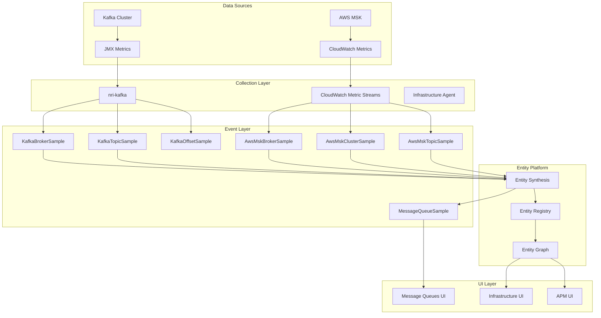

# Unified Kafka/MSK Domain Model

## Executive Summary

This document presents a unified domain model for Kafka monitoring that seamlessly integrates both self-managed Kafka (via On-Host Integration) and AWS Managed Streaming for Kafka (MSK). The model defines how data flows from various sources through the New Relic platform to create a cohesive monitoring experience.

## Domain Model Overview



## Core Domain Entities

### 1. Cluster Entity

```yaml
Entity:
  domain: INFRA
  type: AWSMSKCLUSTER | KAFKACLUSTER
  guid: <accountId>|INFRA|<type>|<base64(clusterName)>
  
Attributes:
  name: string                    # Cluster identifier
  provider: string               # "AwsMsk" | "Kafka"
  clusterState: string           # ACTIVE | CREATING | DELETING
  brokerCount: integer           # Number of brokers
  zookeeperConnectString: string # ZK connection (non-MSK)
  bootstrapBrokers: string       # Kafka bootstrap servers
  region: string                 # AWS region (MSK only)
  clusterArn: string            # AWS ARN (MSK only)
  
Metrics:
  - activeControllerCount
  - offlinePartitionsCount
  - underReplicatedPartitions
  - globalPartitionCount
  - globalTopicCount
```

### 2. Broker Entity

```yaml
Entity:
  domain: INFRA
  type: AWSMSKBROKER | KAFKABROKER
  guid: <accountId>|INFRA|<type>|<base64(brokerId:clusterName)>
  
Attributes:
  name: string                   # "<brokerId>:<clusterName>"
  brokerId: integer              # Broker ID
  parentCluster: string          # Parent cluster name
  parentClusterGuid: string      # Parent cluster GUID
  host: string                   # Broker hostname
  port: integer                  # Broker port
  rack: string                   # Rack ID (if configured)
  
Metrics:
  - messagesInPerSec
  - bytesInPerSec
  - bytesOutPerSec
  - requestsPerSec
  - fetchConsumerTotalTimeMs
  - produceRequestTotalTimeMs
  - diskUsage
  - cpuUsage
  - networkIn/Out
```

### 3. Topic Entity

```yaml
Entity:
  domain: INFRA
  type: AWSMSKTOPIC | KAFKATOPIC
  guid: <accountId>|INFRA|<type>|<base64(clusterName:topicName)>
  
Attributes:
  name: string                   # "<clusterName>:<topicName>"
  topicName: string              # Actual topic name
  parentCluster: string          # Parent cluster name
  parentClusterGuid: string      # Parent cluster GUID
  partitionCount: integer        # Number of partitions
  replicationFactor: integer     # Replication factor
  retentionMs: long             # Retention period
  
Metrics:
  - messagesInPerSec
  - bytesInPerSec
  - bytesOutPerSec
  - fetchRequestsPerSec
  - produceRequestsPerSec
  - partitionCount
  - replicaCount
  - underReplicatedPartitions
```

### 4. Consumer Group Entity

```yaml
Entity:
  domain: INFRA
  type: KAFKACONSUMERGROUP
  guid: <accountId>|INFRA|KAFKACONSUMERGROUP|<base64(clusterName:groupId)>
  
Attributes:
  name: string                   # Consumer group ID
  parentCluster: string          # Parent cluster name
  state: string                  # STABLE | PREPARING_REBALANCE | etc
  protocol: string               # Assignment protocol
  members: integer               # Number of members
  
Metrics:
  - totalLag
  - lagByTopic
  - lagByPartition
  - committedOffset
  - endOffset
  - memberCount
```

## Event Types and Their Relationships

### Primary Event Types

1. **KafkaBrokerSample** (Self-managed Kafka)
   - Source: nri-kafka via JMX
   - Contains: Broker-level metrics from JMX
   - Entity Type: KAFKABROKER

2. **AwsMskBrokerSample** (AWS MSK)
   - Source: CloudWatch Metric Streams
   - Contains: MSK broker metrics
   - Entity Type: AWSMSKBROKER

3. **MessageQueueSample** (Unified)
   - Source: Entity Synthesis
   - Contains: Normalized metrics for UI
   - Entity Types: All Kafka/MSK entities

### Event Transformation Flow

```yaml
Transformation Pipeline:
  1. Collection:
     - nri-kafka -> KafkaBrokerSample, KafkaTopicSample
     - CloudWatch -> AwsMskBrokerSample, AwsMskClusterSample
  
  2. Entity Synthesis:
     Input Events -> Entity Platform -> Entities
     - Maps events to entities using synthesis rules
     - Creates entity relationships
     - Generates entity GUIDs
  
  3. MessageQueue Generation:
     Entities + Metrics -> MessageQueueSample
     - Normalizes metrics across providers
     - Adds UI-specific fields
     - Links to entity GUIDs
```

## Entity Platform Role

### 1. Entity Synthesis

```yaml
Synthesis Rules:
  - Rule: Kafka Cluster
    Input: KafkaBrokerSample with unique clusterName
    Output: Entity(domain=INFRA, type=KAFKACLUSTER)
    
  - Rule: MSK Cluster  
    Input: AwsMskClusterSample
    Output: Entity(domain=INFRA, type=AWSMSKCLUSTER)
    
  - Rule: Message Queue Mapping
    Input: Any Kafka/MSK Entity
    Output: MessageQueueSample event
```

### 2. Entity Registry

- **GUID Generation**: Consistent GUID format across all entities
- **Metadata Storage**: Stores entity attributes and tags
- **Relationship Mapping**: Parent-child relationships (Cluster->Broker->Topic)
- **Lifecycle Management**: Entity creation, updates, and deletion

### 3. Entity Graph

```yaml
Relationships:
  - Cluster CONTAINS Brokers
  - Cluster CONTAINS Topics
  - Topic PARTITIONED_ACROSS Brokers
  - ConsumerGroup CONSUMES_FROM Topics
  - Application CONNECTS_TO Cluster
```

### 4. Entity Discovery

```yaml
Discovery Mechanisms:
  1. Event-based Discovery:
     - New events trigger entity creation
     - Synthesis rules determine entity type
  
  2. API-based Discovery:
     - Direct entity creation via Entity API
     - Used for manual registration
  
  3. Integration Discovery:
     - CloudWatch integration auto-discovers MSK
     - Infrastructure agent discovers Kafka processes
```

## Unified Metrics Model

### Core Metrics (Provider Agnostic)

```yaml
Cluster Metrics:
  - kafka.cluster.brokers.count
  - kafka.cluster.topics.count
  - kafka.cluster.partitions.count
  - kafka.cluster.underReplicated.partitions
  - kafka.cluster.offline.partitions
  
Broker Metrics:
  - kafka.broker.messages.in.rate
  - kafka.broker.messages.out.rate
  - kafka.broker.bytes.in.rate
  - kafka.broker.bytes.out.rate
  - kafka.broker.requests.rate
  - kafka.broker.disk.usage.percent
  
Topic Metrics:
  - kafka.topic.messages.in.rate
  - kafka.topic.bytes.in.rate
  - kafka.topic.bytes.out.rate
  - kafka.topic.partitions.count
  - kafka.topic.replicas.count
```

### Provider-Specific Extensions

```yaml
MSK-Specific:
  - aws.msk.cluster.state
  - aws.msk.broker.cpu.credit.balance
  - aws.msk.data.volume.size
  - aws.msk.connection.count
  
Self-Managed Specific:
  - kafka.jvm.heap.usage
  - kafka.jvm.gc.time
  - kafka.network.processor.idle.percent
  - kafka.request.handler.idle.percent
```

## MessageQueueSample Unified Format

```json
{
  "eventType": "MessageQueueSample",
  "provider": "AwsMsk" | "Kafka",
  "entity.guid": "<entityGuid>",
  "entity.name": "<entityName>",
  "entity.type": "AWSMSKCLUSTER" | "KAFKACLUSTER" | etc,
  "queue.name": "<queueName>",
  "queue.type": "kafka" | "kafka_broker" | "kafka_topic",
  "queue.messagesPerSecond": 1000,
  "queue.bytesInPerSecond": 1048576,
  "queue.bytesOutPerSecond": 524288,
  "queue.consumerLag": 0,
  "queue.brokerCount": 3,
  "queue.topicCount": 10,
  "queue.partitionCount": 30,
  "collector.name": "infrastructure-agent" | "cloudwatch-metric-streams",
  "instrumentation.provider": "newrelic",
  "instrumentation.name": "nri-kafka" | "aws-integration"
}
```

## Implementation Architecture

### 1. Data Collection Layer

```yaml
Collectors:
  nri-kafka:
    - Connects via JMX to Kafka brokers
    - Collects broker, topic, and consumer metrics
    - Runs as Infrastructure Agent integration
    
  CloudWatch Metric Streams:
    - Receives MSK metrics from AWS
    - Transforms CloudWatch format to NR events
    - Handles MSK-specific metrics
    
  Infrastructure Agent:
    - Hosts nri-kafka integration
    - Provides system metrics
    - Handles entity registration
```

### 2. Event Processing Layer

```yaml
Processing Pipeline:
  1. Ingestion:
     - Events arrive via Insights Collector API
     - Events are validated and stored
     
  2. Entity Synthesis:
     - Synthesis rules process events
     - Entities are created/updated
     - Relationships are established
     
  3. MessageQueue Generation:
     - Entity changes trigger MQ events
     - Metrics are normalized
     - UI-specific fields are added
```

### 3. Query Layer

```yaml
Query Patterns:
  UI Queries:
    - FROM MessageQueueSample WHERE provider IN ('AwsMsk', 'Kafka')
    - Aggregates by entity.type
    - Time series for charts
    
  Entity Queries:
    - GraphQL entity search
    - Filter by domain and type
    - Include relationships
    
  Metric Queries:
    - Direct event queries
    - Join with entity data
    - Custom dashboards
```

## Benefits of Unified Model

1. **Single Pane of Glass**: Both self-managed and MSK clusters in one view
2. **Consistent Metrics**: Normalized metrics across providers
3. **Unified Alerting**: Same alert conditions for both types
4. **Seamless Migration**: Easy to compare when migrating to MSK
5. **Rich Context**: Entity relationships provide full topology

## Future Enhancements

1. **Additional Providers**: Support for Confluent Cloud, Azure Event Hubs
2. **Enhanced Discovery**: Auto-discovery of Kafka clients and applications
3. **Deeper Integration**: APM correlation with Kafka entities
4. **Advanced Analytics**: ML-based anomaly detection on unified metrics
5. **Cost Optimization**: Resource usage and cost analysis across providers