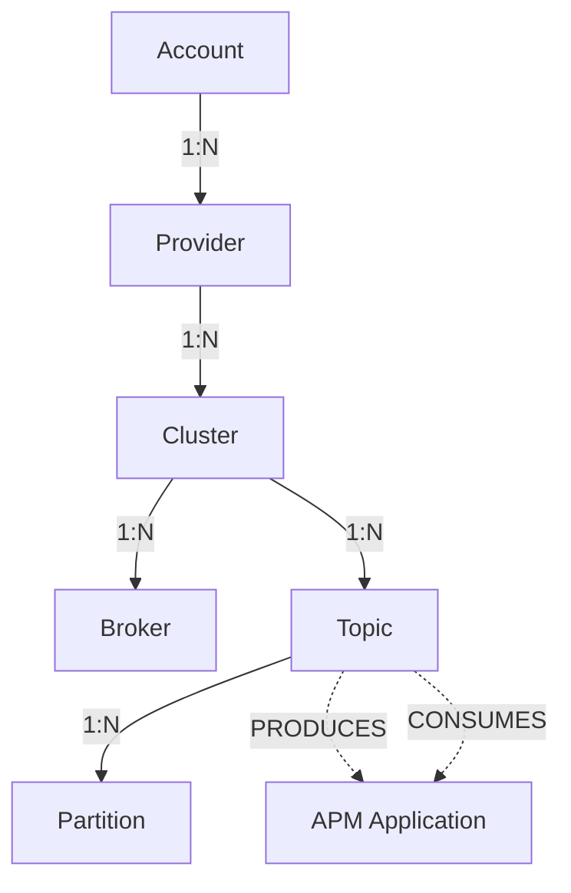

# Product Requirements Document (PRD)
# New Relic Message Queues Monitoring

## Executive Summary

New Relic Message Queues is a comprehensive monitoring solution designed to provide real-time visibility into Kafka message queue infrastructures. The product enables DevOps teams, Site Reliability Engineers (SREs), and platform engineers to monitor, troubleshoot, and optimize their Kafka deployments across AWS Managed Streaming for Kafka (MSK) and Confluent Cloud platforms.

## Product Vision

To be the industry-leading observability platform for message queue infrastructures, providing actionable insights that enable teams to maintain high availability, optimize performance, and quickly resolve issues in their streaming data pipelines.

## Business Objectives

1. **Market Leadership**: Establish New Relic as the go-to solution for Kafka monitoring
2. **Customer Retention**: Increase platform stickiness by providing critical infrastructure monitoring
3. **Revenue Growth**: Drive adoption of New Relic APM through integrated message queue monitoring
4. **Competitive Advantage**: Offer superior visualization and insights compared to native monitoring tools

## Target Users

### Primary Users
1. **DevOps Engineers**
   - Monitor overall health of Kafka clusters
   - Track throughput and performance metrics
   - Identify and resolve infrastructure issues

2. **Site Reliability Engineers (SREs)**
   - Ensure high availability of message queue systems
   - Set up alerts and respond to incidents
   - Optimize cluster performance

3. **Platform Engineers**
   - Design and scale Kafka infrastructure
   - Monitor resource utilization
   - Plan capacity based on usage trends

### Secondary Users
1. **Application Developers**
   - Monitor topic-level metrics for their applications
   - Track message production and consumption rates
   - Debug application-specific issues

2. **Engineering Managers**
   - View high-level health dashboards
   - Track infrastructure costs and efficiency
   - Make data-driven scaling decisions

## User Problems & Needs

### Problem Statement
Organizations running Kafka at scale face significant challenges in monitoring their message queue infrastructure:

1. **Visibility Gap**: Native monitoring tools provide limited visibility into cluster health and performance
2. **Alert Fatigue**: Difficult to identify critical issues among numerous metrics
3. **Troubleshooting Complexity**: Hard to correlate issues across clusters, brokers, and topics
4. **Multi-provider Challenge**: Teams using both AWS MSK and Confluent Cloud need unified monitoring
5. **Scale Management**: Monitoring becomes exponentially complex as clusters grow

### User Needs
1. **Unified Dashboard**: Single pane of glass for all Kafka infrastructure
2. **Real-time Monitoring**: Live updates on cluster health and throughput
3. **Intelligent Alerting**: Context-aware alerts based on entity relationships
4. **Visual Navigation**: Intuitive visualization of complex Kafka topologies
5. **Deep Diagnostics**: Ability to drill down from cluster to topic-level metrics

## Product Features

### 1. Multi-Provider Support
- **AWS MSK Integration**
  - Automatic discovery of MSK clusters
  - Native integration with AWS CloudWatch metrics
  - Support for MSK-specific metrics and features
  
- **Confluent Cloud Integration**
  - API-based integration with Confluent Cloud
  - Support for Confluent-specific metrics
  - Cross-region cluster monitoring

### 2. Comprehensive Dashboard Views

#### Home Dashboard
- **Overview Table**
  - All Kafka accounts and providers
  - Cluster count and health status
  - Aggregate throughput metrics
  - Quick access to detailed views

**NRQL for Home Table Data**:
```nrql
-- AWS MSK Cluster Count
query ALL_KAFKA_TABLE_QUERY {
  actor {
    awsEntitySearch: entitySearch(query: "domain IN ('INFRA') AND type='AWSMSKCLUSTER'") {
      count
      facetedCounts(facets: {facetCriterion: {facet: ACCOUNT_ID}, orderBy: COUNT}) {
        counts {
          count
          facet
        }
      }
    }
  }
}

-- Aggregate Throughput Query
SELECT sum(bytesInPerSec) as 'incomingThroughput', 
       sum(bytesOutPerSec) as 'outgoingThroughput'
FROM (
  SELECT average(provider.bytesInPerSec.Average) as 'bytesInPerSec',
         average(provider.bytesOutPerSec.Average) as 'bytesOutPerSec'
  FROM AwsMskBrokerSample
  FACET provider.clusterName, provider.brokerId
  LIMIT MAX
)
WHERE provider.accountId = '${accountId}'
```

- **Key Metrics**
  - Total clusters across providers
  - Healthy vs unhealthy cluster ratio
  - Incoming/outgoing throughput
  - Active topics and partitions

**Billboard Metrics NRQL**:
```nrql
-- Total Clusters
SELECT uniqueCount(entity.guid) AS 'value'
FROM AwsMskClusterSample
WHERE provider.accountId IN (${accountIds})

-- Unhealthy Clusters  
SELECT uniqueCount(cluster) AS 'value'
FROM (
  SELECT latest(`provider.activeControllerCount.Sum`) AS 'activeControllers',
         latest(`provider.offlinePartitionsCount.Sum`) AS 'offlinePartitions'
  FROM AwsMskClusterSample
  FACET provider.clusterName as cluster
)
WHERE activeControllers != 1 OR offlinePartitions > 0
```

#### Account Summary View
- **Summary Billboards**
  - Cluster count
  - Unhealthy clusters
  - Total topics
  - Total partitions
  - Total brokers

- **Metric Visualizations**
  - Throughput by cluster (line charts)
  - Message rate trends (area charts)
  - Top 20 topics by activity
  - Broker distribution (bar charts)

### 3. Kafka Navigator (Interactive Visualization)

#### HoneyComb Visualization
- **Entity Representation**
  - Hexagonal cells for each entity
  - Color-coded health status
  - Size based on entity importance
  - Interactive hover details

- **View Options**
  - Show: Cluster | Broker | Topic
  - Metric: Health | Alert Status
  - Group By: Type | Cluster | Broker

- **Health Status Indicators**
  - Critical (Red): Immediate attention needed
  - Warning (Yellow): Potential issues
  - Healthy (Green): Operating normally
  - Not Configured (Gray): No alerts set

### 4. Advanced Filtering System

#### Filter Types
- **Provider Filter**: AWS MSK | Confluent Cloud
- **Message Queue Type**: Kafka (extensible for future types)
- **Account Filter**: Multi-account support
- **Status Filter**: All | Healthy | Unhealthy
- **Custom Filters**: Cluster-specific, Topic-specific

#### Search Capabilities
- Entity name search
- GUID-based search
- Tag-based filtering
- Metadata search

### 5. Detailed Metrics & Analytics

#### Cluster Metrics
- Active Controllers
- Offline Partitions Count
- Under-replicated Partitions
- Cluster Load Percentage
- Zookeeper Connection Status

**NRQL Example - Cluster Metrics Dashboard**:
```nrql
SELECT latest(`provider.activeControllerCount.Sum`) AS 'Active Controllers',
       latest(`provider.offlinePartitionsCount.Sum`) AS 'Offline Partitions',
       latest(`provider.zookeeperNetworkRequestLatencyMsMean.Average`) AS 'ZK Latency (ms)'
FROM AwsMskClusterSample
WHERE provider.clusterName = 'production-kafka-cluster'
TIMESERIES AUTO
```

#### Broker Metrics
- Broker Count by Cluster
- Partition Distribution
- Leader Election Rate
- Network Throughput
- Disk Usage

**NRQL Example - Broker Metrics**:
```nrql
SELECT count(*) AS 'Broker Count',
       average(provider.cpuUser.Average) AS 'Avg CPU %',
       average(provider.kafkaDataLogsDiskUsed.Average) AS 'Avg Disk Usage %'
FROM AwsMskBrokerSample
FACET provider.clusterName
LIMIT MAX
```

#### Topic Metrics
- Incoming Throughput (bytes/sec)
- Outgoing Throughput (bytes/sec)
- Message Rate (messages/sec)
- Partition Count
- Consumer Lag

**NRQL Example - Topic Throughput**:
```nrql
SELECT average(provider.bytesInPerSec.Average) AS 'Bytes In/sec',
       average(provider.bytesOutPerSec.Average) AS 'Bytes Out/sec',
       average(provider.messagesInPerSec.Average) AS 'Messages/sec'
FROM AwsMskTopicSample
FACET provider.topic
LIMIT 20
```

### 6. Entity Detail Panel
- **Collapsible Sidebar**
  - Entity metadata
  - Real-time metrics
  - Related entities
  - Alert configuration
  - Historical trends

### 7. Alert Integration
- New Relic Alerts integration
- Entity-based alert policies
- Severity-based prioritization
- Alert history tracking

### 8. Time Range Selection
- Predefined ranges (Last 30 min, 1 hour, 24 hours, etc.)
- Custom time range picker
- Time comparison features

## Technical Architecture

### Frontend Architecture
- **Framework**: React with TypeScript
- **UI Components**: New Relic One SDK components
- **Data Visualization**: @datanerd/vizco, @datanerd/fsi-high-density-view
- **State Management**: React hooks and context
- **Styling**: SCSS with CSS modules

### Data Architecture
- **Query Language**: NRQL (New Relic Query Language)
- **Data Sources**: 
  - Polling-based metrics collection
  - Metric streams for real-time data
- **Entity Model**: Hierarchical entity relationships
- **Caching**: 15-minute cache for performance

### Integration Points
- New Relic APM
- New Relic Infrastructure
- New Relic Alerts
- AWS CloudWatch (for MSK)
- Confluent Cloud API

## Data Model & NRQL Implementation

### Entity Data Model

#### 1. **Entity Types and Hierarchy**
```
Account (1) --> (N) Clusters
Cluster (1) --> (N) Brokers
Cluster (1) --> (N) Topics
Topic (1) --> (N) Partitions
Topic <--> APM Applications (via CONSUMES/PRODUCES relationships)
```

#### 2. **Supported Entity Types**
- **AWS MSK Entities**:
  - `AWSMSKCLUSTER` - MSK Cluster entity
  - `AWSMSKBROKER` - MSK Broker entity
  - `AWSMSKTOPIC` - MSK Topic entity
- **Confluent Cloud Entities**:
  - `CONFLUENTCLOUDCLUSTER` - Confluent Cloud Cluster entity
  - `CONFLUENTCLOUDKAFKATOPIC` - Confluent Cloud Topic entity

#### 3. **Entity Attributes**

**AWS MSK Attributes**:
- Cluster: `provider.clusterName`, `aws.kafka.ClusterName`, `aws.msk.clusterName`
- Broker: `provider.brokerId`, `aws.kafka.BrokerID`, `aws.msk.brokerId`
- Topic: `provider.topic`, `aws.kafka.Topic`, `aws.msk.topic`
- Region: `provider.awsRegion`
- Account: `provider.accountId`

**Confluent Cloud Attributes**:
- Cluster: `kafka.cluster_name`, `kafka.clusterName`, `confluent.clusterName`
- Topic: `topic`, `confluent.kafka.server.metric.topic`
- Resource ID: `resource.kafka.id`

### NRQL Query Patterns

#### 1. **Entity Discovery Queries**

```nrql
-- Discover all AWS MSK Clusters
domain IN ('INFRA') AND type='AWSMSKCLUSTER'

-- Discover all Confluent Cloud Clusters
domain IN ('INFRA') AND type='CONFLUENTCLOUDCLUSTER'

-- Count total topics across providers
domain IN ('INFRA') AND type IN ('AWSMSKTOPIC', 'CONFLUENTCLOUDKAFKATOPIC')
```

#### 2. **Health Monitoring Queries**

**AWS MSK Cluster Health (Polling)**:
```nrql
SELECT latest(`provider.activeControllerCount.Sum`) AS 'Active Controllers', 
       latest(`provider.offlinePartitionsCount.Sum`) AS 'Offline Partitions',
       latest(`provider.underReplicatedPartitions.Sum`) AS 'Under Replicated Partitions',
       latest(`provider.underMinIsrPartitionCount.Sum`) AS 'Under Min ISR Partitions'
FROM AwsMskClusterSample
FACET provider.clusterName as cluster
LIMIT MAX
```

**AWS MSK Cluster Health (Metric Streams)**:
```nrql
SELECT latest(`Active Controllers`) as 'Active Controllers',
       latest(`Offline Partitions`) as 'Offline Partitions',
       latest(`Under Replicated Partitions`) as 'Under Replicated Partitions',
       latest(`Under Min ISR Partitions`) as 'Under Min ISR Partitions'
FROM (
  SELECT filter(sum(aws.kafka.ActiveControllerCount)/datapointCount(),
                where metricName='aws.kafka.ActiveControllerCount') as 'Active Controllers',
         filter(sum(aws.kafka.OfflinePartitionsCount),
                where metricName='aws.kafka.OfflinePartitionsCount') as 'Offline Partitions',
         filter(sum(aws.kafka.UnderReplicatedPartitions),
                where metricName='aws.kafka.UnderReplicatedPartitions') as 'Under Replicated Partitions',
         filter(sum(aws.kafka.UnderMinIsrPartitionCount),
                where metricName='aws.kafka.UnderMinIsrPartitionCount') as 'Under Min ISR Partitions'
  FROM Metric
  FACET aws.kafka.ClusterName OR aws.msk.clusterName AS 'cluster'
  LIMIT MAX
)
FACET cluster
LIMIT MAX
```

**Confluent Cloud Cluster Health**:
```nrql
SELECT (average(confluent_kafka_server_cluster_load_percent or confluent.kafka.server.cluster_load_percent)*100 or 0) as 'Cluster load percent',
       filter(average(confluent_kafka_server_hot_partition_ingress or confluent.kafka.server.hot_partition_ingress), 
              WHERE (confluent_kafka_server_hot_partition_ingress or confluent.kafka.server.hot_partition_ingress)=1) as 'Hot partition Ingress',
       filter(average(confluent_kafka_server_hot_partition_egress or confluent.kafka.server.hot_partition_egress), 
              WHERE (confluent_kafka_server_hot_partition_egress or confluent.kafka.server.hot_partition_egress)=1) as 'Hot partition Egress'
FROM Metric
WHERE metricName like '%confluent%'
FACET kafka.cluster_name or kafka.clusterName or confluent.clusterName
LIMIT MAX
```

#### 3. **Throughput Metrics Queries**

**Incoming Throughput (AWS MSK Polling)**:
```nrql
SELECT sum(bytesInPerSec)
FROM (
  SELECT average(provider.bytesInPerSec.Average) as 'bytesInPerSec'
  FROM AwsMskBrokerSample
  FACET provider.clusterName as cluster, provider.brokerId
  LIMIT MAX
)
```

**Incoming Throughput (AWS Metric Streams)**:
```nrql
SELECT sum(BytesInPerSec)
FROM (
  SELECT filter(average(aws.kafka.BytesInPerSec.byBroker),
                where metricName='aws.kafka.BytesInPerSec.byBroker') as 'BytesInPerSec'
  FROM Metric
  FACET aws.kafka.ClusterName OR aws.msk.clusterName as 'cluster',
        aws.kafka.BrokerID OR aws.msk.brokerId
  LIMIT MAX
)
```

**Outgoing Throughput (Confluent Cloud)**:
```nrql
SELECT sum(kafka_server_brokertopicmetrics_bytesinpersec_value)
FROM (
  SELECT average(confluent_kafka_server_received_bytes or confluent.kafka.server.received_bytes) as 'kafka_server_brokertopicmetrics_bytesinpersec_value'
  FROM Metric
  WHERE metricName like '%confluent%'
  FACET resource.kafka.id, kafka.cluster_name or kafka.clusterName or confluent.clusterName
  LIMIT MAX
)
```

#### 4. **Topic-Level Queries**

**Topics Table Query (AWS MSK)**:
```nrql
SELECT guid, Name, Topic, bytesInPerSec, bytesOutPerSec, messagesInPerSec
FROM (
  SELECT average(provider.bytesInPerSec.Average) or 0 AS 'bytesInPerSec',
         average(provider.bytesOutPerSec.Average) or 0 AS 'bytesOutPerSec',
         average(provider.messagesInPerSec.Average) or 0 AS 'messagesInPerSec'
  FROM AwsMskTopicSample
  FACET entityGuid as 'guid',
        entityName as 'Name',
        `provider.topic` AS 'Topic'
  LIMIT MAX
)
WHERE (`provider.topic` IS NOT NULL)
LIMIT 20
```

**Top Topics by Throughput (Confluent Cloud)**:
```nrql
SELECT average(confluent_kafka_server_sent_bytes or confluent.kafka.server.sent_bytes) as metric
FROM Metric
WHERE metricName like '%confluent%'
FACET topic, confluent.kafka.server.metric.topic
LIMIT 20
```

#### 5. **Summary Dashboard Queries**

**Total Clusters Count**:
```nrql
SELECT uniqueCount(entity.guid) AS 'value'
FROM (
  FROM AwsMskClusterSample SELECT uniqueCount(entity.guid)
  UNION
  FROM Metric WHERE metricName like '%confluent%' 
    SELECT uniqueCount(dimension.ConfluentResourceId)
)
```

**Unhealthy Clusters Count**:
```nrql
-- Uses cluster health queries with conditions:
-- AWS MSK: Active Controllers != 1 OR Offline Partitions > 0
-- Confluent: Hot Partitions > 0 OR Cluster Load > threshold
```

### Health Indicator Thresholds

#### AWS MSK Health Metrics:
- **Active Controllers**: Should be exactly 1 (unhealthy if != 1)
- **Offline Partitions**: Should be 0 (unhealthy if > 0)
- **Under Replicated Partitions**: Should be 0 (warning if > 0)
- **Under Min ISR Partitions**: Should be 0 (critical if > 0)

#### Confluent Cloud Health Metrics:
- **Cluster Load Percent**: Warning at > 70%, Critical at > 90%
- **Hot Partition Ingress**: Unhealthy if any exist (> 0)
- **Hot Partition Egress**: Unhealthy if any exist (> 0)

### GraphQL Entity Search

The application uses GraphQL for complex entity searches:

```graphql
query EntitySearch($query: String!) {
  actor {
    entitySearch(query: $query) {
      count
      results {
        entities {
          guid
          name
          type
          entityType
          tags {
            key
            values
          }
          ... on InfrastructureAwsKafkaClusterEntity {
            clusterName
            awsRegion
          }
        }
      }
    }
  }
}
```

### Metric Collection Sources

1. **AWS MSK Polling Integration**:
   - Event Type: `AwsMskClusterSample`, `AwsMskBrokerSample`, `AwsMskTopicSample`
   - Collection Interval: 5 minutes (default)
   - Metrics: CloudWatch-based metrics

2. **AWS Metric Streams**:
   - Event Type: `Metric`
   - Namespace: `aws.kafka.*`
   - Real-time streaming from CloudWatch

3. **Confluent Cloud Integration**:
   - Event Type: `Metric`
   - Namespace: `confluent.*`, `confluent_kafka_server_*`
   - Collection via Confluent Cloud Metrics API

### Mosaic Template System

The application uses a dynamic template system to generate dashboards based on provider and metric preferences:

#### 1. **Template Structure**
```javascript
{
  name: 'mosaic',
  pages: [{
    name: 'mosaic',
    widgets: [
      {
        title: 'Metric Title',
        layout: { column: 1, row: 1, width: 12, height: 3 },
        visualization: { id: 'viz.line' | 'viz.bar' | 'viz.area' },
        rawConfiguration: {
          facet: { showOtherSeries: false },
          legend: { enabled: true },
          nrqlQueries: [{ query: 'NRQL query string' }]
        }
      }
    ]
  }]
}
```

#### 2. **Visualization Widget Examples**

**Throughput by Cluster (Line Chart)**:
```nrql
SELECT sum(bytesInPerSec)
FROM (
  SELECT average(provider.bytesInPerSec.Average) as 'bytesInPerSec'
  FROM AwsMskBrokerSample
  FACET provider.clusterName as cluster, provider.brokerId
  LIMIT MAX
)
FACET cluster
TIMESERIES AUTO
```

**Topic Count by Cluster (Bar Chart)**:
```nrql
SELECT uniqueCount(entityGuid) AS 'Topics'
FROM AwsMskTopicSample
FACET provider.clusterName
LIMIT MAX
```

**Top 20 Topics by Throughput (Area Chart)**:
```nrql
SELECT average(provider.bytesInPerSec.Average) as metric
FROM AwsMskTopicSample
FACET provider.topic
LIMIT 20
TIMESERIES AUTO
```

#### 3. **Dynamic Query Generation**

The system dynamically adjusts queries based on:
- **Provider Type**: AWS MSK vs Confluent Cloud
- **Integration Type**: Polling vs Metric Streams
- **Time Range**: User-selected time window
- **Filters**: Applied filters modify WHERE clauses

### Complete Data Model Reference

#### 1. **Event Types and Samples**

| Provider | Integration | Event Types | Key Metrics |
|----------|------------|-------------|-------------|
| AWS MSK | Polling | `AwsMskClusterSample`, `AwsMskBrokerSample`, `AwsMskTopicSample` | CloudWatch metrics |
| AWS MSK | Metric Streams | `Metric` (with `aws.kafka.*` namespace) | Real-time CloudWatch |
| Confluent Cloud | API | `Metric` (with `confluent.*` namespace) | Confluent metrics |

#### 2. **Entity Relationship Model**



#### 3. **Common Query Patterns**

**Entity Count with Filters**:
```nrql
domain IN ('INFRA') AND type IN ('AWSMSKCLUSTER', 'CONFLUENTCLOUDCLUSTER')
AND tags.account = 'production'
AND tags.region = 'us-east-1'
```

**Aggregated Metrics with Time Series**:
```nrql
SELECT sum(value) 
FROM (
  -- Inner query with detailed faceting
  SELECT average(metric) as value
  FROM EventType
  FACET dimension1, dimension2
  LIMIT MAX
)
FACET dimension1
TIMESERIES AUTO
```

**Health Status Calculation**:
```nrql
SELECT 
  CASE 
    WHEN activeControllers != 1 THEN 'UNHEALTHY'
    WHEN offlinePartitions > 0 THEN 'UNHEALTHY'
    ELSE 'HEALTHY'
  END as status
FROM (
  -- Health metrics query
)
```

#### 4. **Filter Application in NRQL**

Filters are dynamically added to queries:
```nrql
-- Base query
FROM AwsMskClusterSample SELECT *

-- With account filter
FROM AwsMskClusterSample SELECT *
WHERE provider.accountId = '123456789'

-- With multiple filters
FROM AwsMskClusterSample SELECT *
WHERE provider.accountId = '123456789' 
  AND provider.awsRegion = 'us-east-1'
  AND tags.environment = 'production'
```

## User Workflows

### 1. Initial Setup Workflow
1. User accesses Message Queues from New Relic One
2. Sees empty state with setup instructions
3. Clicks "Set up the integration"
4. Redirected to New Relic Instant Observability
5. Configures AWS MSK or Confluent Cloud integration
6. Returns to see populated dashboard

### 2. Daily Monitoring Workflow
1. User opens Home dashboard
2. Reviews overall health status
3. Identifies any unhealthy clusters
4. Clicks on problematic account/provider
5. Uses Kafka Navigator to locate issues
6. Drills down to specific entities
7. Reviews detailed metrics
8. Takes corrective action

### 3. Incident Response Workflow
1. User receives alert notification
2. Opens Message Queues dashboard
3. Filters by unhealthy status
4. Uses Kafka Navigator with Alert Status view
5. Identifies affected clusters/topics
6. Reviews entity details
7. Correlates with application metrics
8. Resolves issue and monitors recovery

### 4. Capacity Planning Workflow
1. User selects time range (e.g., last 7 days)
2. Reviews throughput trends
3. Analyzes topic growth patterns
4. Checks broker utilization
5. Identifies scaling needs
6. Exports data for reporting

## Success Metrics

### Adoption Metrics
- Number of accounts with Message Queues enabled
- Daily/Monthly Active Users
- Integration setup completion rate
- Feature adoption rates

### Engagement Metrics
- Average session duration
- Dashboard views per user
- Entity detail panel usage
- Filter usage patterns
- Time to first meaningful interaction

### Business Impact Metrics
- MTTR (Mean Time To Resolution) improvement
- Alert accuracy (false positive reduction)
- Infrastructure cost optimization
- Customer retention rate

## Security & Compliance

### Data Security
- Encrypted data transmission
- Role-based access control
- Audit logging for all actions
- No sensitive data storage

### Compliance
- SOC 2 Type II compliant
- GDPR compliant data handling
- HIPAA-ready architecture
- PCI DSS compliance support

## Future Enhancements

### Phase 2 Features
1. **Additional Message Queue Support**
   - RabbitMQ integration
   - Apache Pulsar support
   - Amazon Kinesis monitoring
   - Azure Event Hubs

2. **Advanced Analytics**
   - ML-based anomaly detection
   - Predictive scaling recommendations
   - Consumer lag predictions
   - Performance optimization insights

3. **Enhanced Visualizations**
   - Consumer group tracking
   - Message flow visualization
   - Custom dashboard builder

### Phase 3 Features
1. **Automation Features**
   - Auto-scaling triggers
   - Self-healing capabilities
   - Automated incident response
   - Configuration management

2. **Enterprise Features**
   - Multi-tenant support
   - Advanced RBAC
   - Custom metric definitions
   - White-labeling options

## Technical Requirements

### Performance Requirements
- Dashboard load time < 3 seconds
- Real-time metric updates every 60 seconds
- Support for 1000+ clusters per account
- Handle 100,000+ topics without degradation

### Browser Support
- Chrome (latest 2 versions)
- Firefox (latest 2 versions)
- Safari (latest 2 versions)
- Edge (latest 2 versions)

### API Requirements
- RESTful API for custom integrations
- GraphQL for entity queries
- Webhook support for alerts
- Rate limiting: 1000 requests/minute

## Dependencies

### External Dependencies
- New Relic Platform APIs
- AWS CloudWatch API
- Confluent Cloud API
- New Relic APM agents

### Internal Dependencies
- New Relic One SDK
- Entity synthesis pipeline
- Metric ingestion pipeline
- Alert platform

## Risks & Mitigation

### Technical Risks
1. **Scale Limitations**
   - Risk: Performance degradation with large clusters
   - Mitigation: Implement pagination and virtual scrolling

2. **API Rate Limits**
   - Risk: Hit provider API limits
   - Mitigation: Implement intelligent caching and batching

### Business Risks
1. **Competitive Pressure**
   - Risk: Native tools improve significantly
   - Mitigation: Continuous innovation and integration advantages

2. **Provider Changes**
   - Risk: API changes break integrations
   - Mitigation: Version compatibility and graceful degradation

## Conclusion

New Relic Message Queues provides a comprehensive monitoring solution that addresses the critical need for unified Kafka infrastructure observability. By combining powerful visualizations, intelligent alerting, and deep analytics, the product enables teams to maintain high-performing, reliable message queue systems at scale. The extensible architecture ensures the platform can grow to support additional message queue technologies and use cases as the market evolves.