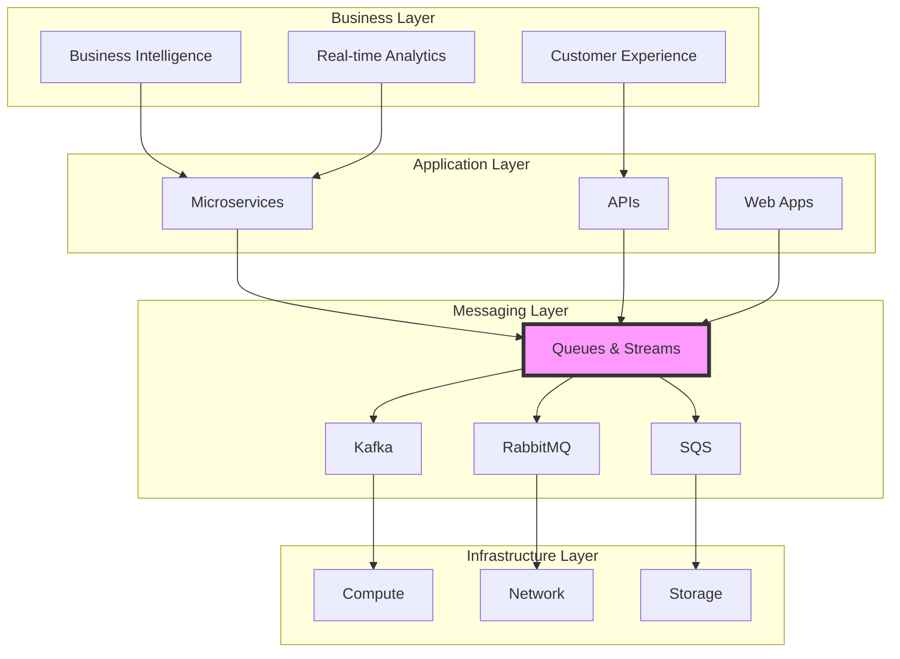
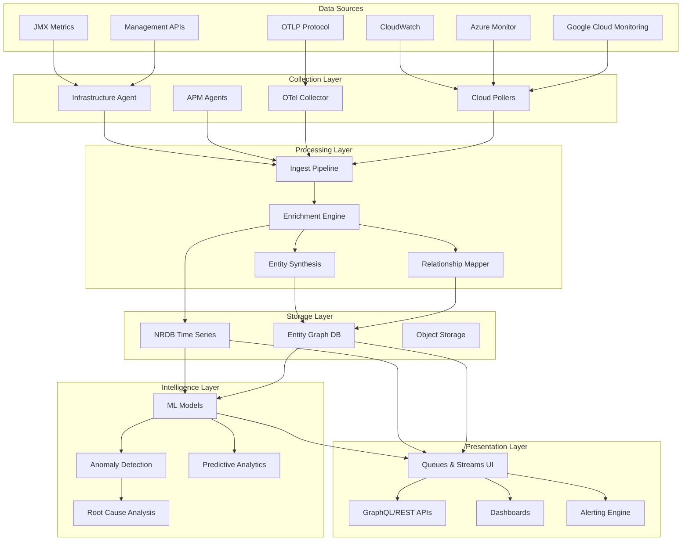
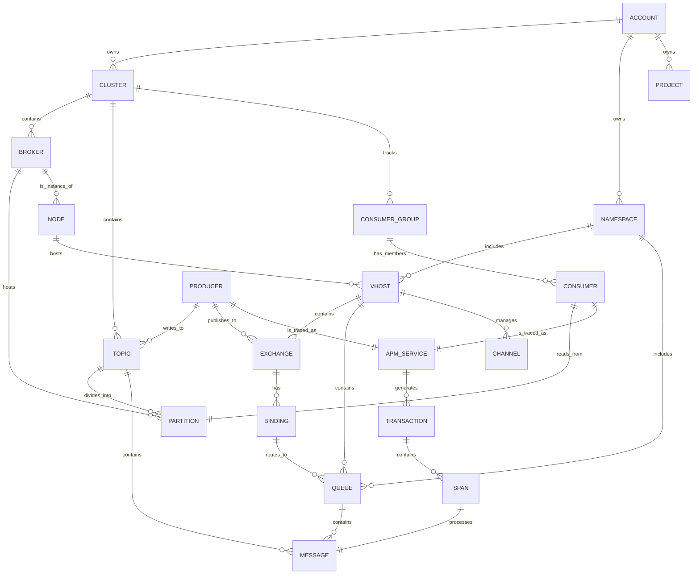

# New Relic Queues & Streaming - Ultimate Data Model Specification v3.0

## 1. Executive Overview

### 1.1 Mission Statement

New Relic Queues & Streaming provides unified observability for heterogeneous messaging architectures, enabling organizations to monitor, troubleshoot, and optimize their event-driven systems through a single pane of glass at `one.newrelic.com > All capabilities > Queues & Streams`.

### 1.2 Core Capabilities

```yaml
Unified_Monitoring:
  - Single interface for 10+ messaging technologies
  - Consistent entity model across providers
  - Standardized metrics and relationships
  
Intelligent_Observability:
  - AI-driven anomaly detection
  - Predictive capacity planning
  - Automated root cause analysis
  - Business impact correlation
  
Deep_Integration:
  - Bi-directional producer ↔ consumer tracing
  - APM service correlation
  - Infrastructure host mapping
  - Cloud provider native metrics
  
Enterprise_Features:
  - Multi-account/region support
  - Role-based access control
  - Compliance reporting
  - SLA/SLO tracking
```

### 1.3 Business Value Metrics

| Metric | Baseline | With Queues & Streaming | Improvement |
|--------|----------|-------------------------|-------------|
| MTTR (Mean Time To Resolution) | 4 hours | 1.5 hours | 62.5% reduction |
| Unplanned Downtime | 12 hours/month | 3 hours/month | 75% reduction |
| Performance Incidents | 25/month | 8/month | 68% reduction |
| Engineering Hours on Troubleshooting | 200/month | 60/month | 70% reduction |
| Data Processing Efficiency | 85% | 97% | 14% improvement |

### 1.4 Strategic Positioning



---

## 2. Architecture & Design Principles

### 2.1 Core Design Principles

```yaml
Principle_1_Unified_Model:
  description: "Single conceptual model across all messaging technologies"
  implementation:
    - Common entity types (Cluster, Broker, Topic/Queue)
    - Standardized metrics (throughput, latency, errors)
    - Consistent relationship patterns
  benefit: "Reduced cognitive load, faster onboarding"

Principle_2_Provider_Agnostic:
  description: "Abstract provider differences while preserving unique capabilities"
  implementation:
    - Generic metrics with provider-specific extensions
    - Unified query language (NRQL)
    - Common alerting patterns
  benefit: "Multi-cloud and hybrid deployments supported"

Principle_3_Scale_First:
  description: "Built for enterprise scale from day one"
  implementation:
    - Cardinality management
    - Sampling strategies
    - Efficient data structures
  benefit: "Handles millions of messages/sec without degradation"

Principle_4_Intelligence_Native:
  description: "AI/ML capabilities built into the platform"
  implementation:
    - Anomaly detection models
    - Predictive analytics
    - Pattern recognition
  benefit: "Proactive issue detection and prevention"

Principle_5_Open_Standards:
  description: "Embrace industry standards and protocols"
  implementation:
    - OpenTelemetry semantic conventions
    - W3C trace context
    - CloudEvents compatibility
  benefit: "Future-proof and vendor-neutral"
```

### 2.2 Technical Architecture



### 2.3 Data Flow Architecture

```yaml
Data_Flow_Stages:
  1_Collection:
    sources:
      - "JMX beans from Kafka brokers"
      - "RabbitMQ Management API"
      - "AWS CloudWatch metrics"
      - "Azure Monitor metrics"
      - "APM distributed traces"
      - "OTLP metrics/traces"
    frequency: "15s - 5m depending on source"
    
  2_Ingestion:
    rate: "Up to 2M events/minute per account"
    protocols: ["HTTPS", "gRPC", "HTTP/2"]
    compression: "gzip, zstd"
    
  3_Processing:
    enrichment:
      - "Add entity metadata"
      - "Calculate derived metrics"
      - "Detect relationships"
    latency: "< 2 seconds end-to-end"
    
  4_Storage:
    retention:
      raw_metrics: "8-395 days (configurable)"
      aggregated: "13 months"
      relationships: "Based on activity"
    
  5_Query:
    engines: ["NRQL", "GraphQL", "PromQL compatible"]
    performance: "< 1s for most queries"
    
  6_Intelligence:
    ml_training: "Continuous with 2-week baseline"
    anomaly_detection: "Real-time scoring"
    predictions: "Up to 24 hours ahead"
```

---

## 3. Supported Technologies Matrix

### 3.1 Production-Ready Integrations

| Technology | Provider | Version Support | Integration Method | Collection Frequency | Maturity | Limitations |
|------------|----------|-----------------|-------------------|---------------------|----------|-------------|
| **Apache Kafka** | Self-Managed | 0.8.0 - 3.x | On-Host (JMX) | 15-30s | GA | 10K topics max |
| **Amazon MSK** | AWS | All versions | CloudWatch Metrics | 60s | GA | Standard CW limits |
| **Confluent Cloud** | Confluent | Current | REST API | 60s | GA | API rate limits |
| **RabbitMQ** | Self-Managed | 3.0+ | Management API | 30s | GA | Mgmt plugin required |
| **Amazon SQS** | AWS | All types | CloudWatch | 5m | GA | 1000 queues/region |
| **Azure Service Bus** | Azure | Standard/Premium | Azure Monitor | 60s | Preview | Premium features only |
| **Google Cloud Pub/Sub** | GCP | All | Cloud Monitoring | 60s | Preview | 5m minimum latency |
| **IBM MQ** | IBM | 8.0+ | Prometheus Exporter | 30s | GA | Limited metrics |
| **Amazon MQ** | AWS | ActiveMQ 5.15+ | CloudWatch | 5m | GA | ActiveMQ only |
| **MSMQ** | Microsoft | All | .NET Agent | 60s | GA | Windows only |

### 3.2 Technology-Specific Features

```yaml
Apache_Kafka:
  unique_features:
    - Partition-level metrics
    - Consumer group lag tracking
    - Controller metrics
    - JMX bean customization
  premium_capabilities:
    - Transaction monitoring
    - Exactly-once semantics tracking
    - Schema registry integration
    
Amazon_MSK:
  unique_features:
    - Serverless scaling metrics
    - Multi-VPC metrics
    - Kafka Connect monitoring
    - Cruise Control integration
  aws_specific:
    - IAM authentication metrics
    - Encryption in transit tracking
    
RabbitMQ:
  unique_features:
    - Virtual host isolation
    - Exchange routing metrics
    - Channel-level tracking
    - Memory/disk alarms
  clustering:
    - Mirrored queue metrics
    - Federation tracking
    - Shovel monitoring
    
SQS:
  unique_features:
    - FIFO queue metrics
    - Dead letter queue tracking
    - Message attributes
    - Long polling metrics
  aws_specific:
    - KMS encryption overhead
    - Cross-region replication
```

### 3.3 Feature Comparison Matrix

| Feature | Kafka | MSK | Confluent | RabbitMQ | SQS | Service Bus | Pub/Sub |
|---------|-------|-----|-----------|----------|-----|--------------|---------|
| **Cluster Metrics** | ✅ | ✅ | ✅ | ✅ | ❌ | ✅ | ❌ |
| **Broker/Node Metrics** | ✅ | ✅ | ✅ | ✅ | ❌ | ❌ | ❌ |
| **Topic/Queue Metrics** | ✅ | ✅ | ✅ | ✅ | ✅ | ✅ | ✅ |
| **Partition Metrics** | ✅ | ✅ | ✅ | ❌ | ❌ | ✅ | ❌ |
| **Consumer Lag** | ✅ | ✅ | ✅ | ⚠️ | ⚠️ | ✅ | ✅ |
| **Producer Metrics** | ✅ | ✅ | ✅ | ✅ | ✅ | ✅ | ✅ |
| **Dead Letter Monitoring** | ⚠️ | ⚠️ | ⚠️ | ✅ | ✅ | ✅ | ✅ |
| **Distributed Tracing** | ✅ | ✅ | ✅ | ✅ | ✅ | ⚠️ | ⚠️ |
| **Auto-discovery** | ✅ | ✅ | ✅ | ✅ | ✅ | ✅ | ✅ |
| **Multi-region** | ✅ | ✅ | ✅ | ✅ | ✅ | ✅ | ✅ |

Legend: ✅ Full Support | ⚠️ Partial Support | ❌ Not Available

---

## 4. Entity Model Architecture

### 4.1 Complete Entity Hierarchy



### 4.2 Entity Type Definitions

```yaml
Core_Entity_Types:
  MESSAGE_QUEUE_CLUSTER:
    domain: INFRA
    guid_pattern: "{accountId}|INFRA|MESSAGE_QUEUE_CLUSTER|{hash(clusterName)}"
    key_attributes:
      - clusterName
      - provider
      - region (if cloud)
    relationships:
      outgoing: [MANAGES, CONTAINS]
      incoming: [HOSTED_ON, MONITORED_BY]
    golden_metrics:
      - health.score
      - throughput.total
      - error.rate
      - availability.percentage
    
  MESSAGE_QUEUE_BROKER:
    domain: INFRA
    guid_pattern: "{accountId}|INFRA|MESSAGE_QUEUE_BROKER|{hash(clusterId:brokerId)}"
    key_attributes:
      - brokerId
      - hostname
      - clusterName
    relationships:
      outgoing: [HOSTS, SERVES]
      incoming: [MANAGED_BY, CONNECTED_TO]
    golden_metrics:
      - cpu.usage
      - memory.usage
      - network.throughput
      - request.latency
    
  MESSAGE_QUEUE_TOPIC:
    domain: INFRA
    guid_pattern: "{accountId}|INFRA|MESSAGE_QUEUE_TOPIC|{hash(clusterId:topicName)}"
    key_attributes:
      - topic
      - clusterName
      - partitionCount
    relationships:
      outgoing: [PARTITIONED_INTO]
      incoming: [PRODUCED_TO, CONSUMED_FROM]
    golden_metrics:
      - throughput.in
      - throughput.out
      - consumer.lag
      - error.rate
    
  MESSAGE_QUEUE_QUEUE:
    domain: INFRA
    guid_pattern: "{accountId}|INFRA|MESSAGE_QUEUE_QUEUE|{hash(provider:region:queueName)}"
    key_attributes:
      - queueName
      - vhost (RabbitMQ)
      - queueUrl (SQS)
    relationships:
      outgoing: [PROCESSED_BY]
      incoming: [ROUTED_FROM, PUBLISHED_TO]
    golden_metrics:
      - depth
      - throughput.in
      - throughput.out
      - processing.time
```

### 4.3 Entity Synthesis Rules

```yaml
Entity_Synthesis:
  kafka_cluster:
    required_fields: [clusterName, provider]
    optional_fields: [kafka.cluster.id, bootstrap.servers]
    merge_strategy: "clusterName exact match"
    ttl: "24 hours inactive"
    
  kafka_topic:
    required_fields: [topic, clusterName]
    optional_fields: [partitions, replicationFactor]
    merge_strategy: "topic + cluster composite"
    ttl: "7 days inactive"
    
  rabbitmq_queue:
    required_fields: [queue, vhost]
    optional_fields: [node, durable, exclusive]
    merge_strategy: "queue + vhost + cluster composite"
    ttl: "3 days inactive"
    
  sqs_queue:
    required_fields: [queueName, account, region]
    optional_fields: [queueUrl, arn, queueType]
    merge_strategy: "ARN exact match or URL match"
    ttl: "30 days inactive"
```

---

## 5. Entity Identification & Metadata

### 5.1 Comprehensive Identification Schema

```yaml
Entity_GUID_Structure:
  format: "{accountId}|{domain}|{entityType}|{uniqueHash}"
  components:
    accountId: 
      type: "integer"
      description: "New Relic account ID"
      example: "1234567"
    domain:
      type: "enum"
      values: ["APM", "BROWSER", "INFRA", "MOBILE", "SYNTH"]
      description: "Top-level categorization"
    entityType:
      type: "string"
      pattern: "^[A-Z_]+$"
      description: "Specific entity type constant"
    uniqueHash:
      type: "string"
      length: 32
      algorithm: "SHA256 of normalized composite key"
      
Composite_Key_Examples:
  kafka_topic: "SHA256(clusterName:topicName)"
  rabbitmq_queue: "SHA256(clusterName:vhost:queueName)"
  sqs_queue: "SHA256(accountId:region:queueName)"
  msk_cluster: "SHA256(arn)"
```

### 5.2 Required Metadata Schema

```json
{
  "entity": {
    "guid": "MTIzNDU2N3xJTkZSQXxNRVNTQUdFX1FVRVVFX0NMVVNURVh8YWJjZGVmZ2hpams",
    "name": "prod-kafka-cluster-us-east-1",
    "entityType": "MESSAGE_QUEUE_CLUSTER",
    "domain": "INFRA",
    "reporting": true,
    "metadata": {
      "provider": "kafka",
      "providerExternalId": "arn:aws:kafka:us-east-1:123456:cluster/prod/12345",
      "clusterName": "prod-kafka-cluster-us-east-1",
      "version": "2.8.1",
      "account": "123456789012",
      "region": "us-east-1",
      "environment": "production",
      "createdAt": "2024-01-15T10:30:00Z",
      "lastSeenAt": "2025-06-07T14:30:00Z"
    },
    "tags": {
      "team": "platform",
      "costCenter": "engineering",
      "criticality": "high",
      "sla": "99.99",
      "dataClassification": "confidential",
      "businessUnit": "payments",
      "compliance": ["pci", "sox"],
      "customTags": {
        "deploymentModel": "multi-az",
        "backupStrategy": "cross-region",
        "alertingTeam": "platform-oncall"
      }
    },
    "goldenMetrics": [
      {
        "name": "cluster.health.score",
        "value": 98.5,
        "unit": "percentage"
      },
      {
        "name": "cluster.throughput.total",
        "value": 1250000,
        "unit": "messages/second"
      },
      {
        "name": "cluster.availability",
        "value": 99.98,
        "unit": "percentage"
      }
    ],
    "relationships": [
      {
        "type": "CONTAINS",
        "targetGuid": "BROKER_GUID_1",
        "metadata": {
          "createdAt": "2024-01-15T10:31:00Z"
        }
      }
    ]
  }
}
```

### 5.3 Naming Conventions & Standards

```yaml
Naming_Standards:
  clusters:
    pattern: "{environment}-{provider}-cluster-{region}[-{identifier}]"
    examples:
      - "prod-kafka-cluster-us-east-1"
      - "staging-rabbitmq-cluster-eu-west-1-payments"
      - "dev-msk-cluster-us-west-2-analytics"
    constraints:
      - "Lowercase alphanumeric with hyphens"
      - "Maximum 63 characters"
      - "Must start with letter"
      - "No consecutive hyphens"
      
  topics:
    pattern: "{domain}.{entity}.{action}[.{version}]"
    examples:
      - "orders.payment.processed.v1"
      - "inventory.item.updated.v2"
      - "user.profile.created"
    constraints:
      - "Lowercase with dots as separator"
      - "Version suffix optional but recommended"
      - "Maximum 255 characters"
      
  queues:
    pattern: "{service}-{action}-{environment}[-{qualifier}]"
    examples:
      - "payment-processor-prod"
      - "email-sender-staging-priority"
      - "inventory-updater-dev"
    constraints:
      - "Lowercase alphanumeric with hyphens"
      - "Environment identifier required"
      - "Maximum 80 characters"
      
  consumer_groups:
    pattern: "{service}-{function}[-{instance}]"
    examples:
      - "order-service-payment-processor"
      - "analytics-engine-aggregator-1"
      - "notification-service-email-sender"
```

### 5.4 Extended Metadata Attributes

```yaml
Provider_Specific_Metadata:
  kafka:
    cluster_metadata:
      - kafka.cluster.id
      - kafka.version
      - kafka.bootstrap.servers
      - kafka.security.protocol
      - kafka.zookeeper.connect (legacy)
    topic_metadata:
      - kafka.topic.config.retention.ms
      - kafka.topic.config.compression.type
      - kafka.topic.config.cleanup.policy
      - kafka.topic.config.segment.bytes
    broker_metadata:
      - kafka.broker.rack
      - kafka.broker.log.dirs
      - kafka.broker.num.network.threads
      
  rabbitmq:
    node_metadata:
      - rabbitmq.node.type (disc/ram)
      - rabbitmq.erlang.version
      - rabbitmq.management.version
    queue_metadata:
      - rabbitmq.queue.durable
      - rabbitmq.queue.exclusive
      - rabbitmq.queue.auto_delete
      - rabbitmq.queue.arguments
    vhost_metadata:
      - rabbitmq.vhost.tracing
      - rabbitmq.vhost.description
      
  aws:
    common_metadata:
      - aws.account.alias
      - aws.arn
      - aws.vpc.id
      - aws.subnet.ids
      - aws.security.groups
    sqs_metadata:
      - sqs.queue.type (standard/fifo)
      - sqs.visibility.timeout
      - sqs.message.retention.period
      - sqs.kms.master.key.id
    msk_metadata:
      - msk.cluster.state
      - msk.broker.node.type
      - msk.encryption.in.transit
      - msk.enhanced.monitoring
```

### 5.5 Tag Management Strategy

```yaml
Tag_Categories:
  Technical_Tags:
    purpose: "Technical classification and routing"
    managed_by: "Platform team"
    examples:
      provider: ["kafka", "rabbitmq", "sqs"]
      environment: ["prod", "staging", "dev", "qa"]
      region: ["us-east-1", "eu-west-1", "ap-south-1"]
      version: ["2.8.1", "3.0.0", "latest"]
      
  Business_Tags:
    purpose: "Business context and ownership"
    managed_by: "Product teams"
    examples:
      team: ["platform", "payments", "analytics"]
      costCenter: ["eng-001", "prod-002"]
      businessUnit: ["retail", "wholesale", "corporate"]
      product: ["checkout", "inventory", "shipping"]
      
  Operational_Tags:
    purpose: "Operational management"
    managed_by: "Operations team"
    examples:
      sla: ["99.9", "99.99", "99.999"]
      criticality: ["high", "medium", "low"]
      alertingTeam: ["platform-oncall", "app-oncall"]
      maintenanceWindow: ["sun-02:00-06:00-utc"]
      
  Compliance_Tags:
    purpose: "Regulatory and compliance tracking"
    managed_by: "Security/Compliance team"
    examples:
      compliance: ["pci", "hipaa", "sox", "gdpr"]
      dataClassification: ["public", "internal", "confidential", "restricted"]
      encryption: ["in-transit", "at-rest", "both"]
      auditRequired: ["true", "false"]
      
Tag_Limits:
  max_tags_per_entity: 100
  max_tag_key_length: 128
  max_tag_value_length: 256
  max_total_tag_size: "64KB"
  reserved_prefixes: ["nr.", "aws.", "azure.", "gcp."]
```

---

**[End of Part 1/4]**
# New Relic Queues & Streaming - Ultimate Data Model Specification v3.0 [Part 2/4]

## 6. Comprehensive Metrics Catalog

### 6.1 Cluster-Level Metrics

#### 6.1.1 Universal Cluster Metrics (All Providers)

| Metric Name | Internal Key | Unit | Type | Calculation | Alert Threshold | Business Impact |
|-------------|--------------|------|------|-------------|-----------------|-----------------|
| **Health Score** | `cluster.health.score` | 0-100 | Gauge | Composite algorithm | < 80 | Service degradation |
| **Availability** | `cluster.availability.percentage` | % | Gauge | (Online Brokers / Total) * 100 | < 100 | Redundancy loss |
| **Total Throughput In** | `cluster.throughput.in.bytesPerSec` | MB/s | Gauge | Sum(all brokers bytes in) | > 80% capacity | Scale needed |
| **Total Throughput Out** | `cluster.throughput.out.bytesPerSec` | MB/s | Gauge | Sum(all brokers bytes out) | > 80% capacity | Consumer bottleneck |
| **Message Rate In** | `cluster.messages.in.rate` | msgs/s | Gauge | Sum(all topics msgs in) | Baseline + 3σ | Traffic spike |
| **Message Rate Out** | `cluster.messages.out.rate` | msgs/s | Gauge | Sum(all topics msgs out) | < 50% of in rate | Processing lag |
| **Error Rate** | `cluster.errors.rate` | errors/s | Gauge | Sum(all error types) | > 1% of traffic | Quality degradation |
| **Latency P99** | `cluster.latency.p99` | ms | Histogram | 99th percentile all requests | > 100ms | User impact |

#### 6.1.2 Kafka-Specific Cluster Metrics

| Metric Name | JMX Bean/Source | Unit | Critical Value | Auto-Remediation |
|-------------|-----------------|------|----------------|------------------|
| **Offline Partitions** | `kafka.controller:OfflinePartitionsCount` | count | > 0 | Page on-call |
| **Under-Replicated Partitions** | `kafka.server:UnderReplicatedPartitions` | count | > 0 | Rebalance replicas |
| **Active Controller Count** | `kafka.controller:ActiveControllerCount` | count | ≠ 1 | Controller election |
| **Preferred Replica Imbalance** | `kafka.controller:PreferredReplicaImbalanceCount` | count | > 10% topics | Leader rebalance |
| **Total Topics** | `kafka.server:GlobalTopicCount` | count | > 10,000 | Capacity planning |
| **Total Partitions** | `kafka.server:GlobalPartitionCount` | count | > 100,000 | Shard limit warning |
| **ISR Shrink Rate** | `kafka.server:IsrShrinksPerSec` | /sec | > 1/min | Replica sync issues |
| **ISR Expand Rate** | `kafka.server:IsrExpandsPerSec` | /sec | Normal ops | Healthy recovery |
| **Broker Count** | Calculated | count | < expected | Broker failure |
| **ZooKeeper Session Expiration** | `SessionExpireListener` | /min | > 0 | Connection issues |

#### 6.1.3 RabbitMQ Cluster Metrics

| Metric Name | Management API Path | Unit | Warning | Critical |
|-------------|-------------------|------|---------|----------|
| **Cluster Partitions** | `/api/nodes` (partitions detected) | boolean | true | Network split |
| **Disk Free Alarm** | `/api/nodes` (disk_free_alarm) | boolean | true | Publisher blocking |
| **Memory Alarm** | `/api/nodes` (mem_alarm) | boolean | true | Connection throttling |
| **Total Connections** | `/api/connections` (count) | count | > 10K | > 20K |
| **Total Channels** | `/api/channels` (count) | count | > 50K | > 100K |
| **Total Queues** | `/api/queues` (count) | count | > 1K | > 10K |
| **Total Exchanges** | `/api/exchanges` (count) | count | > 500 | > 1K |
| **Cluster Message Rate** | `/api/overview` (message_stats) | msgs/s | - | - |
| **Node Synchronization** | `/api/nodes` (synchronized) | % | < 100% | < 50% |

### 6.2 Broker/Node Metrics

#### 6.2.1 Kafka Broker Metrics

| Metric Category | Metric Name | JMX Bean | Unit | Percentiles | Business Context |
|-----------------|-------------|----------|------|-------------|------------------|
| **Throughput** | Bytes In Rate | `kafka.server:BrokerTopicMetrics,name=BytesInPerSec` | bytes/s | - | Ingestion capacity |
| | Bytes Out Rate | `kafka.server:BrokerTopicMetrics,name=BytesOutPerSec` | bytes/s | - | Delivery capacity |
| | Messages In Rate | `kafka.server:BrokerTopicMetrics,name=MessagesInPerSec` | msgs/s | - | Message volume |
| | Total Fetch Requests | `kafka.network:RequestMetrics,name=TotalTimeMs,request=Fetch` | req/s | - | Consumer demand |
| **Latency** | Produce Request Time | `kafka.network:RequestMetrics,name=TotalTimeMs,request=Produce` | ms | P50,P95,P99 | Producer experience |
| | Fetch Request Time | `kafka.network:RequestMetrics,name=TotalTimeMs,request=Fetch` | ms | P50,P95,P99 | Consumer experience |
| | Request Queue Time | `kafka.network:RequestMetrics,name=RequestQueueTimeMs` | ms | P50,P95,P99 | Broker load |
| | Response Queue Time | `kafka.network:RequestMetrics,name=ResponseQueueTimeMs` | ms | P50,P95,P99 | Network pressure |
| **Resources** | CPU Usage | `java.lang:OperatingSystem` (ProcessCpuLoad) | % | - | Compute utilization |
| | JVM Heap Used | `java.lang:Memory` (HeapMemoryUsage.used) | MB | - | Memory pressure |
| | Network Threads Idle | `kafka.network:SocketServer,name=NetworkProcessorAvgIdlePercent` | % | - | Thread pool health |
| | Disk Usage | `kafka.log:LogFlushStats,name=LogFlushRateAndTimeMs` | % | - | Storage capacity |
| **Replication** | Partition Count | `kafka.server:ReplicaManager,name=PartitionCount` | count | - | Broker load |
| | Leader Count | `kafka.server:ReplicaManager,name=LeaderCount` | count | - | Leadership distribution |
| | ISR Shrink Rate | `kafka.server:ReplicaManager,name=IsrShrinksPerSec` | /s | - | Replica health |
| | Lag Max | `kafka.server:ReplicaFetcherManager,name=MaxLag` | messages | - | Replication delay |

#### 6.2.2 RabbitMQ Node Metrics

| Metric Category | Metric Name | API Field | Unit | Threshold | Action |
|-----------------|-------------|-----------|------|-----------|--------|
| **Resources** | Memory Used | `mem_used` | MB | > 80% limit | Increase memory |
| | Disk Free | `disk_free` | GB | < 1GB | Add storage |
| | File Descriptors | `fd_used` / `fd_total` | count | > 90% | Increase ulimit |
| | Sockets Used | `sockets_used` / `sockets_total` | count | > 90% | Connection limit |
| | Erlang Processes | `proc_used` / `proc_total` | count | > 80% | Scale node |
| **Performance** | Run Queue | `run_queue` | count | > CPU count | CPU bottleneck |
| | Context Switches | `context_switches` | /s | > 100K | Thread contention |
| | GC Count | `gc_num` | /s | > 100 | Memory pressure |
| | GC Bytes Reclaimed | `gc_bytes_reclaimed` | MB/s | Low = leak | Memory analysis |
| **I/O** | IO Read Bytes | `io_read_bytes` | MB/s | - | Disk throughput |
| | IO Write Bytes | `io_write_bytes` | MB/s | - | Disk throughput |
| | IO Sync Count | `io_sync_count` | /s | > 1000 | Disk latency |
| | Mnesia TX Count | `mnesia_tx_count` | /s | - | Metadata ops |

### 6.3 Topic/Queue Metrics

#### 6.3.1 Kafka Topic Metrics

| Metric Name | Source | Unit | Aggregation | Cardinality Note |
|-------------|--------|------|-------------|------------------|
| **Throughput In** | `BrokerTopicMetrics` | bytes/s | Sum across brokers | Per topic |
| **Throughput Out** | `BrokerTopicMetrics` | bytes/s | Sum across brokers | Per topic |
| **Messages In Rate** | `BrokerTopicMetrics` | msgs/s | Sum across brokers | Per topic |
| **Fetch Rate** | `BrokerTopicMetrics` | fetches/s | Sum across brokers | Per topic |
| **Failed Fetch Rate** | `BrokerTopicMetrics` | fails/s | Sum across brokers | Per topic |
| **Failed Produce Rate** | `BrokerTopicMetrics` | fails/s | Sum across brokers | Per topic |
| **Partition Count** | Metadata | count | Static | Low cardinality |
| **Replication Factor** | Metadata | count | Static | Low cardinality |
| **Min ISR** | Config | count | Static | Low cardinality |
| **Retention Bytes** | Config | bytes | Static | Low cardinality |
| **Retention Time** | Config | ms | Static | Low cardinality |
| **Consumer Lag Sum** | Offset tracking | messages | Sum all groups | High cardinality |
| **Max Consumer Lag** | Offset tracking | messages | Max across groups | High cardinality |

#### 6.3.2 RabbitMQ Queue Metrics

| Metric Name | API Field | Unit | Type | Update Frequency |
|-------------|-----------|------|------|------------------|
| **Total Messages** | `messages` | count | Gauge | Real-time |
| **Messages Ready** | `messages_ready` | count | Gauge | Real-time |
| **Messages Unacked** | `messages_unacknowledged` | count | Gauge | Real-time |
| **Publish Rate** | `message_stats.publish_details.rate` | msgs/s | Rate | 5s average |
| **Deliver Rate** | `message_stats.deliver_details.rate` | msgs/s | Rate | 5s average |
| **Ack Rate** | `message_stats.ack_details.rate` | msgs/s | Rate | 5s average |
| **Redelivery Rate** | `message_stats.redeliver_details.rate` | msgs/s | Rate | 5s average |
| **Consumer Count** | `consumers` | count | Gauge | Real-time |
| **Consumer Utilization** | `consumer_utilisation` | % | Gauge | Real-time |
| **Memory Usage** | `memory` | bytes | Gauge | Real-time |
| **Message Bytes** | `message_bytes` | bytes | Gauge | Real-time |
| **Head Message Age** | `head_message_timestamp` | seconds | Calculated | When available |

#### 6.3.3 SQS Queue Metrics

| Metric Name | CloudWatch Metric | Unit | Statistic | Collection Period |
|-------------|-------------------|------|-----------|-------------------|
| **Messages Visible** | `ApproximateNumberOfMessagesVisible` | count | Average | 5 minutes |
| **Messages Not Visible** | `ApproximateNumberOfMessagesNotVisible` | count | Average | 5 minutes |
| **Messages Delayed** | `ApproximateNumberOfMessagesDelayed` | count | Average | 5 minutes |
| **Message Age** | `ApproximateAgeOfOldestMessage` | seconds | Maximum | 5 minutes |
| **Messages Sent** | `NumberOfMessagesSent` | count | Sum | 5 minutes |
| **Messages Received** | `NumberOfMessagesReceived` | count | Sum | 5 minutes |
| **Messages Deleted** | `NumberOfMessagesDeleted` | count | Sum | 5 minutes |
| **Empty Receives** | `NumberOfEmptyReceives` | count | Sum | 5 minutes |
| **Sent Message Size** | `SentMessageSize` | bytes | Average | 5 minutes |

### 6.4 Partition-Level Metrics (Kafka)

| Metric Name | JMX Bean | Unit | Collection Strategy | Storage Impact |
|-------------|----------|------|---------------------|----------------|
| **Partition Size** | `kafka.log:type=Log,name=Size` | bytes | Sample top 100 | High cardinality |
| **Segment Count** | `kafka.log:type=Log,name=NumLogSegments` | count | Daily snapshot | Medium |
| **Log End Offset** | `kafka.log:type=Log,name=LogEndOffset` | offset | Per consumer group | Very high |
| **High Watermark** | `kafka.server:type=ReplicaManager,name=HighWatermark` | offset | Critical partitions | High |
| **Under Replicated** | `kafka.server:type=ReplicaManager,name=UnderReplicated` | boolean | All partitions | Medium |
| **Leader** | `kafka.server:type=ReplicaManager,name=Leader` | broker_id | All partitions | Medium |
| **ISR Count** | `kafka.server:type=Partition,name=InSyncReplicasCount` | count | All partitions | Medium |

### 6.5 Consumer Group Metrics (Kafka)

| Metric Name | Source | Unit | Aggregation | Business Impact |
|-------------|--------|------|-------------|-----------------|
| **Total Lag** | Offset diff | messages | Sum all partitions | Processing delay |
| **Max Lag** | Offset diff | messages | Max partition | Worst-case delay |
| **Lag Trend** | Calculated | msgs/min | Derivative | Catching up? |
| **Consumer Count** | Group metadata | count | Current | Scaling indicator |
| **Partition Assignment** | Group metadata | count | Per consumer | Load balance |
| **Commit Rate** | Offset commits | commits/s | Average | Progress rate |
| **Rebalance Rate** | Group coordinator | /hour | Count | Stability |
| **State** | Coordinator | enum | Current | Health check |

---

## 7. Event Types & Data Structures

### 7.1 Event Type Registry

| Event Type | Entity Coverage | Frequency | Default Retention | Data Points/Day | Compression |
|------------|-----------------|-----------|-------------------|-----------------|-------------|
| `KafkaClusterSample` | Cluster | 60s | 30 days | 1,440 | 80% |
| `KafkaBrokerSample` | Broker | 15-30s | 8 days | 2,880-5,760 | 75% |
| `KafkaTopicSample` | Topic | 30s | 8 days | 2,880 | 70% |
| `KafkaPartitionSample` | Partition | 5m | 3 days | 288 | 85% |
| `KafkaOffsetSample` | Consumer Group | 60s | 8 days | 1,440 | 60% |
| `KafkaProducerSample` | Producer | 30s | 7 days | 2,880 | 65% |
| `KafkaConsumerSample` | Consumer | 30s | 7 days | 2,880 | 65% |
| `RabbitmqClusterSample` | Cluster | 60s | 30 days | 1,440 | 80% |
| `RabbitmqNodeSample` | Node | 30s | 8 days | 2,880 | 75% |
| `RabbitmqVhostSample` | VHost | 60s | 8 days | 1,440 | 80% |
| `RabbitmqQueueSample` | Queue | 30s | 8 days | 2,880 | 70% |
| `RabbitmqExchangeSample` | Exchange | 60s | 8 days | 1,440 | 85% |
| `RabbitmqConnectionSample` | Connection | 5m | 1 day | 288 | 90% |
| `QueueSample` | SQS Queue | 5m | 8 days | 288 | 85% |
| `AwsMskClusterSample` | MSK Cluster | 60s | 30 days | 1,440 | 80% |
| `AwsMskBrokerSample` | MSK Broker | 60s | 8 days | 1,440 | 75% |
| `AzureServiceBusSample` | Service Bus | 60s | 8 days | 1,440 | 80% |
| `GcpPubSubSample` | Pub/Sub | 60s | 8 days | 1,440 | 80% |

### 7.2 Event Schema Definitions

#### 7.2.1 KafkaBrokerSample Schema

```json
{
  "eventType": "KafkaBrokerSample",
  "timestamp": 1717776000000,
  "entityGuid": "MTIzNDU2N3xJTkZSQXxNRVNTQUdFX1FVRVVFX0JST0tFUnw5ODc2NTQzMjE",
  "entityName": "broker-1.prod-kafka-cluster",
  "provider": "kafka",
  "clusterName": "prod-kafka-cluster",
  "brokerId": 1,
  "hostname": "kafka-broker-1.internal",
  
  "metrics": {
    "broker.bytesInPerSecond": 1048576,
    "broker.bytesOutPerSecond": 2097152,
    "broker.messagesInPerSecond": 1000,
    "broker.fetchRequestsPerSecond": 50,
    "broker.produceRequestsPerSecond": 100,
    "broker.requestHandlerAvgIdlePercent": 0.85,
    "broker.networkProcessorAvgIdlePercent": 0.90,
    "broker.replicationBytesInPerSecond": 524288,
    "broker.replicationBytesOutPerSecond": 524288,
    "broker.partitionCount": 1500,
    "broker.leaderCount": 500,
    "broker.underReplicatedPartitions": 0,
    "broker.offlinePartitionsCount": 0
  },
  
  "latency": {
    "request.produce.totalTimeMs.p50": 2.5,
    "request.produce.totalTimeMs.p95": 10.2,
    "request.produce.totalTimeMs.p99": 25.7,
    "request.fetch.totalTimeMs.p50": 5.3,
    "request.fetch.totalTimeMs.p95": 15.8,
    "request.fetch.totalTimeMs.p99": 45.2,
    "request.produce.queueTimeMs.mean": 0.5,
    "request.fetch.queueTimeMs.mean": 0.8
  },
  
  "resources": {
    "cpu.user": 45.2,
    "cpu.system": 12.3,
    "memory.heap.used": 4096,
    "memory.heap.max": 8192,
    "disk.log.dir.used.percent": 67.5,
    "network.connections.active": 1250,
    "threads.network.idle.percent": 85,
    "threads.request.idle.percent": 80
  },
  
  "metadata": {
    "kafka.version": "2.8.1",
    "kafka.commitId": "abcd1234",
    "jvm.version": "11.0.12",
    "os.version": "Ubuntu 20.04.3 LTS",
    "rack.id": "us-east-1a",
    "listeners": ["PLAINTEXT://0.0.0.0:9092", "SSL://0.0.0.0:9093"]
  },
  
  "tags": {
    "environment": "production",
    "datacenter": "us-east-1",
    "team": "platform",
    "sla": "99.99"
  }
}
```

#### 7.2.2 RabbitmqQueueSample Schema

```json
{
  "eventType": "RabbitmqQueueSample",
  "timestamp": 1717776000000,
  "entityGuid": "MTIzNDU2N3xJTkZSQXxNRVNTQUdFX1FVRVVFX1FVRVVFfDEyMzQ1Njc4OQ",
  "entityName": "payment-processor",
  "provider": "rabbitmq",
  "clusterName": "prod-rabbitmq-cluster",
  "vhost": "/payments",
  "node": "rabbit@rmq-node-1",
  "queue": "payment-processor",
  
  "metrics": {
    "queue.totalMessages": 1500,
    "queue.messagesReady": 1200,
    "queue.messagesUnacknowledged": 300,
    "queue.messagesPublishedPerSecond": 100,
    "queue.messagesDeliveredPerSecond": 95,
    "queue.messagesAcknowledgedPerSecond": 94,
    "queue.messagesRedeliveredPerSecond": 1,
    "queue.consumerCount": 10,
    "queue.consumerUtilization": 0.92,
    "queue.memory": 52428800,
    "queue.messageBytes": 15728640,
    "queue.messageBytesPersistent": 15728640
  },
  
  "configuration": {
    "durable": true,
    "exclusive": false,
    "autoDelete": false,
    "arguments": {
      "x-message-ttl": 3600000,
      "x-max-length": 100000,
      "x-queue-type": "classic"
    },
    "policy": "ha-all",
    "effectivePolicyDefinition": {
      "ha-mode": "all",
      "ha-sync-mode": "automatic"
    }
  },
  
  "bindings": [
    {
      "source": "payment-exchange",
      "routingKey": "payment.process",
      "arguments": {}
    }
  ],
  
  "slave_nodes": ["rabbit@rmq-node-2", "rabbit@rmq-node-3"],
  "synchronised_slave_nodes": ["rabbit@rmq-node-2", "rabbit@rmq-node-3"],
  
  "tags": {
    "queue_type": "payment",
    "priority": "high",
    "team": "payments"
  }
}
```

#### 7.2.3 QueueSample (SQS) Schema

```json
{
  "eventType": "QueueSample",
  "timestamp": 1717776000000,
  "entityGuid": "MTIzNDU2N3xJTkZSQXxNRVNTQUdFX1FVRVVFX1FVRVVFfDk4NzY1NDMyMQ",
  "entityName": "order-processing-queue",
  "provider": "SqsQueue",
  "providerAccountId": "123456789012",
  "providerAccountName": "production-aws",
  "providerRegion": "us-east-1",
  "queueName": "order-processing-queue",
  
  "provider.approximateAgeOfOldestMessage": 45,
  "provider.approximateNumberOfMessagesDelayed": 10,
  "provider.approximateNumberOfMessagesNotVisible": 25,
  "provider.approximateNumberOfMessagesVisible": 150,
  "provider.numberOfEmptyReceives": 5,
  "provider.numberOfMessagesDeleted": 1000,
  "provider.numberOfMessagesReceived": 1050,
  "provider.numberOfMessagesSent": 1100,
  "provider.sentMessageSize.Average": 2048,
  "provider.sentMessageSize.Maximum": 8192,
  
  "attributes": {
    "QueueArn": "arn:aws:sqs:us-east-1:123456789012:order-processing-queue",
    "QueueUrl": "https://sqs.us-east-1.amazonaws.com/123456789012/order-processing-queue",
    "CreatedTimestamp": "1609459200",
    "LastModifiedTimestamp": "1717689600",
    "DelaySeconds": "0",
    "MaximumMessageSize": "262144",
    "MessageRetentionPeriod": "345600",
    "ReceiveMessageWaitTimeSeconds": "20",
    "VisibilityTimeout": "30",
    "KmsMasterKeyId": "alias/aws/sqs",
    "FifoQueue": "false",
    "ContentBasedDeduplication": "false"
  },
  
  "tags": {
    "aws:cloudformation:stack-name": "production-stack",
    "Environment": "production",
    "Application": "order-service",
    "Team": "orders"
  }
}
```

### 7.3 Event Processing Rules

```yaml
Event_Processing_Pipeline:
  1_Validation:
    required_fields:
      - eventType
      - timestamp
      - entityGuid
      - provider
    timestamp_tolerance: "+/- 5 minutes from current time"
    guid_format: "Regex validation"
    
  2_Enrichment:
    entity_resolution:
      - "Match entityGuid to existing entity"
      - "Create new entity if not exists"
      - "Update entity metadata"
    
    relationship_detection:
      - "Infer from entity hierarchy"
      - "Extract from event attributes"
      - "Apply business rules"
    
    metric_calculation:
      - "Convert counters to rates"
      - "Calculate percentiles"
      - "Derive business metrics"
    
  3_Storage_Optimization:
    compression:
      algorithm: "zstd"
      level: 3
      min_size: "1KB"
    
    sampling:
      high_cardinality_metrics:
        - "Partition-level metrics: 10% sample"
        - "Connection-level metrics: 1% sample"
      
    aggregation:
      pre_aggregate:
        - "1-minute rollups"
        - "5-minute rollups"
        - "1-hour rollups"
    
  4_Retention_Management:
    default_retention: "8 days"
    extended_retention:
      - "Cluster metrics: 30 days"
      - "Business KPIs: 395 days"
    
    cold_storage:
      after: "8 days"
      format: "Parquet"
      compression: "Snappy"
```

---

## 8. Relationship Model & Graph

### 8.1 Relationship Type Definitions

```yaml
Relationship_Types:
  MANAGES:
    description: "Administrative ownership relationship"
    source_types: [CLUSTER, NAMESPACE]
    target_types: [BROKER, NODE, TOPIC, QUEUE]
    cardinality: "1:N"
    ttl: "75 minutes inactive"
    attributes:
      - created_at
      - relationship_strength (strong/weak)
    
  CONTAINS:
    description: "Physical containment relationship"
    source_types: [CLUSTER, VHOST, NAMESPACE]
    target_types: [TOPIC, QUEUE, EXCHANGE, PARTITION]
    cardinality: "1:N"
    ttl: "3 days inactive"
    attributes:
      - created_at
      - is_active
    
  HOSTS:
    description: "Infrastructure hosting relationship"
    source_types: [BROKER, NODE, HOST]
    target_types: [PARTITION, VHOST, SERVICE]
    cardinality: "1:N"
    ttl: "24 hours inactive"
    attributes:
      - hosting_type (primary/replica)
      - resource_allocation
    
  ROUTES_TO:
    description: "Message routing relationship"
    source_types: [EXCHANGE, TOPIC]
    target_types: [QUEUE, SUBSCRIPTION]
    cardinality: "N:N"
    ttl: "75 minutes inactive"
    attributes:
      - routing_key
      - binding_arguments
    
  PRODUCES_TO:
    description: "Producer relationship"
    source_types: [SERVICE, APPLICATION, FUNCTION]
    target_types: [TOPIC, QUEUE, EXCHANGE]
    cardinality: "N:N"
    ttl: "15 minutes inactive"
    attributes:
      - message_rate
      - last_produced
      - protocol
    
  CONSUMES_FROM:
    description: "Consumer relationship"
    source_types: [SERVICE, APPLICATION, FUNCTION]
    target_types: [TOPIC, QUEUE, SUBSCRIPTION]
    cardinality: "N:N"
    ttl: "15 minutes inactive"
    attributes:
      - consumer_group
      - lag
      - consumption_rate
    
  REPLICATED_TO:
    description: "Data replication relationship"
    source_types: [PARTITION, QUEUE]
    target_types: [BROKER, NODE]
    cardinality: "N:N"
    ttl: "1 hour inactive"
    attributes:
      - replication_lag
      - is_in_sync
      - replica_type (leader/follower)
    
  MONITORS:
    description: "Monitoring relationship"
    source_types: [ALERT, DASHBOARD, SYNTHETIC]
    target_types: [CLUSTER, TOPIC, QUEUE, SERVICE]
    cardinality: "N:N"
    ttl: "Never expires"
    attributes:
      - monitor_type
      - threshold
      - notification_channel
```

### 8.2 Relationship Discovery Rules

```yaml
Automatic_Discovery:
  kafka_relationships:
    cluster_to_broker:
      rule: "Broker reports clusterName matching cluster entity"
      relationship: "MANAGES"
      confidence: "HIGH"
    
    cluster_to_topic:
      rule: "Topic reports clusterName matching cluster entity"
      relationship: "CONTAINS"
      confidence: "HIGH"
    
    topic_to_partition:
      rule: "Partition reports topic name"
      relationship: "CONTAINS"
      confidence: "HIGH"
    
    broker_to_partition:
      rule: "Partition leader/replica on broker"
      relationship: "HOSTS"
      confidence: "HIGH"
    
  rabbitmq_relationships:
    node_to_vhost:
      rule: "VHost reports node name"
      relationship: "HOSTS"
      confidence: "HIGH"
    
    vhost_to_queue:
      rule: "Queue reports vhost"
      relationship: "CONTAINS"
      confidence: "HIGH"
    
    exchange_to_queue:
      rule: "Binding exists between exchange and queue"
      relationship: "ROUTES_TO"
      confidence: "HIGH"
    
  apm_relationships:
    service_to_topic:
      rule: "Trace contains messaging span with destination"
      relationship: "PRODUCES_TO or CONSUMES_FROM"
      confidence: "MEDIUM"
    
    service_to_service:
      rule: "Trace shows message flow between services"
      relationship: "CALLS (via queue)"
      confidence: "HIGH"
```

### 8.3 Relationship Queries

```graphql
# Get all consumers of a specific topic
query GetTopicConsumers($topicGuid: EntityGuid!) {
  actor {
    entity(guid: $topicGuid) {
      ... on MessageQueueTopicEntity {
        name
        consumers: relatedEntities(
          filter: {
            relationshipTypes: {include: [CONSUMES_FROM]}
            entityDomain: {include: [APM]}
          }
        ) {
          results {
            target {
              entity {
                name
                guid
                ... on ApmApplicationEntity {
                  language
                  alertSeverity
                  reporting
                  goldenMetrics {
                    metrics {
                      name
                      value
                      unit
                    }
                  }
                }
              }
            }
          }
        }
      }
    }
  }
}

# Get complete message flow for a business transaction
query GetMessageFlow($startServiceGuid: EntityGuid!) {
  actor {
    entity(guid: $startServiceGuid) {
      relationships {
        produces: relatedEntities(
          filter: {relationshipTypes: {include: [PRODUCES_TO]}}
        ) {
          results {
            target {
              entity {
                ... on MessageQueueEntity {
                  name
                  entityType
                  consumers: relatedEntities(
                    filter: {relationshipTypes: {include: [CONSUMES_FROM]}}
                  ) {
                    results {
                      target {
                        entity {
                          name
                          guid
                        }
                      }
                    }
                  }
                }
              }
            }
          }
        }
      }
    }
  }
}
```

### 8.4 Relationship Visualization

```yaml
Visualization_Types:
  service_map:
    description: "End-to-end message flow visualization"
    includes:
      - Services (APM entities)
      - Topics/Queues (messaging entities)  
      - Databases (infrastructure entities)
    relationships_shown:
      - PRODUCES_TO
      - CONSUMES_FROM
      - CALLS
      - QUERIES
    metrics_overlay:
      - Throughput (width of connection)
      - Latency (color gradient)
      - Errors (red highlighting)
    
  topology_view:
    description: "Infrastructure topology"
    includes:
      - Clusters
      - Brokers/Nodes
      - Topics/Queues
      - Partitions
    relationships_shown:
      - MANAGES
      - CONTAINS
      - HOSTS
      - REPLICATED_TO
    health_indicators:
      - Entity health color coding
      - Relationship strength
      - Activity indicators
    
  dependency_graph:
    description: "Application dependencies via messaging"
    includes:
      - Applications
      - Services
      - Functions
    relationships_shown:
      - Async dependencies via queues
      - Sync dependencies via APIs
      - Database dependencies
    analysis_features:
      - Critical path highlighting
      - Circular dependency detection
      - Impact analysis
```

---

**[End of Part 2/4]**

This completes the second part covering metrics, events, and relationships. Part 3 will continue with integration requirements, OpenTelemetry alignment, and security.

# New Relic Queues & Streaming - Ultimate Data Model Specification v3.0 [Part 3/4]

## 9. Integration Requirements & Setup

### 9.1 Apache Kafka Integration

#### 9.1.1 Prerequisites and Compatibility

```yaml
Infrastructure_Requirements:
  agent_version: ">= 1.16.0"
  integration_version: ">= 3.1.0"
  java_version: ">= 8"
  kafka_version: "0.8.0 - 3.x"
  
System_Requirements:
  cpu: "2+ cores recommended"
  memory: "4GB minimum, 8GB recommended"
  disk: "Fast SSD for metrics storage"
  network: "Low latency to brokers"
  
JMX_Configuration:
  enabled: true
  port: 9999  # Standard port
  authentication: false  # Or configure SASL
  ssl: false  # Or configure TLS
  
  startup_options: |
    -Dcom.sun.management.jmxremote
    -Dcom.sun.management.jmxremote.port=9999
    -Dcom.sun.management.jmxremote.local.only=false
    -Dcom.sun.management.jmxremote.authenticate=false
    -Dcom.sun.management.jmxremote.ssl=false
    -Djava.rmi.server.hostname=<BROKER_HOSTNAME>
```

#### 9.1.2 Integration Configuration

```yaml
integrations:
  - name: nri-kafka
    env:
      # Cluster configuration
      CLUSTER_NAME: prod-kafka-cluster
      KAFKA_VERSION: "2.8.1"
      AUTODISCOVER_STRATEGY: bootstrap  # or zookeeper
      
      # Bootstrap discovery (preferred)
      BOOTSTRAP_BROKER_HOST: kafka-1.internal:9092,kafka-2.internal:9092
      
      # Zookeeper discovery (legacy)
      ZOOKEEPER_HOSTS: zk-1.internal:2181,zk-2.internal:2181
      ZOOKEEPER_PATH: /kafka-cluster
      
      # JMX connection per broker
      PRODUCERS: |
        - name: broker-1
          host: kafka-1.internal
          port: 9999
        - name: broker-2  
          host: kafka-2.internal
          port: 9999
      
      # Topic configuration
      TOPIC_MODE: List  # or All
      TOPIC_LIST: |
        [
          "critical-events",
          "orders.*",
          "payments.*"
        ]
      TOPIC_REGEX: "production-.*"
      
      # Consumer group monitoring
      CONSUMER_GROUPS: |
        [
          "payment-processor",
          "order-service",
          "analytics-consumer"
        ]
      CONSUMER_GROUP_REGEX: "prod-.*"
      
      # Collection settings
      COLLECT_BROKER_TOPIC_DATA: true
      COLLECT_TOPIC_SIZE: true
      COLLECT_TOPIC_OFFSET: true
      
      # Performance tuning
      METRICS_MAX_POOL_SIZE: 10
      REQUEST_TIMEOUT_MS: 30000
      
    interval: 30s
    
    # SASL/SSL configuration
    env_sasl:
      SASL_MECHANISM: SCRAM-SHA-512
      SASL_USERNAME: ${KAFKA_USERNAME}
      SASL_PASSWORD: ${KAFKA_PASSWORD}
      SECURITY_PROTOCOL: SASL_SSL
      SSL_TRUSTSTORE_LOCATION: /etc/kafka/truststore.jks
      SSL_TRUSTSTORE_PASSWORD: ${TRUSTSTORE_PASS}
      SSL_KEYSTORE_LOCATION: /etc/kafka/keystore.jks
      SSL_KEYSTORE_PASSWORD: ${KEYSTORE_PASS}
```

#### 9.1.3 Advanced JMX Bean Collection

```yaml
custom_jmx_beans:
  # Transaction monitoring
  - domain: kafka.server
    type: TransactionCoordinator
    attribute: ActiveTransactionCount
    
  # Quota monitoring  
  - domain: kafka.server
    type: ClientQuotaManager
    name: ThrottleTime
    request: Produce
    
  # Stream processing
  - domain: kafka.streams
    type: stream-metrics
    attribute: process-latency-avg
    
  # Connect monitoring
  - domain: kafka.connect
    type: connector-metrics
    attribute: connector-startup-attempts-total
```

### 9.2 RabbitMQ Integration

#### 9.2.1 Prerequisites

```yaml
Requirements:
  rabbitmq_version: ">= 3.0"
  management_plugin: enabled
  management_api_port: 15672
  
  # Enable management plugin
  rabbitmq-plugins enable rabbitmq_management
  
  # Create monitoring user
  rabbitmqctl add_user newrelic ${RABBITMQ_PASSWORD}
  rabbitmqctl set_user_tags newrelic monitoring
  rabbitmqctl set_permissions -p / newrelic "" "" ".*"
```

#### 9.2.2 Integration Configuration

```yaml
integrations:
  - name: nri-rabbitmq
    env:
      # Connection settings
      HOSTNAME: localhost
      PORT: 15672
      USERNAME: newrelic
      PASSWORD: ${RABBITMQ_PASSWORD}
      USE_SSL: false
      
      # Cluster configuration
      CLUSTER_NAME: prod-rabbitmq-cluster
      
      # Collection configuration
      QUEUES: |
        [
          {"vhost": "/", "name": "critical-queue"},
          {"vhost": "/payments", "name": "payment-queue"}
        ]
      QUEUES_REGEXES: |
        [
          {"vhost": "/", "regex": "prod-.*"},
          {"vhost": "/staging", "regex": ".*"}
        ]
      
      # Exchange configuration
      EXCHANGES: |
        [
          {"vhost": "/", "name": "topic-exchange"},
          {"vhost": "/payments", "name": "payment-exchange"}
        ]
      EXCHANGES_REGEXES: |
        [
          {"vhost": "/", "regex": ".*-exchange"}
        ]
      
      # VHost configuration
      VHOSTS: |
        ["/", "/payments", "/orders"]
      
      # Node-specific settings
      NODE_NAME: rabbit@$(hostname)
      
      # Performance settings
      PAGINATION_LIMIT: 2000
      TIMEOUT: 30
      
    interval: 30s
    
    # SSL configuration
    env_ssl:
      USE_SSL: true
      CA_BUNDLE_FILE: /etc/rabbitmq/ca_certificate.pem
      CERT_FILE: /etc/rabbitmq/client_certificate.pem
      KEY_FILE: /etc/rabbitmq/client_key.pem
```


#### 9.3.2 AWS Integration Configuration

```yaml
aws_integration:
  # Method 1: CloudWatch Metric Streams (Recommended)
  metric_streams:
    enabled: true
    namespaces:
      - AWS/Kafka
      - AWS/SQS
      - AWS/AmazonMQ
    
    kinesis_data_firehose:
      delivery_stream: newrelic-metrics-stream
      endpoint: https://aws-api.newrelic.com/cloudwatch-metrics/v1
      api_key: ${NEW_RELIC_LICENSE_KEY}
    
    filters:
      include:
        - namespace: AWS/Kafka
          metric_names: ["*"]
        - namespace: AWS/SQS
          metric_names: 
            - ApproximateNumberOfMessagesVisible
            - ApproximateNumberOfMessagesNotVisible
            - ApproximateAgeOfOldestMessage
            - NumberOfMessagesSent
            - NumberOfMessagesReceived
            - NumberOfMessagesDeleted
  
  # Method 2: Polling Integration (Legacy)
  polling:
    msk:
      enabled: true
      interval: 60
      regions: ["us-east-1", "us-west-2"]
      tag_filters:
        - key: Environment
          value: production
      
    sqs:
      enabled: true
      interval: 300  # 5 minutes
      regions: ["us-east-1", "us-west-2"]
      fetch_tags: true
      fetch_extended_attributes: true
      queue_prefixes: ["prod-", "critical-"]
```

---

## 10. OpenTelemetry Alignment

### 10.1 Semantic Convention Mapping

#### 10.1.1 Resource Attributes

```yaml
Resource_Attribute_Mapping:
  # System attributes
  otel.resource.attributes:
    service.name: "service"
    service.namespace: "namespace" 
    service.instance.id: "instanceId"
    service.version: "version"
    deployment.environment: "environment"
    
  # Messaging system
  messaging.attributes:
    messaging.system: "provider"  # kafka, rabbitmq, sqs
    messaging.destination: "topic" / "queueName"
    messaging.destination_kind: (derived)  # topic or queue
    messaging.protocol: "protocol"
    messaging.protocol_version: "protocolVersion"
    messaging.url: "connectionString"
    
  # Kafka specific
  messaging.kafka.attributes:
    messaging.kafka.message.key: "kafka.key"
    messaging.kafka.consumer.group: "consumerGroup"
    messaging.kafka.client_id: "kafka.clientId"
    messaging.kafka.partition: "partition"
    messaging.kafka.message.offset: "offset"
    messaging.kafka.tombstone: "kafka.tombstone"
    
  # RabbitMQ specific  
  messaging.rabbitmq.attributes:
    messaging.rabbitmq.routing_key: "rabbitmq.routingKey"
    messaging.rabbitmq.exchange: "exchangeName"
    
  # Cloud attributes
  cloud.attributes:
    cloud.provider: (derived)  # aws, azure, gcp
    cloud.account.id: "account"
    cloud.region: "region"
    cloud.availability_zone: "availabilityZone"
    cloud.platform: (derived)  # aws_msk, aws_sqs
```

#### 10.1.2 Metric Name Mapping

```yaml
Metric_Mappings:
  # Producer metrics
  otel.producer.metrics:
    messaging.producer.messages:
      name: "messaging.producer.messages"
      unit: "{messages}"
      type: Counter
      maps_to: "provider.messagesInPerSec"
      
    messaging.producer.bytes:
      name: "messaging.producer.bytes"  
      unit: "By"
      type: Counter
      maps_to: "provider.bytesInPerSec"
      
    messaging.producer.duration:
      name: "messaging.producer.duration"
      unit: "ms"
      type: Histogram
      maps_to: "request.produce.totalTimeMs"
      
  # Consumer metrics
  otel.consumer.metrics:
    messaging.consumer.messages:
      name: "messaging.consumer.messages"
      unit: "{messages}"
      type: Counter
      maps_to: "consumer.messagesConsumedPerSec"
      
    messaging.consumer.lag:
      name: "messaging.consumer.lag"
      unit: "{messages}"
      type: Gauge
      maps_to: "consumer.lag"
      
    messaging.consumer.duration:
      name: "messaging.consumer.duration"
      unit: "ms"
      type: Histogram
      maps_to: "consumer.processingTime"
      
  # Queue metrics
  otel.queue.metrics:
    messaging.queue.messages:
      name: "messaging.queue.messages"
      unit: "{messages}"
      type: Gauge
      maps_to: "queue.totalMessages"
      
    messaging.queue.message_age:
      name: "messaging.queue.message_age"
      unit: "s"
      type: Gauge
      maps_to: "queue.oldestMessageAge"
```

### 10.2 Trace Context Propagation

#### 10.2.1 Header Formats

```yaml
Trace_Context_Headers:
  w3c_traceparent:
    format: "00-{trace_id}-{span_id}-{flags}"
    example: "00-4bf92f3577b34da6a3ce929d0e0e4736-00f067aa0ba902b7-01"
    kafka_header: "traceparent"
    rabbitmq_header: "x-trace-parent"
    
  w3c_tracestate:
    format: "vendor1=value1,vendor2=value2"
    example: "newrelic=eyJ2IjpbMCwxXSwiZCI6eyJ0eSI6IkFwcCJ9fQ"
    kafka_header: "tracestate"
    rabbitmq_header: "x-trace-state"
    
  newrelic_headers:
    distributed_trace:
      header: "newrelic"
      format: "JSON base64 encoded"
    transaction_id:
      header: "x-newrelic-transaction"
    
  b3_headers:
    trace_id: "X-B3-TraceId"
    span_id: "X-B3-SpanId"
    parent_span_id: "X-B3-ParentSpanId"
    sampled: "X-B3-Sampled"
```

#### 10.2.2 Propagation Implementation

```java
// Java Kafka Producer Example
@Component
public class KafkaProducerTracing {
    
    @Autowired
    private Tracer tracer;
    
    public void sendMessage(String topic, String key, String value) {
        Span span = tracer.spanBuilder("kafka.send")
            .setSpanKind(SpanKind.PRODUCER)
            .setAttribute("messaging.system", "kafka")
            .setAttribute("messaging.destination", topic)
            .setAttribute("messaging.destination_kind", "topic")
            .setAttribute("messaging.kafka.message.key", key)
            .startSpan();
            
        try (Scope scope = span.makeCurrent()) {
            ProducerRecord<String, String> record = 
                new ProducerRecord<>(topic, key, value);
            
            // Inject trace context
            TextMapPropagator propagator = GlobalOpenTelemetry.getPropagators()
                .getTextMapPropagator();
            
            propagator.inject(Context.current(), record.headers(), 
                (headers, key, value) -> 
                    headers.add(key, value.getBytes(StandardCharsets.UTF_8))
            );
            
            producer.send(record, (metadata, exception) -> {
                if (exception != null) {
                    span.recordException(exception);
                    span.setStatus(StatusCode.ERROR);
                } else {
                    span.setAttribute("messaging.kafka.partition", 
                        metadata.partition());
                    span.setAttribute("messaging.kafka.offset", 
                        metadata.offset());
                }
                span.end();
            });
        }
    }
}

// Node.js RabbitMQ Example
const { context, trace, propagation } = require('@opentelemetry/api');

async function publishMessage(exchange, routingKey, message) {
  const tracer = trace.getTracer('rabbitmq-publisher');
  const span = tracer.startSpan('rabbitmq.publish', {
    kind: SpanKind.PRODUCER,
    attributes: {
      'messaging.system': 'rabbitmq',
      'messaging.destination': exchange,
      'messaging.destination_kind': 'exchange',
      'messaging.rabbitmq.routing_key': routingKey
    }
  });
  
  const ctx = trace.setSpan(context.active(), span);
  
  try {
    const headers = {};
    propagation.inject(ctx, headers);
    
    await channel.publish(
      exchange,
      routingKey,
      Buffer.from(JSON.stringify(message)),
      {
        headers,
        persistent: true,
        timestamp: Date.now()
      }
    );
    
    span.setStatus({ code: SpanStatusCode.OK });
  } catch (error) {
    span.recordException(error);
    span.setStatus({ code: SpanStatusCode.ERROR });
    throw error;
  } finally {
    span.end();
  }
}
```

### 10.3 OpenTelemetry Collector Configuration

```yaml
# otel-collector-config.yaml
receivers:
  otlp:
    protocols:
      grpc:
        endpoint: 0.0.0.0:4317
      http:
        endpoint: 0.0.0.0:4318
        
  kafka_metrics:
    protocol_version: 2.0.0
    scrapers:
      - brokers:
          - kafka-1:9092
          - kafka-2:9092
        topics:
          - orders
          - payments
        groups:
          - payment-processor
          - order-service
    collection_interval: 30s
    
  rabbitmq:
    endpoint: http://rabbitmq:15672
    username: ${RABBITMQ_USERNAME}
    password: ${RABBITMQ_PASSWORD}
    collection_interval: 30s

processors:
  batch:
    timeout: 1s
    send_batch_size: 1024
    
  memory_limiter:
    check_interval: 1s
    limit_mib: 1024
    spike_limit_mib: 256
    
  attributes:
    actions:
      # Map OTel to New Relic conventions
      - key: messaging.destination
        from_attribute: messaging.destination.name
        action: upsert
      - key: provider
        from_attribute: messaging.system
        action: upsert
      - key: topic
        from_attribute: messaging.destination
        action: upsert
        
  resource:
    attributes:
      - key: service.name
        value: "messaging-collector"
        action: upsert
      - key: deployment.environment
        from_attribute: DEPLOYMENT_ENV
        action: insert
        
  transform:
    metric_statements:
      # Convert OTel metrics to NR format
      - context: datapoint
        statements:
          - set(attributes["entityGuid"], 
              CalculateEntityGuid(
                attributes["messaging.system"],
                attributes["messaging.destination"]
              ))

exporters:
  newrelic:
    api_key: ${NEW_RELIC_API_KEY}
    
  logging:
    loglevel: info
    
  debug:
    verbosity: detailed

extensions:
  health_check:
    endpoint: 0.0.0.0:13133
    
  pprof:
    endpoint: 0.0.0.0:1777
    
  zpages:
    endpoint: 0.0.0.0:55679

service:
  extensions: [health_check, pprof, zpages]
  
  pipelines:
    traces:
      receivers: [otlp]
      processors: [memory_limiter, batch, attributes, resource]
      exporters: [newrelic, logging]
      
    metrics:
      receivers: [otlp, kafka_metrics, rabbitmq]
      processors: [memory_limiter, batch, attributes, transform]
      exporters: [newrelic]
      
    logs:
      receivers: [otlp]
      processors: [memory_limiter, batch]
      exporters: [newrelic]
```

---

## 11. APM & Distributed Tracing

### 11.1 Message Transaction Types

```yaml
Transaction_Types:
  producer_transaction:
    type: "MessageBroker/Produce"
    attributes:
      messaging.system: required
      messaging.destination: required
      messaging.operation: "send"
      message.size: optional
      message.key: optional
    metrics:
      duration: "Time to send"
      throughput: "Messages/second"
      errors: "Failed sends"
      
  consumer_transaction:
    type: "MessageBroker/Consume"
    attributes:
      messaging.system: required
      messaging.destination: required
      messaging.operation: "receive"
      messaging.consumer_id: recommended
      message.age: optional
    metrics:
      duration: "Processing time"
      lag: "Consumer lag"
      errors: "Processing failures"
      
  batch_transaction:
    type: "MessageBroker/ConsumeBatch"
    attributes:
      messaging.batch_size: required
      messaging.batch_duration: required
    metrics:
      batch_size: "Messages per batch"
      processing_rate: "Messages/second"
```

### 11.2 Span Attributes and Enrichment

```yaml
Span_Attributes:
  required:
    - span.kind: [PRODUCER, CONSUMER]
    - messaging.system: "kafka|rabbitmq|sqs"
    - messaging.destination: "topic or queue name"
    - messaging.operation: "send|receive|process"
    
  recommended:
    - messaging.message_id: "unique message identifier"
    - messaging.conversation_id: "correlation id"
    - messaging.message_payload_size_bytes: integer
    - messaging.protocol: "kafka_protocol|amqp|http"
    - net.peer.name: "broker hostname"
    - net.peer.port: integer
    
  kafka_specific:
    - messaging.kafka.message_key: string
    - messaging.kafka.partition: integer
    - messaging.kafka.offset: integer
    - messaging.kafka.consumer_group: string
    - messaging.kafka.tombstone: boolean
    
  rabbitmq_specific:
    - messaging.rabbitmq.routing_key: string
    - messaging.rabbitmq.exchange: string
    - messaging.rabbitmq.delivery_tag: integer
    - messaging.rabbitmq.redelivered: boolean
    
  sqs_specific:
    - messaging.sqs.message_id: string
    - messaging.sqs.receipt_handle: string
    - messaging.sqs.message_group_id: string
    - messaging.sqs.message_deduplication_id: string
```

### 11.3 Distributed Trace Examples

```json
// Example: Order Processing Flow
{
  "trace_id": "4bf92f3577b34da6a3ce929d0e0e4736",
  "spans": [
    {
      "span_id": "a1b2c3d4e5f60001",
      "parent_span_id": null,
      "operation": "POST /api/orders",
      "service": "order-api",
      "duration_ms": 250,
      "attributes": {
        "http.method": "POST",
        "http.url": "/api/orders",
        "http.status_code": 201
      }
    },
    {
      "span_id": "a1b2c3d4e5f60002",
      "parent_span_id": "a1b2c3d4e5f60001",
      "operation": "kafka.send",
      "service": "order-api",
      "duration_ms": 15,
      "attributes": {
        "span.kind": "PRODUCER",
        "messaging.system": "kafka",
        "messaging.destination": "orders.created",
        "messaging.kafka.partition": 3,
        "messaging.kafka.offset": 12345
      }
    },
    {
      "span_id": "a1b2c3d4e5f60003",
      "parent_span_id": "a1b2c3d4e5f60002",
      "operation": "kafka.receive",
      "service": "payment-service",
      "duration_ms": 5,
      "attributes": {
        "span.kind": "CONSUMER",
        "messaging.system": "kafka",
        "messaging.destination": "orders.created",
        "messaging.kafka.consumer_group": "payment-processor",
        "messaging.kafka.lag": 10
      }
    },
    {
      "span_id": "a1b2c3d4e5f60004",
      "parent_span_id": "a1b2c3d4e5f60003",
      "operation": "process_payment",
      "service": "payment-service",
      "duration_ms": 180,
      "attributes": {
        "payment.amount": 99.99,
        "payment.currency": "USD",
        "payment.method": "credit_card"
      }
    }
  ]
}
```

### 11.4 APM Integration Patterns

```yaml
Integration_Patterns:
  auto_instrumentation:
    java:
      agent_version: ">= 6.0.0"
      kafka_support:
        - kafka-clients: "0.11.0+"
        - spring-kafka: "2.0+"
        - reactor-kafka: "1.0+"
      rabbitmq_support:
        - amqp-client: "4.0+"
        - spring-amqp: "2.0+"
        
    nodejs:
      agent_version: ">= 8.0.0"
      kafka_support:
        - kafkajs: "1.0+"
        - node-rdkafka: "2.0+"
      rabbitmq_support:
        - amqplib: "0.5+"
        
    python:
      agent_version: ">= 7.0.0"
      kafka_support:
        - kafka-python: "1.4+"
        - confluent-kafka: "1.0+"
      rabbitmq_support:
        - pika: "1.0+"
        - aio-pika: "6.0+"
        
  manual_instrumentation:
    example: |
      # Python example
      import newrelic.agent
      
      @newrelic.agent.message_transaction(
          library='Kafka',
          destination_type='Topic', 
          destination_name='orders.created'
      )
      def process_order(message):
          # Add custom attributes
          newrelic.agent.add_custom_attribute(
              'order.id', message['order_id']
          )
          newrelic.agent.add_custom_attribute(
              'order.value', message['total_amount']
          )
          
          # Process the order
          result = handle_order_logic(message)
          
          # Record custom metric
          newrelic.agent.record_custom_metric(
              'Custom/OrderProcessing/Duration',
              time.time() - start_time
          )
          
          return result
```

---

---

**[End of Part 3/4]**

This completes the third part covering integration requirements, OpenTelemetry alignment, APM integration, and security. Part 4 will conclude with API patterns, alerting, performance optimization, operations, and migration guides.

# New Relic Queues & Streaming - Ultimate Data Model Specification v3.0 [Part 4/4]

## 13. API Access Patterns

### 13.1 NerdGraph API Queries

#### 13.1.1 Entity Discovery Queries

```graphql
# Discover all messaging clusters
query DiscoverMessagingClusters($accountId: Int!) {
  actor {
    account(id: $accountId) {
      nrql(
        query: """
        SELECT uniques(entityGuid, 1000) 
        FROM KafkaClusterSample, RabbitmqClusterSample, AwsMskClusterSample 
        WHERE reporting = 'true' 
        SINCE 1 hour ago
        """
      ) {
        results
      }
    }
    
    entitySearch(
      query: """
      type IN ('MESSAGE_QUEUE_CLUSTER') 
      AND reporting = true 
      AND tags.environment = 'production'
      """
    ) {
      count
      results {
        entities {
          guid
          name
          type
          ... on MessageQueueClusterEntityOutline {
            tags {
              key
              values
            }
            provider
            clusterName
            region
            account
          }
        }
        nextCursor
      }
    }
  }
}

# Get detailed cluster information with relationships
query GetClusterDetails($clusterGuid: EntityGuid!) {
  actor {
    entity(guid: $clusterGuid) {
      ... on MessageQueueClusterEntity {
        guid
        name
        entityType
        reporting
        tags {
          key
          values
        }
        
        # Cluster-specific fields
        clusterName
        provider
        version
        brokerCount
        topicCount
        
        # Golden metrics
        goldenMetrics {
          metrics {
            name
            title
            value
            unit
          }
        }
        
        # Health status
        alertSeverity
        recentAlertViolations {
          alertSeverity
          violationUrl
          label
          level
          closedAt
          openedAt
        }
        
        # Related entities
        brokers: relatedEntities(
          filter: {
            relationshipTypes: {include: [CONTAINS]}
            entityType: {include: [MESSAGE_QUEUE_BROKER]}
          }
        ) {
          results {
            target {
              entity {
                guid
                name
                ... on MessageQueueBrokerEntity {
                  brokerId
                  hostname
                  reporting
                }
              }
            }
          }
        }
        
        topics: relatedEntities(
          filter: {
            relationshipTypes: {include: [CONTAINS]}
            entityType: {include: [MESSAGE_QUEUE_TOPIC]}
          }
        ) {
          count
          results(limit: 100) {
            target {
              entity {
                guid
                name
                ... on MessageQueueTopicEntity {
                  topic
                  partitionCount
                  replicationFactor
                }
              }
            }
          }
        }
      }
    }
  }
}

# Complex relationship traversal
query TraceMessageFlow($startingEntityGuid: EntityGuid!) {
  actor {
    entity(guid: $startingEntityGuid) {
      name
      entityType
      
      # Find all producers
      producers: relatedEntities(
        filter: {
          relationshipTypes: {include: [PRODUCES_TO]}
          direction: INBOUND
        }
      ) {
        results {
          source {
            entity {
              guid
              name
              ... on ApmApplicationEntity {
                language
                throughput: nrdbQuery(
                  nrql: """
                  SELECT rate(count(*), 1 minute) 
                  FROM Transaction 
                  WHERE entityGuid = '${guid}' 
                  AND name LIKE 'MessageBroker/Produce%'
                  SINCE 5 minutes ago
                  """
                ) {
                  results
                }
              }
            }
          }
        }
      }
      
      # Find all consumers
      consumers: relatedEntities(
        filter: {
          relationshipTypes: {include: [CONSUMES_FROM]}
          direction: OUTBOUND
        }
      ) {
        results {
          target {
            entity {
              guid
              name
              ... on ApmApplicationEntity {
                language
                lag: nrdbQuery(
                  nrql: """
                  SELECT latest(consumer.lag) 
                  FROM Metric 
                  WHERE entity.guid = '${guid}'
                  SINCE 5 minutes ago
                  """
                ) {
                  results
                }
              }
            }
          }
        }
      }
    }
  }
}
```

#### 13.1.2 Metric Queries

```graphql
# Get real-time metrics for a topic
query GetTopicMetrics($topicGuid: EntityGuid!, $duration: Minutes!) {
  actor {
    entity(guid: $topicGuid) {
      ... on MessageQueueTopicEntity {
        topic
        
        # Throughput metrics
        throughput: nrdbQuery(
          nrql: """
          SELECT 
            average(provider.bytesInPerSec.Average) as 'Bytes In/sec',
            average(provider.bytesOutPerSec.Average) as 'Bytes Out/sec',
            average(provider.messagesInPerSec.Average) as 'Messages In/sec'
          FROM KafkaTopicSample 
          WHERE entityGuid = '${topicGuid}' 
          SINCE ${duration} minutes ago 
          TIMESERIES 1 minute
          """
        ) {
          results
        }
        
        # Consumer lag by group
        consumerLag: nrdbQuery(
          nrql: """
          SELECT 
            latest(consumer.lag) as 'Lag',
            derivative(consumer.lag, 1 minute) as 'Lag Trend'
          FROM KafkaOffsetSample 
          WHERE topic = '${topic}' 
          FACET consumerGroup 
          SINCE ${duration} minutes ago
          """
        ) {
          results
        }
        
        # Error analysis
        errors: nrdbQuery(
          nrql: """
          SELECT 
            count(*) as 'Total Errors',
            percentage(count(*), WHERE error = true) as 'Error Rate'
          FROM Transaction 
          WHERE messaging.destination.name = '${topic}'
          AND error = true
          FACET error.class
          SINCE ${duration} minutes ago
          """
        ) {
          results
        }
      }
    }
  }
}

# Aggregate metrics across multiple entities
query GetAggregateMetrics($entityGuids: [EntityGuid!]!) {
  actor {
    entities(guids: $entityGuids) {
      guid
      name
      
      nrdbQuery(
        nrql: """
        SELECT 
          sum(provider.messagesInPerSec.Average) as 'Total Messages/sec',
          sum(provider.bytesInPerSec.Average) as 'Total Bytes/sec',
          average(broker.requestHandlerAvgIdlePercent) as 'Avg Idle %'
        FROM KafkaBrokerSample 
        WHERE entityGuid IN (${entityGuids})
        SINCE 1 hour ago
        TIMESERIES 5 minutes
        """
      ) {
        results
      }
    }
  }
}
```

#### 13.1.3 Mutation Operations

```graphql
# Create a dashboard for messaging monitoring
mutation CreateMessagingDashboard($accountId: Int!, $clusterName: String!) {
  dashboardCreate(
    accountId: $accountId
    dashboard: {
      name: "Messaging Dashboard - ${clusterName}"
      description: "Comprehensive monitoring for ${clusterName}"
      permissions: PRIVATE
      pages: [
        {
          name: "Overview"
          description: "Cluster health and key metrics"
          widgets: [
            {
              title: "Cluster Health Score"
              configuration: {
                billboard: {
                  nrqlQueries: [
                    {
                      query: """
                      SELECT latest(cluster.health.score) 
                      FROM MessagingClusterSample 
                      WHERE clusterName = '${clusterName}'
                      """
                    }
                  ]
                  thresholds: [
                    {value: 80, severity: WARNING}
                    {value: 60, severity: CRITICAL}
                  ]
                }
              }
              rawConfiguration: null
            }
            {
              title: "Message Throughput"
              configuration: {
                line: {
                  nrqlQueries: [
                    {
                      query: """
                      SELECT 
                        sum(provider.messagesInPerSec.Average) as 'Messages In',
                        sum(provider.messagesOutPerSec.Average) as 'Messages Out'
                      FROM KafkaTopicSample 
                      WHERE clusterName = '${clusterName}'
                      TIMESERIES 1 minute
                      """
                    }
                  ]
                }
              }
            }
          ]
        }
      ]
    }
  ) {
    entityResult {
      guid
      name
    }
    errors {
      description
    }
  }
}

# Update entity tags
mutation UpdateEntityTags($entityGuid: EntityGuid!, $tags: [TaggingTagInput!]!) {
  taggingAddTagsToEntity(
    guid: $entityGuid
    tags: $tags
  ) {
    errors {
      message
    }
  }
}

# Create alert condition
mutation CreateLagAlertCondition(
  $accountId: Int!
  $policyId: ID!
  $topicName: String!
  $threshold: Float!
) {
  alertsNrqlConditionCreate(
    accountId: $accountId
    policyId: $policyId
    condition: {
      name: "High Consumer Lag - ${topicName}"
      enabled: true
      type: STATIC
      nrql: {
        query: """
        SELECT max(consumer.lag) 
        FROM KafkaOffsetSample 
        WHERE topic = '${topicName}'
        """
      }
      terms: [{
        threshold: $threshold
        thresholdOccurrences: ALL
        thresholdDuration: 300
        priority: CRITICAL
        operator: ABOVE
      }]
      violationTimeLimitSeconds: 86400
      expiration: {
        expirationDuration: 300
        closeViolationsOnExpiration: true
      }
    }
  ) {
    id
    name
  }
}
```

### 13.2 REST API Examples

#### 13.2.1 Query API

```bash
# Get entity by GUID
curl -X GET "https://api.newrelic.com/graphql" \
  -H "Api-Key: ${NEW_RELIC_API_KEY}" \
  -H "Content-Type: application/json" \
  -d '{
    "query": "{ actor { entity(guid: \"MTIzNDU2N3xJTkZSQXxNRVNTQUdFX1FVRVVFX0NMVVNURVx8YWJj\") { name entityType tags { key values } } } }"
  }'

# Execute NRQL query
curl -X POST "https://api.newrelic.com/graphql" \
  -H "Api-Key: ${NEW_RELIC_API_KEY}" \
  -H "Content-Type: application/json" \
  -d '{
    "query": "query($accountId: Int!, $nrql: Nrql!) { actor { account(id: $accountId) { nrql(query: $nrql) { results } } } }",
    "variables": {
      "accountId": 1234567,
      "nrql": "SELECT average(provider.bytesInPerSec.Average) FROM KafkaTopicSample FACET topic SINCE 1 hour ago"
    }
  }'

# Batch query multiple metrics
curl -X POST "https://api.newrelic.com/graphql" \
  -H "Api-Key: ${NEW_RELIC_API_KEY}" \
  -H "Content-Type: application/json" \
  -d '{
    "query": "query BatchMetrics($queries: [NrqlQueryInput!]!) { actor { account(id: 1234567) { nrqlQueries: nrql(queries: $queries) { results nrql } } } }",
    "variables": {
      "queries": [
        { "query": "SELECT count(*) FROM Transaction WHERE appName = '\''payment-service'\'' SINCE 5 minutes ago" },
        { "query": "SELECT average(duration) FROM Transaction WHERE appName = '\''payment-service'\'' SINCE 5 minutes ago" }
      ]
    }
  }'
```

#### 13.2.2 Streaming API

```python
# Python example for streaming metrics
import requests
import json
from typing import Generator

class NewRelicStreamingClient:
    def __init__(self, api_key: str, account_id: int):
        self.api_key = api_key
        self.account_id = account_id
        self.base_url = "https://api.newrelic.com/graphql"
        
    def stream_metrics(self, query: str) -> Generator[dict, None, None]:
        """Stream real-time metrics using server-sent events"""
        headers = {
            'Api-Key': self.api_key,
            'Content-Type': 'application/json',
            'Accept': 'text/event-stream'
        }
        
        subscription = {
            "query": f"""
            subscription StreamMetrics {{
              nrqlSubscription(
                accountId: {self.account_id}
                query: "{query}"
              ) {{
                results
                timestamp
              }}
            }}
            """
        }
        
        response = requests.post(
            self.base_url,
            headers=headers,
            json=subscription,
            stream=True
        )
        
        for line in response.iter_lines():
            if line:
                if line.startswith(b'data: '):
                    data = json.loads(line[6:])
                    yield data

# Usage
client = NewRelicStreamingClient(api_key="YOUR_KEY", account_id=1234567)

for metric in client.stream_metrics(
    "SELECT average(provider.bytesInPerSec.Average) "
    "FROM KafkaTopicSample "
    "WHERE clusterName = 'production' "
    "TIMESERIES 1 minute"
):
    print(f"Timestamp: {metric['timestamp']}, Value: {metric['results']}")
```

### 13.3 SDK Integration Examples

#### 13.3.1 Java SDK

```java
package com.example.newrelic;

import com.newrelic.api.agent.NewRelic;
import com.newrelic.telemetry.Attributes;
import com.newrelic.telemetry.MetricBatchSender;
import com.newrelic.telemetry.metrics.Gauge;
import com.newrelic.telemetry.metrics.MetricBatch;

public class MessagingMetricsPublisher {
    private final MetricBatchSender metricBatchSender;
    
    public MessagingMetricsPublisher(String apiKey) {
        this.metricBatchSender = MetricBatchSender.builder()
            .apiKey(apiKey)
            .build();
    }
    
    public void publishQueueMetrics(String queueName, QueueStats stats) {
        Attributes attributes = new Attributes()
            .put("queue.name", queueName)
            .put("provider", "kafka")
            .put("environment", System.getenv("ENVIRONMENT"));
            
        MetricBatch batch = new MetricBatch(
            List.of(
                new Gauge(
                    "messaging.queue.depth",
                    stats.getDepth(),
                    System.currentTimeMillis(),
                    attributes
                ),
                new Gauge(
                    "messaging.queue.consumer.lag",
                    stats.getConsumerLag(),
                    System.currentTimeMillis(),
                    attributes
                )
            ),
            new Attributes().put("service.name", "messaging-monitor")
        );
        
        metricBatchSender.sendBatch(batch);
    }
    
    // Custom event for message processing
    public void recordMessageProcessed(Message message) {
        Map<String, Object> eventAttributes = new HashMap<>();
        eventAttributes.put("messageId", message.getId());
        eventAttributes.put("topic", message.getTopic());
        eventAttributes.put("partition", message.getPartition());
        eventAttributes.put("offset", message.getOffset());
        eventAttributes.put("processingTime", message.getProcessingTime());
        eventAttributes.put("messageSize", message.getSize());
        
        NewRelic.recordCustomEvent("MessageProcessed", eventAttributes);
    }
}
```

#### 13.3.2 Node.js SDK

```javascript
const { MetricClient } = require('@newrelic/telemetry-sdk').telemetry.metrics;
const { EventClient } = require('@newrelic/telemetry-sdk').telemetry.events;

class MessagingMonitor {
  constructor(apiKey) {
    this.metricClient = new MetricClient({
      apiKey,
      interval: 5000 // Send metrics every 5 seconds
    });
    
    this.eventClient = new EventClient({
      apiKey
    });
  }
  
  async recordTopicMetrics(topicName, metrics) {
    const attributes = {
      'topic': topicName,
      'cluster': process.env.KAFKA_CLUSTER,
      'environment': process.env.ENVIRONMENT
    };
    
    // Record gauges
    this.metricClient.recordGauge(
      'messaging.topic.messages.ready',
      metrics.messagesReady,
      attributes
    );
    
    this.metricClient.recordGauge(
      'messaging.topic.throughput.in',
      metrics.throughputIn,
      { ...attributes, unit: 'bytes/second' }
    );
    
    // Record summary for latency distribution
    this.metricClient.recordSummary(
      'messaging.topic.latency',
      {
        count: metrics.latency.count,
        sum: metrics.latency.sum,
        min: metrics.latency.min,
        max: metrics.latency.max
      },
      { ...attributes, unit: 'milliseconds' }
    );
  }
  
  async recordConsumerLag(consumerGroup, topic, lag) {
    const event = {
      eventType: 'ConsumerLag',
      consumerGroup,
      topic,
      lag,
      timestamp: Date.now(),
      severity: lag > 10000 ? 'HIGH' : lag > 1000 ? 'MEDIUM' : 'LOW'
    };
    
    await this.eventClient.send(event);
  }
  
  // Distributed tracing helper
  createMessageSpan(tracer, message) {
    const span = tracer.startSpan('message.process', {
      attributes: {
        'messaging.system': 'kafka',
        'messaging.destination': message.topic,
        'messaging.destination_kind': 'topic',
        'messaging.kafka.partition': message.partition,
        'messaging.kafka.offset': message.offset,
        'messaging.kafka.consumer_group': this.consumerGroup
      }
    });
    
    return span;
  }
}
```

## 15. Performance & Optimization

### 15.1 Cardinality Management

```yaml
Cardinality_Control_Strategies:
  metric_cardinality_limits:
    partition_metrics:
      collection_strategy: "sampling"
      sample_rate: 0.1  # 10% of partitions
      priority_list:
        - "leader partitions"
        - "high-throughput partitions"
        - "partitions with consumer lag > 1000"
      max_series: 10000
      
    consumer_group_metrics:
      collection_strategy: "top_n"
      limit: 100  # Top 100 consumer groups
      ranking_metric: "total_lag"
      update_frequency: "5 minutes"
      
    connection_metrics:
      collection_strategy: "aggregation"
      group_by: ["application", "host"]
      drop_dimensions: ["connection_id", "port"]
      
  attribute_optimization:
    high_cardinality_attributes:
      - message_id: "drop"
      - correlation_id: "hash"
      - timestamp: "round to minute"
      - user_id: "hash prefix"
      
    dimension_reduction:
      ip_addresses: "subnet mask /24"
      timestamps: "1 minute buckets"
      error_messages: "category mapping"
      
  event_sampling:
    high_volume_events:
      MessageProcessed:
        sample_rate: 0.01  # 1%
        always_include: "errors and slow transactions"
      ConnectionCreated:
        sample_rate: 0.001  # 0.1%
        aggregate_to: "ConnectionStats per minute"
```

### 15.2 Query Optimization

```yaml
Query_Optimization_Patterns:
  index_usage:
    primary_indices:
      - entityGuid
      - timestamp
      - provider
    secondary_indices:
      - clusterName
      - topic
      - queueName
      - consumerGroup
    compound_indices:
      - [clusterName, topic]
      - [vhost, queue]
      - [topic, consumerGroup]
      
  query_patterns:
    efficient_aggregation: |
      # Good: Pre-filter before aggregation
      SELECT average(metric) 
      FROM KafkaTopicSample 
      WHERE clusterName = 'production' 
        AND topic LIKE 'critical-%'
      FACET topic 
      LIMIT 20
      
    avoid_wildcards: |
      # Bad: Leading wildcard
      WHERE topic LIKE '%suffix'
      
      # Good: Trailing wildcard
      WHERE topic LIKE 'prefix%'
      
    time_range_optimization: |
      # Include time range in WHERE clause
      WHERE timestamp >= ${startTime} 
        AND timestamp < ${endTime}
      
  materialized_views:
    hourly_aggregates:
      retention: "90 days"
      metrics:
        - "average throughput by cluster"
        - "p95 latency by service"
        - "total messages by topic"
        
    daily_summaries:
      retention: "395 days"
      metrics:
        - "peak throughput"
        - "total message volume"
        - "error counts by type"
```

---

## Appendices

### Appendix A: Complete NRQL Query Library

```sql
-- Dashboard Queries
-- ================

-- Cluster Overview
SELECT 
  latest(cluster.health.score) as 'Health Score',
  latest(provider.offlinePartitionsCount) as 'Offline Partitions',
  latest(provider.underReplicatedPartitions) as 'Under-Replicated',
  percentage(count(*), WHERE broker.status = 'online') as 'Broker Availability'
FROM KafkaClusterSample
WHERE clusterName = 'production'
SINCE 5 minutes ago

-- Topic Performance Matrix
SELECT 
  latest(provider.messagesInPerSec.Average) as 'Msgs/sec In',
  latest(provider.bytesInPerSec.Average) / 1048576 as 'MB/sec In',
  latest(provider.bytesOutPerSec.Average) / 1048576 as 'MB/sec Out',
  max(consumer.totalLag) as 'Max Lag',
  uniqueCount(consumerGroup) as 'Consumer Groups'
FROM KafkaTopicSample
FACET topic
LIMIT 50

-- Consumer Group Health
SELECT 
  latest(consumer.lag) as 'Current Lag',
  derivative(consumer.lag, 1 minute) as 'Lag Trend',
  if(derivative(consumer.lag, 1 minute) > 0, 'Growing', 
     if(derivative(consumer.lag, 1 minute) < 0, 'Shrinking', 'Stable')) as 'Status',
  latest(consumer.offset) as 'Current Offset',
  rate(average(consumer.offset), 1 minute) as 'Consumption Rate'
FROM KafkaOffsetSample
FACET consumerGroup, topic, partition
WHERE consumerGroup = 'payment-processor'
SINCE 1 hour ago

-- Alert Queries
-- =============

-- Kafka Partition Distribution
SELECT 
  uniqueCount(partition) as 'Partitions',
  filter(uniqueCount(partition), WHERE leader = brokerId) as 'Leader Partitions',
  percentage(
    filter(uniqueCount(partition), WHERE leader = brokerId),
    uniqueCount(partition)
  ) as 'Leadership %'
FROM KafkaPartitionSample
FACET brokerId
WHERE clusterName = 'production'

-- Message Processing SLI
SELECT 
  filter(count(*), WHERE duration < 100) as 'Fast',
  filter(count(*), WHERE duration >= 100 AND duration < 500) as 'Normal',
  filter(count(*), WHERE duration >= 500 AND duration < 1000) as 'Slow',
  filter(count(*), WHERE duration >= 1000) as 'Very Slow',
  percentage(count(*), WHERE duration < 500) as 'SLI %'
FROM Transaction
WHERE name LIKE 'MessageBroker/Consume%'
FACET appName

-- Capacity Planning
-- ================

-- Growth Projection
SELECT 
  count(*) as 'Current Volume',
  predictLinear(count(*), 7) as '1 Week Projection',
  predictLinear(count(*), 30) as '1 Month Projection',
  stddev(count(*)) as 'Volatility'
FROM MessagingEvent
SINCE 30 days ago
TIMESERIES 1 day

-- Cost Analysis
SELECT 
  sum(dataPoints) as 'Total Data Points',
  sum(dataPoints) * 0.00025 as 'Estimated Cost ($)',
  percentage(sum(dataPoints), FACET eventType) as '% by Event Type'
FROM NrUsage
WHERE productLine = 'Metrics'
AND usageType = 'MessagingMetrics'
SINCE 1 month ago
FACET eventType
```

### Appendix B: Configuration Templates

```yaml
# Kafka Integration Full Configuration
integrations:
  - name: nri-kafka
    env:
      CLUSTER_NAME: '${KAFKA_CLUSTER_NAME}'
      AUTODISCOVER_STRATEGY: bootstrap
      BOOTSTRAP_BROKER_HOST: '${KAFKA_BOOTSTRAP_SERVERS}'
      
      # Authentication
      SASL_MECHANISM: '${KAFKA_SASL_MECHANISM:-PLAIN}'
      SASL_USERNAME: '${KAFKA_USERNAME}'
      SASL_PASSWORD: '${KAFKA_PASSWORD}'
      SECURITY_PROTOCOL: '${KAFKA_SECURITY_PROTOCOL:-SASL_SSL}'
      
      # TLS/SSL
      TLS_CA_FILE: '/etc/kafka/ca-cert.pem'
      TLS_CERT_FILE: '/etc/kafka/client-cert.pem'
      TLS_KEY_FILE: '/etc/kafka/client-key.pem'
      TLS_INSECURE_SKIP_VERIFY: false
      
      # Topic Configuration
      TOPIC_MODE: List
      TOPIC_LIST: '${KAFKA_TOPICS}'
      TOPIC_REGEX: '${KAFKA_TOPIC_REGEX:-}'
      COLLECT_TOPIC_SIZE: true
      COLLECT_TOPIC_OFFSET: true
      
      # Consumer Groups
      CONSUMER_GROUPS: '${KAFKA_CONSUMER_GROUPS}'
      CONSUMER_GROUP_REGEX: '${KAFKA_CONSUMER_GROUP_REGEX:-}'
      
      # Performance
      METRICS_MAX_POOL_SIZE: 10
      REQUEST_TIMEOUT: 30000
      METADATA_REFRESH_INTERVAL: 15000
      
      # Producers (JMX connections per broker)
      PRODUCERS: |
        {{- range $i, $broker := .Values.kafka.brokers }}
        - name: broker-{{ $broker.id }}
          host: {{ $broker.host }}
          port: {{ $broker.jmxPort | default 9999 }}
          {{- if $.Values.kafka.jmx.authentication }}
          user: {{ $.Values.kafka.jmx.username }}
          password: {{ $.Values.kafka.jmx.password }}
          {{- end }}
        {{- end }}
      
      # Collection Settings
      COLLECT_BROKER_TOPIC_DATA: true
      COLLECT_BROKER_TOPIC_PARTITION_DATA: ${COLLECT_PARTITION_DATA:-false}
      
    interval: ${COLLECTION_INTERVAL:-30s}
    timeout: ${COLLECTION_TIMEOUT:-60s}
    
    labels:
      environment: '${ENVIRONMENT}'
      region: '${REGION}'
      cluster_name: '${KAFKA_CLUSTER_NAME}'
      
    inventory_source: config/kafka


**[End of Specification]**