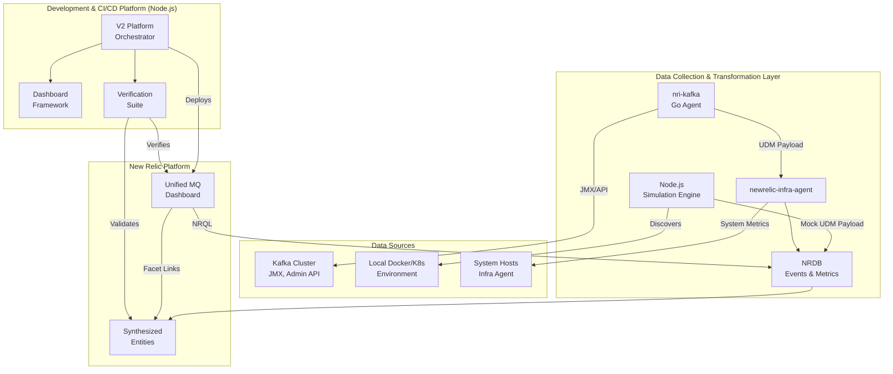

# Technical Specification: Unified Message Queuing (MQ) Observability Platform

**Version:** 1.1  
**Status:** FINAL  
**Last Updated:** January 2025

## 1.0 Overview & Vision

This document specifies the technical design for a comprehensive, provider-agnostic platform to monitor Message Queuing (MQ) systems within New Relic. The platform's vision is to provide a complete "CI/CD for Observability" lifecycle, encompassing data collection, simulation, transformation, dashboard generation, and automated verification.

### Core Tenets

- **Unified Data Model (UDM)**: A single, standardized data schema for all MQ telemetry, enabling consistent dashboards and alerts across providers (e.g., Kafka, RabbitMQ).
- **Dual-Mode Data Collection**: The platform supports both a production-grade Go agent (nri-kafka) for live environments and a high-fidelity Node.js simulator for development, testing, and demos.
- **Entity-Centric Observability**: All data is mapped to formal New Relic entities, enabling full platform integration with features like Entity Explorer, Workloads, and automated relationship mapping.
- **Verifiably Correct Dashboards**: Dashboards are not just created but are programmatically built, deployed, and validated end-to-end to guarantee functionality.

## 2.0 System Architecture

The platform is a composite system of two primary repositories working in concert.



### Components

- **Data Collection Layer (nri-kafka, newrelic-infra-agent)**: The production-grade collectors. nri-kafka is responsible for all Kafka-specific telemetry, which it transforms into the UDM. newrelic-infra-agent collects host metrics and acts as the transport for nri-kafka's payload.

- **Development & CI/CD Platform (Node.js)**: The control plane for building and validating the solution.
  - **Simulation Engine**: Generates mock UDM-compliant data for agentless development.
  - **Dashboard Framework**: A "dashboard-as-code" engine.
  - **Verification Suite**: A powerful CI/CD-style validator.
  - **V2 Platform Orchestrator**: A unified controller (`v2/platform-orchestrator.js`) designed to manage the platform's operational modes (simulation, deployment, verification).

## 3.0 Unified Data Model (UDM) Specification

### 3.1 Guiding Principles

The UDM is the canonical schema for all MQ data. It supports two query paradigms:

1. **Raw Event Querying**: Direct NRQL queries against Sample event types for maximum flexibility.
2. **Entity-Centric Querying**: Interaction with synthesized entities, enabling platform features and simplified filtering.

### 3.2 Event Types

| Event Type | Description | Source(s) |
|------------|-------------|-----------|
| `MessageQueueBrokerSample` | Performance and health metrics for a single broker node. | nri-kafka, Simulation Engine |
| `MessageQueueTopicSample` | Cluster-wide health and metadata for a topic. | nri-kafka (from Admin API), Simulation Engine |
| `MessageQueueOffsetSample` | Granular consumer group offset and lag data, per partition. | nri-kafka (`--consumer_offset` mode) |
| `SystemSample` (Built-in) | Host-level CPU, Memory, Disk, and Network metrics. | newrelic-infra-agent |

### 3.3 Entity Specification

Entities are synthesized from events in NRDB based on a defined set of identifying attributes.

| Entity Name | Entity Type | Populating Event(s) | Namespace | Identifying Attributes for GUID |
|-------------|-------------|---------------------|-----------|--------------------------------|
| MQ Broker | `MESSAGE_QUEUE_BROKER` | `MessageQueueBrokerSample` | `ka-broker` | `clusterName`, `provider`, `broker.id` |
| MQ Topic | `MESSAGE_QUEUE_TOPIC` | `MessageQueueTopicSample` | `ka-topic` | `clusterName`, `provider`, `topic.name` |
| MQ Consumer Group | `MESSAGE_QUEUE_CONSUMER` | `MessageQueueOffsetSample` | `ka-consumer-group` | `clusterName`, `provider`, `consumer.group.id` |
| Host | `HOST` | `SystemSample` | (none) | `hostname` (for automatic correlation with Broker) |

### 3.4 Detailed Attribute Specification

#### Broker Attributes

| Attribute | Type | Description | Source/Mapping (nri-kafka) |
|-----------|------|-------------|----------------------------|
| `broker.id` | String | The unique ID of the broker. | Kafka Broker ID. |
| `broker.hostname` | String | Broker hostname. Must match hostname from SystemSample. | Broker Host. |
| `broker.isController` | Boolean | 1 if this broker is the active controller, 0 otherwise. | JMX: `kafka.controller:type=KafkaController,name=ActiveControllerCount` |
| `broker.throughput.in.bytesPerSecond` | Float | Rate of bytes received by the broker. | JMX: `kafka.server:type=BrokerTopicMetrics,name=BytesInPerSec` (All Topics) |
| `broker.throughput.out.bytesPerSecond` | Float | Rate of bytes sent by the broker. | JMX: `kafka.server:type=BrokerTopicMetrics,name=BytesOutPerSec` (All Topics) |
| `broker.throughput.messagesPerSecond` | Float | Rate of messages received by the broker. | JMX: `kafka.server:type=BrokerTopicMetrics,name=MessagesInPerSec` (All Topics) |
| `broker.partitions.count` | Integer | Total number of partitions hosted on this broker. | JMX: `kafka.server:type=ReplicaManager,name=PartitionCount` |
| `broker.partitions.underReplicated.count` | Integer | Number of under-replicated partitions on this broker. | JMX: `kafka.server:type=ReplicaManager,name=UnderReplicatedPartitions` |
| `broker.topic.throughput.in.bytesPerSecond` | Float | Per-topic rate of bytes in. Attribute `topic.name` is attached. | JMX: `kafka.server:type=BrokerTopicMetrics,name=BytesInPerSec,topic=<TopicName>` |

#### Topic Attributes

| Attribute | Type | Description | Source/Mapping (nri-kafka) |
|-----------|------|-------------|----------------------------|
| `topic.name` | String | The name of the topic. | Kafka Topic Name. |
| `topic.partitions.count` | Integer | Total number of partitions for this topic. | Kafka Admin API: DescribeTopics |
| `topic.partitions.underReplicated.count` | Integer | Number of under-replicated partitions for this topic. | Kafka Admin API: Calculated by comparing Replicas vs. ISR list. |
| `topic.partitions.nonPreferredLeader.count` | Integer | Partitions whose leader is not the preferred replica. | Kafka Admin API: Calculated from partition metadata. |

#### Consumer Group Attributes

| Attribute | Type | Description | Source/Mapping (nri-kafka --consumer_offset) |
|-----------|------|-------------|----------------------------------------------|
| `consumer.group.id` | String | The ID of the consumer group. | Kafka Admin API: ListConsumerGroups |
| `topic.name` | String | The topic being consumed. | Kafka Admin API: ListConsumerGroupOffsets |
| `partition.id` | Integer | The partition ID. | Kafka Admin API: ListConsumerGroupOffsets |
| `consumer.offset.committed` | Integer | The last committed offset for this partition. | Kafka Admin API: ListConsumerGroupOffsets |
| `consumer.offset.latest` | Integer | The latest available offset (high-water mark). | Kafka Admin API: ListPartitionReassignments or similar |
| `consumer.lag` | Integer | The calculated lag (latest - committed). | Calculated in-agent. |
| `consumer.group.lag.total` | Integer | Aggregated metric on the Group Entity. Sum of lag. | Calculated in-agent by CGroupMetricsAggregator. |
| `consumer.group.lag.max` | Integer | Aggregated metric on the Group Entity. Max lag. | Calculated in-agent by CGroupMetricsAggregator. |

## 4.0 Data Collection and Transformation Flows

### 4.1 Flow: Production Instrumentation (nri-kafka + infra-agent)

This is the primary flow for live environments.

1. **Configuration & Execution**: The newrelic-infra-agent executes nri-kafka based on its `kafka-definition.yml`. The `kafka-config.yml` dictates behavior, including enabling JMX, specifying broker endpoints, or activating the `--consumer_offset` mode.

2. **Collection Mode Branching**:
   - **Default (Metrics)**: The agent spawns concurrent worker pools to connect to all brokers via JMX. It collects broker-level, topic-level, and client-level metrics.
   - **Offset Mode**: The agent uses the Sarama client to connect to the Kafka Admin API, bypassing JMX entirely. It performs the detailed consumer group offset collection as specified in the `consumeroffset` package.

3. **UDM Transformation**:
   - **Crucial Step**: All collected data is marshalled into the UDM format specified in Section 3.0. This mapping from raw JMX MBean names to the canonical UDM attributes is a core responsibility of the agent.
   - **MSK Shim Interception**: If `MSK_SHIM_ENABLED=true`, the `msk.GlobalMSKHook` intercepts the collected data before it's finalized. It performs a secondary transformation into an `AwsMsk...Sample` format and aggregates cluster-level metrics. The shim then adds these transformed entities and metrics to the final payload alongside the standard UDM data. This allows the same agent run to power both the Unified Dashboard and the AWS-specific New Relic UI.

4. **Ingestion**: The final JSON payload, containing UDM-compliant events, is passed to stdout, where the newrelic-infra-agent picks it up and sends it to New Relic.

### 4.2 Flow: Development & Testing (Node.js Simulation)

This flow enables rapid, agentless development.

1. **Configuration**: The `config/v2` directory defines the topology of the simulated environment (e.g., `simulation.json`).

2. **Execution**: The `v2/PlatformOrchestrator` is run in simulation mode.

3. **Generation & Streaming**: The `DataSimulator` engine generates realistic, time-series data that natively conforms to the UDM specification. The `NewRelicStreamer` then sends these events directly to the New Relic Event API. This perfectly mocks the output of the production agent, allowing for dashboard development and verification without a live Kafka cluster.

## 5.0 Dashboard CI/CD Platform (Node.js)

This platform automates the lifecycle of the monitoring dashboard.

1. **Content Definition**: `dashboards/content/message-queues-content-provider.js` acts as the single source of truth for the dashboard's content, defining pages, widgets, and the required UDM attributes for its NRQL queries.

2. **Generation Pipeline** (`build-and-verify-dashboards.js`):
   - The `DashboardFramework` ingests the content provider definition.
   - The `QueryBuilder` constructs NRQL queries targeting the UDM.
   - The `LayoutEngine` arranges widgets.
   - A dashboard JSON is generated.

3. **Verification Pipeline**:
   - **Static Analysis**: The `DashboardVerifier` validates the JSON structure.
   - **API Validation**: The `programmatic-dashboard-deploy.js` script iterates through every NRQL query, runs it against the New Relic API (using either simulated or real data), and confirms it returns a valid response. It attempts to auto-fix common syntax errors.
   - **Render Validation**: The `BrowserVerifier` uses Playwright to programmatically launch a browser, log in to New Relic, load the deployed dashboard, and check for any "We can't render this widget" errors, providing the ultimate functional validation.

4. **Deployment**: The validated dashboard is deployed to the target New Relic account via the NerdGraph API.

## 6.0 Unified Dashboard Specification

The platform will produce a single, unified dashboard titled "Message Queuing Observability".

### Page 1: Cluster Health Overview

**KPIs**:
- **Cluster Count**: `SELECT uniqueCount(clusterName) FROM MessageQueueBrokerSample`
- **Broker Count**: `SELECT uniqueCount(broker.id) FROM MessageQueueBrokerSample`
- **Total Throughput**: `SELECT sum(broker.throughput.in.bytesPerSecond) FROM MessageQueueBrokerSample`
- **Controller Status**: `SELECT latest(broker.hostname) FROM MessageQueueBrokerSample WHERE broker.isController = 1`

**Broker Health & Load**: Table
```sql
SELECT average(cpuPercent) as 'CPU', 
       average(memoryPercent) as 'Memory', 
       average(broker.throughput.in.bytesPerSecond) as 'Throughput' 
FROM SystemSample, MessageQueueBrokerSample 
FACET broker.hostname
```

### Page 2: Broker Deep Dive (Dashboard variable: `$brokerHostname`)

**System Performance**:
```sql
SELECT average(cpuPercent), 
       average(memoryUsedPercent), 
       average(diskUsedPercent) 
FROM SystemSample 
WHERE hostname = '$brokerHostname' 
TIMESERIES
```

**Kafka Throughput**:
```sql
SELECT average(broker.throughput.in.bytesPerSecond), 
       average(broker.throughput.out.bytesPerSecond) 
FROM MessageQueueBrokerSample 
WHERE broker.hostname = '$brokerHostname' 
TIMESERIES
```

**Partition Status**:
```sql
SELECT latest(broker.partitions.count), 
       latest(broker.partitions.underReplicated.count) 
FROM MessageQueueBrokerSample 
WHERE broker.hostname = '$brokerHostname' 
TIMESERIES
```

### Page 3: Topic & Lag Analysis (Dashboard variables: `$topicName`, `$consumerGroupId`)

**Topic Health**:
```sql
SELECT latest(topic.partitions.underReplicated.count) 
FROM MessageQueueTopicSample 
WHERE topic.name = '$topicName'
```

**Group Lag (Max)**:
```sql
SELECT max(consumer.lag) 
FROM MessageQueueOffsetSample 
WHERE consumer.group.id = '$consumerGroupId' 
TIMESERIES
```

**Lag by Topic for Group**:
```sql
SELECT sum(consumer.lag) 
FROM MessageQueueOffsetSample 
WHERE consumer.group.id = '$consumerGroupId' 
FACET topic.name
```

**Partition-level Lag Details**: Table
```sql
SELECT latest(consumer.lag) as 'Lag' 
FROM MessageQueueOffsetSample 
WHERE consumer.group.id = '$consumerGroupId' 
AND topic.name = '$topicName' 
FACET partition.id
```

## 7.0 Deployment and Operation

### Collector Deployment

1. Install `newrelic-infra-agent` on all Kafka hosts.
2. In the `integrations.d` directory, place the `nri-kafka` binary and `kafka-config.yml`.
3. Configure `kafka-config.yml` with JMX endpoints, credentials, and desired collection mode. For production monitoring, ensure the default metric mode is used. For lag audits, run an instance with `--consumer_offset true`.

### Dashboard Deployment

1. Clone the `deepaucksharma-hackathon-bootstrap` repository.
2. Set environment variables: 
   ```bash
   export NEW_RELIC_USER_API_KEY=...
   export NEW_RELIC_ACCOUNT_ID=...
   ```
3. Execute `node deploy-dashboard-with-validation.js`.
4. The platform will build, test, verify, and deploy the dashboard, outputting a permalink to the live, functional dashboard in New Relic.

## 8.0 Integration Points

### New Relic APIs

- **Event API**: For streaming simulated data and custom events
- **NerdGraph API**: For dashboard deployment and entity queries
- **Query API**: For dashboard validation and data verification

### Infrastructure

- **JMX**: Primary interface for Kafka metrics collection
- **Kafka Admin API**: For consumer group offset collection
- **Docker/Kubernetes**: For service discovery in containerized environments

## 9.0 Security Considerations

- All API keys should be stored as environment variables
- JMX connections should use SSL/TLS when available
- Follow principle of least privilege for Kafka Admin API access
- Dashboard deployment requires appropriate RBAC permissions

## 10.0 Future Enhancements

1. **Multi-Provider Support**: Extend beyond Kafka to RabbitMQ, ActiveMQ, etc.
2. **Automated Alerting**: Generate alert conditions based on UDM metrics
3. **Capacity Planning**: Add predictive analytics for resource planning
4. **Cost Optimization**: Track and optimize infrastructure costs
5. **ML Anomaly Detection**: Integrate with New Relic Applied Intelligence