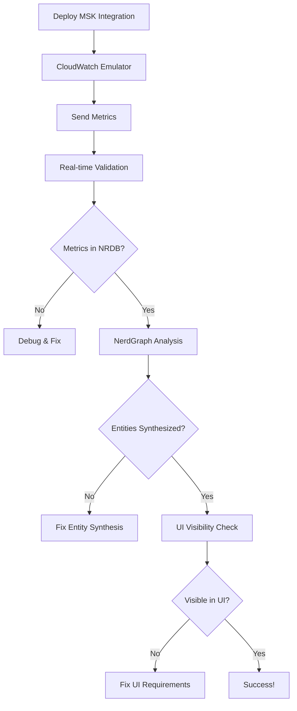

# UI Visibility Verification Strategy

## Overview

This document outlines a comprehensive strategy for verifying and ensuring AWS MSK metrics appear in the New Relic Message Queues UI. It builds upon the ultimate verification system and focuses specifically on UI visibility as the primary goal.

## Primary Goal

**Ensure AWS MSK entities are visible in the New Relic Message Queues UI**

### Success Criteria
1. MSK clusters appear in Message Queues home page
2. Broker and topic details are accessible
3. All UI filters and navigation work correctly
4. Health scores show 90%+ across all categories

## Verification Flow



## Phase 1: Metric Validation (NRDB)

### 1.1 Critical Metrics Check

```sql
-- Verify CloudWatch metrics are arriving
FROM Metric
SELECT count(*), uniqueCount(metricName)
WHERE collector.name = 'cloudwatch-metric-streams'
AND aws.Namespace = 'AWS/Kafka'
SINCE 10 minutes ago
```

### 1.2 Required Fields Validation

```sql
-- Check for UI-critical fields
FROM Metric
SELECT count(*),
  percentage(count(*), WHERE aws.accountId IS NOT NULL) as 'Has Account ID',
  percentage(count(*), WHERE aws.region IS NOT NULL) as 'Has Region',
  percentage(count(*), WHERE aws.Dimensions IS NOT NULL) as 'Has Dimensions'
WHERE collector.name = 'cloudwatch-metric-streams'
AND metricName LIKE '%Kafka%'
SINCE 10 minutes ago
```

### 1.3 Real-time Monitoring Script

```bash
#!/bin/bash
# real-time-metric-monitor.sh

while true; do
  clear
  echo "=== MSK Metric Monitor - $(date) ==="
  
  # Check metric count
  METRIC_COUNT=$(nrql "FROM Metric SELECT count(*) WHERE collector.name = 'cloudwatch-metric-streams' AND aws.Namespace = 'AWS/Kafka' SINCE 5 minutes ago" | jq '.results[0].count')
  echo "📊 Metrics received: $METRIC_COUNT"
  
  # Check unique entity types
  ENTITY_TYPES=$(nrql "FROM Metric SELECT uniqueCount(entity.type) WHERE collector.name = 'cloudwatch-metric-streams' SINCE 5 minutes ago" | jq '.results[0].uniqueCount')
  echo "🎯 Entity types: $ENTITY_TYPES"
  
  # Color-coded status
  if [ "$METRIC_COUNT" -gt 0 ]; then
    echo "✅ Status: RECEIVING METRICS"
  else
    echo "❌ Status: NO METRICS"
  fi
  
  sleep 30
done
```

## Phase 2: Entity Synthesis Validation (NerdGraph)

### 2.1 Entity Query via NerdGraph

```javascript
// validate-entity-synthesis.js
const { NerdGraphClient } = require('./nerdgraph-client');

async function validateEntitySynthesis(accountId) {
  const client = new NerdGraphClient(process.env.NEW_RELIC_API_KEY);
  
  const query = `
    {
      actor {
        account(id: ${accountId}) {
          entitySearch(query: "type IN ('AWS_KAFKA_CLUSTER', 'AWS_KAFKA_BROKER', 'AWS_KAFKA_TOPIC') AND reporting = 'true'") {
            count
            results {
              entities {
                guid
                name
                type
                reporting
                tags {
                  key
                  values
                }
                ... on AwsMskClusterEntity {
                  activeControllerCount
                  offlinePartitionsCount
                  clusterName
                  awsAccountId
                }
              }
            }
          }
        }
      }
    }
  `;
  
  const result = await client.query(query);
  const entities = result.actor.account.entitySearch.results.entities;
  
  console.log(`\n📊 Entity Synthesis Report`);
  console.log(`Found ${entities.length} MSK entities`);
  
  // Validate each entity
  entities.forEach(entity => {
    const validation = validateEntity(entity);
    console.log(`\n${validation.icon} ${entity.name}`);
    console.log(`  Type: ${entity.type}`);
    console.log(`  GUID: ${entity.guid}`);
    console.log(`  Issues: ${validation.issues.join(', ') || 'None'}`);
  });
  
  return entities;
}

function validateEntity(entity) {
  const issues = [];
  
  // Check critical tags
  const requiredTags = ['awsAccountId', 'awsRegion', 'providerAccountId'];
  const tags = entity.tags.reduce((acc, tag) => {
    acc[tag.key] = tag.values;
    return acc;
  }, {});
  
  requiredTags.forEach(required => {
    if (!tags[required]) {
      issues.push(`Missing ${required}`);
    }
  });
  
  // Special check for providerExternalId
  if (!tags.providerExternalId) {
    issues.push('CRITICAL: Missing providerExternalId');
  }
  
  return {
    icon: issues.length === 0 ? '✅' : '❌',
    issues
  };
}
```

### 2.2 Entity Relationship Validation

```javascript
// Check entity relationships
async function validateRelationships(accountId) {
  const query = `
    {
      actor {
        account(id: ${accountId}) {
          cluster: entitySearch(query: "type = 'AWS_KAFKA_CLUSTER'") {
            results {
              entities {
                guid
                name
                relatedEntities {
                  results {
                    count
                    entities {
                      guid
                      type
                      name
                    }
                  }
                }
              }
            }
          }
        }
      }
    }
  `;
  
  const result = await client.query(query);
  const clusters = result.actor.account.cluster.results.entities;
  
  clusters.forEach(cluster => {
    const relatedCount = cluster.relatedEntities.results.count;
    console.log(`\n🔗 Cluster: ${cluster.name}`);
    console.log(`   Related entities: ${relatedCount}`);
    
    if (relatedCount === 0) {
      console.log('   ❌ WARNING: No related entities found!');
    }
  });
}
```

## Phase 3: UI Visibility Verification

### 3.1 Message Queue UI Checks

```javascript
// ui-visibility-checks.js
class UIVisibilityChecker {
  constructor(accountId) {
    this.accountId = accountId;
    this.checks = {
      homePage: false,
      clusterList: false,
      brokerDetails: false,
      topicDetails: false,
      filters: false,
      navigation: false
    };
  }
  
  async runAllChecks() {
    console.log('\n🔍 Running UI Visibility Checks...\n');
    
    // Check 1: Home page visibility
    await this.checkHomePage();
    
    // Check 2: Cluster list
    await this.checkClusterList();
    
    // Check 3: Broker details
    await this.checkBrokerDetails();
    
    // Check 4: Topic details
    await this.checkTopicDetails();
    
    // Check 5: Filters
    await this.checkFilters();
    
    // Check 6: Navigation
    await this.checkNavigation();
    
    this.printReport();
  }
  
  async checkHomePage() {
    const query = `
      FROM AwsMskClusterSample
      SELECT count(*), uniqueCount(clusterName)
      WHERE providerAccountId IS NOT NULL
      SINCE 1 hour ago
    `;
    
    const result = await this.runQuery(query);
    this.checks.homePage = result.count > 0;
    
    console.log(`${this.checks.homePage ? '✅' : '❌'} Home Page: ${result.count} clusters found`);
  }
  
  async checkClusterList() {
    const query = `
      FROM AwsMskClusterSample
      SELECT latest(provider.activeControllerCount.Sum),
             latest(provider.offlinePartitionsCount.Sum),
             latest(provider.globalPartitionCount)
      FACET clusterName
      WHERE entity.guid IS NOT NULL
      SINCE 1 hour ago
    `;
    
    const result = await this.runQuery(query);
    this.checks.clusterList = result.facets && result.facets.length > 0;
    
    console.log(`${this.checks.clusterList ? '✅' : '❌'} Cluster List: ${result.facets?.length || 0} clusters with metrics`);
  }
  
  async checkBrokerDetails() {
    const query = `
      FROM AwsMskBrokerSample
      SELECT count(*), uniqueCount(provider.brokerId)
      WHERE entity.type = 'AWS_KAFKA_BROKER'
      AND providerExternalId IS NOT NULL
      SINCE 1 hour ago
    `;
    
    const result = await this.runQuery(query);
    this.checks.brokerDetails = result.count > 0;
    
    console.log(`${this.checks.brokerDetails ? '✅' : '❌'} Broker Details: ${result.uniqueCount || 0} brokers found`);
  }
  
  printReport() {
    console.log('\n📊 UI Visibility Report');
    console.log('=====================');
    
    const passed = Object.values(this.checks).filter(v => v).length;
    const total = Object.keys(this.checks).length;
    const score = Math.round((passed / total) * 100);
    
    console.log(`Overall Score: ${score}%`);
    console.log(`Passed: ${passed}/${total}`);
    
    if (score < 100) {
      console.log('\n⚠️  Action Required:');
      Object.entries(this.checks).forEach(([check, passed]) => {
        if (!passed) {
          console.log(`  - Fix ${check}`);
        }
      });
    } else {
      console.log('\n🎉 All UI visibility checks passed!');
    }
  }
}
```

### 3.2 Automated UI Navigation Test

```javascript
// Simulates UI navigation paths
async function testUINavigation() {
  const paths = [
    {
      name: 'Cluster to Broker',
      query: `
        FROM AwsMskClusterSample, AwsMskBrokerSample
        SELECT count(*)
        WHERE AwsMskClusterSample.clusterName = AwsMskBrokerSample.clusterName
        SINCE 1 hour ago
      `
    },
    {
      name: 'Broker to Topic',
      query: `
        FROM AwsMskBrokerSample, AwsMskTopicSample
        SELECT count(*)
        WHERE AwsMskBrokerSample.clusterName = AwsMskTopicSample.clusterName
        SINCE 1 hour ago
      `
    },
    {
      name: 'Dimensional Metrics',
      query: `
        FROM Metric
        SELECT count(*)
        WHERE metricName LIKE 'kafka.%'
        AND entity.guid IS NOT NULL
        SINCE 1 hour ago
      `
    }
  ];
  
  console.log('\n🧭 Testing UI Navigation Paths\n');
  
  for (const path of paths) {
    const result = await runQuery(path.query);
    const success = result.count > 0;
    console.log(`${success ? '✅' : '❌'} ${path.name}: ${result.count} connections`);
  }
}
```

## Phase 4: Continuous Monitoring

### 4.1 Real-time Dashboard

```javascript
// Create a live dashboard for monitoring
class UIVisibilityDashboard {
  constructor() {
    this.metrics = {
      entitiesCreated: 0,
      metricsReceived: 0,
      uiScore: 0,
      lastUpdate: null
    };
  }
  
  async start() {
    console.log('🚀 Starting UI Visibility Dashboard\n');
    
    setInterval(async () => {
      await this.update();
      this.render();
    }, 30000); // Update every 30 seconds
  }
  
  async update() {
    // Update metrics
    this.metrics.metricsReceived = await this.getMetricCount();
    this.metrics.entitiesCreated = await this.getEntityCount();
    this.metrics.uiScore = await this.calculateUIScore();
    this.metrics.lastUpdate = new Date();
  }
  
  render() {
    console.clear();
    console.log('╔════════════════════════════════════════╗');
    console.log('║     MSK UI Visibility Dashboard        ║');
    console.log('╠════════════════════════════════════════╣');
    console.log(`║ 📊 Metrics Received: ${this.metrics.metricsReceived.toString().padEnd(17)}║`);
    console.log(`║ 🎯 Entities Created: ${this.metrics.entitiesCreated.toString().padEnd(17)}║`);
    console.log(`║ 🏆 UI Score: ${(this.metrics.uiScore + '%').padEnd(24)}║`);
    console.log(`║ 🕐 Last Update: ${this.formatTime(this.metrics.lastUpdate).padEnd(21)}║`);
    console.log('╚════════════════════════════════════════╝');
    
    // Show alerts if needed
    if (this.metrics.uiScore < 80) {
      console.log('\n⚠️  ALERT: UI visibility score below threshold!');
    }
  }
}
```

### 4.2 Alert Configuration

```yaml
# new-relic-alerts.yaml
alerts:
  - name: MSK UI Visibility Alert
    conditions:
      - type: NRQL
        query: |
          FROM AwsMskClusterSample
          SELECT percentage(count(*), WHERE entity.guid IS NOT NULL)
          WHERE providerExternalId IS NOT NULL
        threshold: 80
        operator: BELOW
        duration: 5 minutes
        
  - name: Entity Synthesis Failure
    conditions:
      - type: NRQL
        query: |
          FROM Metric
          SELECT count(*)
          WHERE collector.name = 'cloudwatch-metric-streams'
          AND entity.guid IS NULL
        threshold: 100
        operator: ABOVE
        duration: 10 minutes
```

## Phase 5: Troubleshooting Workflow

### 5.1 Diagnostic Script

```bash
#!/bin/bash
# diagnose-ui-visibility.sh

echo "🔍 MSK UI Visibility Diagnostic Tool"
echo "===================================="

# Step 1: Check metrics
echo -e "\n1️⃣ Checking Metrics..."
METRICS=$(nrql "FROM Metric SELECT count(*) WHERE collector.name = 'cloudwatch-metric-streams' SINCE 10 minutes ago")
if [ "$METRICS" -eq 0 ]; then
  echo "❌ No CloudWatch metrics found"
  echo "   Fix: Check CloudWatch emulator is running"
  exit 1
fi
echo "✅ Found $METRICS metrics"

# Step 2: Check entities
echo -e "\n2️⃣ Checking Entities..."
ENTITIES=$(nrql "FROM entity SELECT count(*) WHERE type LIKE '%KAFKA%' SINCE 1 hour ago")
if [ "$ENTITIES" -eq 0 ]; then
  echo "❌ No Kafka entities found"
  echo "   Fix: Check entity synthesis - missing required fields?"
  exit 1
fi
echo "✅ Found $ENTITIES entities"

# Step 3: Check critical fields
echo -e "\n3️⃣ Checking Critical Fields..."
PROVIDER_EXTERNAL_ID=$(nrql "FROM AwsMskClusterSample SELECT count(*) WHERE providerExternalId IS NOT NULL SINCE 1 hour ago")
if [ "$PROVIDER_EXTERNAL_ID" -eq 0 ]; then
  echo "❌ Missing providerExternalId (CRITICAL!)"
  echo "   Fix: Add providerExternalId = AWS Account ID"
  exit 1
fi
echo "✅ providerExternalId present"

# Step 4: Check UI queries
echo -e "\n4️⃣ Checking UI Queries..."
UI_QUERY=$(nrql "FROM AwsMskClusterSample SELECT count(*) WHERE entity.guid IS NOT NULL AND providerAccountId IS NOT NULL SINCE 1 hour ago")
if [ "$UI_QUERY" -eq 0 ]; then
  echo "❌ UI queries returning no results"
  echo "   Fix: Check entity.guid and providerAccountId"
  exit 1
fi
echo "✅ UI queries working"

echo -e "\n✅ All checks passed! MSK should be visible in UI"
```

## Success Metrics

### Primary KPIs
1. **UI Visibility Score**: 90%+ (clusters, brokers, topics visible)
2. **Entity Synthesis Rate**: 100% (all metrics create entities)
3. **Field Completeness**: 100% (all required fields present)
4. **Navigation Success**: 100% (all UI paths work)

### Monitoring Query
```sql
-- Overall UI Health Score
FROM AwsMskClusterSample, AwsMskBrokerSample, AwsMskTopicSample
SELECT 
  percentage(count(*), WHERE AwsMskClusterSample.entity.guid IS NOT NULL) as 'Cluster Visibility',
  percentage(count(*), WHERE AwsMskBrokerSample.entity.guid IS NOT NULL) as 'Broker Visibility',
  percentage(count(*), WHERE AwsMskTopicSample.entity.guid IS NOT NULL) as 'Topic Visibility',
  percentage(count(*), WHERE AwsMskClusterSample.providerExternalId IS NOT NULL) as 'Account Mapping'
SINCE 1 hour ago
```

## Implementation Timeline

### Day 1: Foundation
- Deploy CloudWatch emulator
- Verify metrics in NRDB
- Run basic validation

### Day 2: Entity Validation
- Implement NerdGraph checks
- Validate entity synthesis
- Fix missing fields

### Day 3: UI Testing
- Run all UI visibility checks
- Test navigation paths
- Fix any gaps

### Day 4: Monitoring
- Set up continuous monitoring
- Configure alerts
- Create dashboard

### Day 5: Production
- Final validation
- Documentation
- Handoff to operations

## Key Takeaways

1. **providerExternalId is CRITICAL** - Without it, no UI visibility
2. **Use NerdGraph for deep validation** - More powerful than basic NRQL
3. **Test actual UI paths** - Don't just check if data exists
4. **Monitor continuously** - UI visibility can break silently
5. **Automate everything** - Manual checks don't scale

Remember: The goal is not just to have metrics, but to ensure they appear correctly in the Message Queues UI!