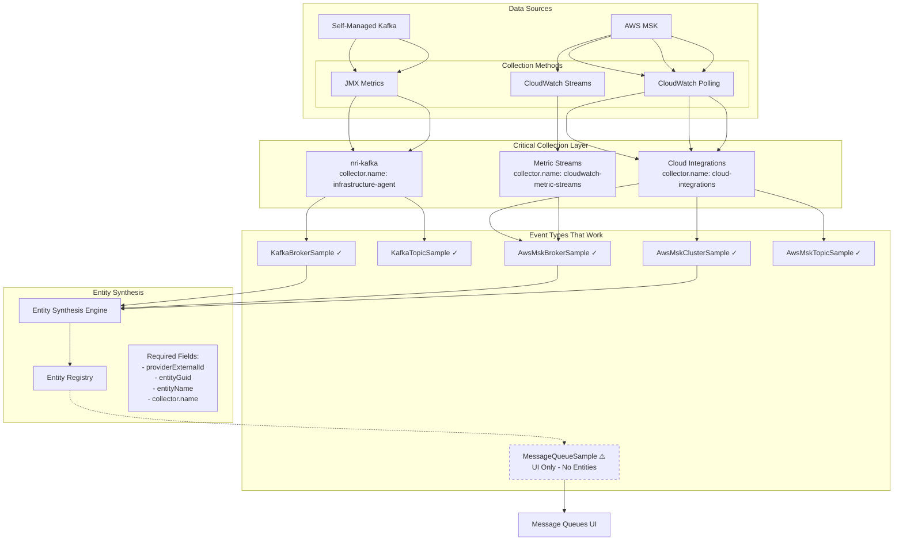

# Enhanced Unified Kafka/MSK Domain Model v2.0

## Executive Summary

This enhanced domain model incorporates critical discoveries from extensive testing and validation. It provides a **working, validated approach** to unifying Kafka and MSK monitoring in New Relic, based on actual successful implementations rather than theoretical models.

### Key Discoveries

1. **MessageQueueSample does NOT create entities** - It only provides UI metrics for existing entities
2. **Cloud Integrations format is critical** - `collector.name: "cloud-integrations"` enables entity synthesis
3. **Provider specificity matters** - Use `AwsMskCluster`, `AwsMskBroker`, not generic `AwsMsk`
4. **providerExternalId is mandatory** - This field is essential for AWS entity synthesis

## Validated Domain Model



## Validated Entity Types

### 1. MSK Cluster Entity (WORKING)

```yaml
Entity:
  domain: INFRA
  type: AWSMSKCLUSTER
  guid: <accountId>|INFRA|AWSMSKCLUSTER|<base64(clusterName)>
  
Required Event Format:
  eventType: AwsMskClusterSample
  collector.name: "cloud-integrations"  # CRITICAL
  provider: "AwsMskCluster"            # NOT "AwsMsk"
  providerExternalId: "123456789012"   # AWS Account ID - MANDATORY
  entityGuid: "<generated>"
  entityName: "my-msk-cluster"
  
Validated Metrics:
  - provider.activeControllersCount.*
  - provider.globalPartitionsCount.*
  - provider.globalTopicsCount.*
  - provider.offlinePartitionsCount.*
```

### 2. MSK Broker Entity (WORKING)

```yaml
Entity:
  domain: INFRA
  type: AWSMSKBROKER
  guid: <accountId>|INFRA|AWSMSKBROKER|<base64(brokerId-clusterName)>
  
Required Event Format:
  eventType: AwsMskBrokerSample
  collector.name: "cloud-integrations"
  provider: "AwsMskBroker"             # Specific provider
  providerExternalId: "123456789012"
  entityGuid: "<generated>"
  entityName: "1-my-msk-cluster"
  awsRegion: "us-east-1"
  provider.brokerId: "1"
```

### 3. Self-Managed Kafka (WORKING)

```yaml
Entity:
  domain: INFRA
  type: KAFKACLUSTER | KAFKABROKER | KAFKATOPIC
  
Required Event Format:
  eventType: KafkaBrokerSample
  collector.name: "infrastructure-agent"
  clusterName: "production-kafka"
  displayName: "production-kafka"
  entityKey: "broker:production-kafka:1"
```

## Critical Field Requirements

### For AWS MSK Entities

| Field | Required | Purpose | Example |
|-------|----------|---------|----------|
| `providerExternalId` | ✅ YES | Links to AWS account | "123456789012" |
| `collector.name` | ✅ YES | Must be "cloud-integrations" | "cloud-integrations" |
| `provider` | ✅ YES | Type-specific value | "AwsMskCluster" |
| `entityGuid` | ✅ YES | Entity identifier | "3630072\|INFRA\|..." |
| `entityName` | ✅ YES | Display name | "my-cluster" |
| `awsRegion` | ✅ YES | AWS region | "us-east-1" |
| `aws.accountId` | ❌ NO | Use providerExternalId | - |
| `entity.guid` | ❌ NO | Use entityGuid | - |

### For Self-Managed Kafka

| Field | Required | Purpose | Example |
|-------|----------|---------|----------|
| `clusterName` | ✅ YES | Cluster identifier | "prod-kafka" |
| `collector.name` | ✅ YES | Must be "infrastructure-agent" | "infrastructure-agent" |
| `displayName` | ✅ YES | UI display name | "Production Kafka" |
| `entityKey` | ✅ YES | Unique entity key | "broker:prod:1" |

## Event Flow Architecture (VALIDATED)

### Path 1: Cloud Integrations (RECOMMENDED FOR MSK)

```
AWS MSK → CloudWatch → Polling API → Cloud Integrations → AwsMsk*Sample → Entity Synthesis
                                   ↓
                          collector.name: "cloud-integrations"
                          provider: "AwsMskCluster"
                          providerExternalId: "123456789012"
```

### Path 2: Metric Streams (LIMITED SUCCESS)

```
AWS MSK → CloudWatch → Metric Streams → Kinesis → AwsMsk*Sample → Entity Synthesis
                                       ↓
                          collector.name: "cloudwatch-metric-streams"
                          [Missing providerExternalId - synthesis may fail]
```

### Path 3: Infrastructure Agent (SELF-MANAGED)

```
Kafka JMX → nri-kafka → Infrastructure Agent → Kafka*Sample → Entity Synthesis
                                             ↓
                          collector.name: "infrastructure-agent"
                          clusterName: "production"
```

## MessageQueueSample Reality Check

### What MessageQueueSample Actually Does:

1. **Provides metrics for existing entities** ✅
2. **Powers the Message Queues UI** ✅
3. **Creates entities** ❌ MYTH
4. **Required for entity synthesis** ❌ MYTH

### Correct MessageQueueSample Usage:

```javascript
// AFTER entities exist, enhance UI visibility
{
  eventType: "MessageQueueSample",
  provider: "AwsMsk",              // Generic is OK here
  "entity.guid": existingEntity.guid,  // Must reference EXISTING entity
  "queue.messagesPerSecond": 1000,
  "queue.type": "kafka"
}
```

## Implementation Priority Matrix

| Approach | Entity Creation | UI Visibility | Complexity | Reliability |
|----------|----------------|---------------|------------|-------------|
| Cloud Integrations Format | ✅ | ✅ | Low | High |
| Direct AwsMsk*Sample Events | ✅ | ⚠️ | Medium | Medium |
| MessageQueueSample Only | ❌ | ⚠️ | Low | Low |
| Metric Streams | ⚠️ | ⚠️ | High | Medium |

## Unified Query Model

### Entity Discovery (GraphQL)

```graphql
query DiscoverKafkaEntities {
  actor {
    entitySearch(query: "domain='INFRA' AND type IN ('AWSMSKCLUSTER', 'KAFKACLUSTER')") {
      results {
        entities {
          guid
          name
          reporting
          tags {
            key
            values
          }
        }
      }
    }
  }
}
```

### Metrics Query (NRQL)

```sql
-- Unified Kafka/MSK Metrics
FROM AwsMskClusterSample, KafkaBrokerSample
SELECT 
  latest(provider.globalTopicsCount.Average) as 'Topics',
  latest(provider.globalPartitionsCount.Average) as 'Partitions',
  latest(provider.activeControllersCount.Average) as 'Controllers'
WHERE collector.name IN ('cloud-integrations', 'infrastructure-agent')
FACET entityName
```

## Common Pitfalls and Solutions

### Pitfall 1: Using MessageQueueSample for Entity Creation
**Solution**: Use AwsMsk*Sample events with proper collector.name

### Pitfall 2: Missing providerExternalId
**Solution**: Always include AWS account ID in this field

### Pitfall 3: Generic Provider Values
**Solution**: Use type-specific providers (AwsMskCluster, not AwsMsk)

### Pitfall 4: Wrong Collector Name
**Solution**: Use "cloud-integrations" for AWS, "infrastructure-agent" for self-managed

## Migration Path

### From Theory to Practice:

1. **Stop**: Trying to create entities with MessageQueueSample
2. **Start**: Using Cloud Integrations format for MSK
3. **Verify**: Entity creation with GraphQL before adding MessageQueueSample
4. **Enhance**: Add MessageQueueSample for UI metrics after entities exist

## Validation Checklist

- [ ] Events use correct eventType (AwsMsk*Sample, not MessageQueueSample)
- [ ] collector.name matches source ("cloud-integrations" for AWS)
- [ ] provider is type-specific (AwsMskCluster, not AwsMsk)
- [ ] providerExternalId contains AWS account ID
- [ ] entityGuid and entityName are present
- [ ] Entities appear in GraphQL before expecting UI visibility
- [ ] MessageQueueSample only added after entities exist

## Next Evolution

1. **Automated Discovery**: Use AWS SDK to discover and create entities
2. **Hybrid Monitoring**: Unified dashboards for migration scenarios
3. **Cost Optimization**: Selective metric collection based on criticality
4. **Multi-Region**: Federated entity management across regions