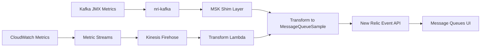

# Production Implementation Guide for AWS MSK in Message Queues UI

## Table of Contents
1. [Architecture Overview](#architecture-overview)
2. [Implementation Checklist](#implementation-checklist)
3. [Code Templates](#code-templates)
4. [Metric Mappings](#metric-mappings)
5. [Validation Queries](#validation-queries)
6. [Troubleshooting](#troubleshooting)
7. [Performance Considerations](#performance-considerations)

## Architecture Overview



## Implementation Checklist

### Phase 1: Core Implementation
- [ ] Implement MessageQueueSample transformation
- [ ] Map all golden metrics to queue.* namespace
- [ ] Add AWS context fields
- [ ] Set correct entity types (AWSMSKCLUSTER, etc.)
- [ ] Include timestamp and provider fields

### Phase 2: Metric Completeness
- [ ] Map all CloudWatch metric names
- [ ] Include metric aggregations where applicable
- [ ] Add custom attributes for MSK-specific data
- [ ] Implement metric unit conversions

### Phase 3: Relationships & Context
- [ ] Add awsMskClusterName to all entities
- [ ] Include awsMskBrokerId for brokers
- [ ] Add AWS tags as attributes
- [ ] Include cluster state information

### Phase 4: Production Readiness
- [ ] Add error handling and retries
- [ ] Implement metric batching
- [ ] Add logging and monitoring
- [ ] Configure rate limiting
- [ ] Set up health checks

## Code Templates

### 1. Go Implementation for nri-kafka MSK Shim

```go
package msk

import (
    "fmt"
    "strings"
    "time"
)

// MessageQueueEvent represents a MessageQueueSample event
type MessageQueueEvent struct {
    EventType     string                 `json:"eventType"`
    Timestamp     int64                  `json:"timestamp"`
    Provider      string                 `json:"provider"`
    CollectorName string                 `json:"collector.name"`
    QueueName     string                 `json:"queue.name"`
    QueueType     string                 `json:"queue.type"`
    EntityName    string                 `json:"entity.name"`
    EntityType    string                 `json:"entity.type"`
    Attributes    map[string]interface{} `json:"-"`
}

// TransformToMessageQueue converts MSK metrics to MessageQueueSample events
func TransformToMessageQueue(entityType, entityName, clusterName string, metrics map[string]float64, metadata map[string]string) *MessageQueueEvent {
    event := &MessageQueueEvent{
        EventType:     "MessageQueueSample",
        Timestamp:     time.Now().UnixMilli(),
        Provider:      "AwsMsk",
        CollectorName: "cloudwatch-metric-streams",
        QueueName:     entityName,
        EntityName:    entityName,
        Attributes:    make(map[string]interface{}),
    }
    
    // Set entity type and queue type
    switch entityType {
    case "cluster":
        event.EntityType = "AWSMSKCLUSTER"
        event.QueueType = "kafka_cluster"
    case "broker":
        event.EntityType = "AWSMSKBROKER"
        event.QueueType = "kafka_broker"
    case "topic":
        event.EntityType = "AWSMSKTOPIC"
        event.QueueType = "kafka_topic"
    }
    
    // Add AWS context
    event.Attributes["awsMskClusterName"] = clusterName
    event.Attributes["awsAccountId"] = metadata["accountId"]
    event.Attributes["awsRegion"] = metadata["region"]
    
    // Map metrics to queue namespace
    for metricName, value := range metrics {
        // Map to queue.* namespace
        queueMetricName := mapToQueueMetric(entityType, metricName)
        if queueMetricName != "" {
            event.Attributes[queueMetricName] = value
        }
        
        // Also include original metric name
        event.Attributes[metricName] = value
    }
    
    // Add entity-specific attributes
    addEntitySpecificAttributes(event, entityType, metadata)
    
    return event
}

// mapToQueueMetric maps CloudWatch metric names to queue.* namespace
func mapToQueueMetric(entityType, metricName string) string {
    metricMappings := map[string]map[string]string{
        "cluster": {
            "ActiveControllerCount":    "queue.activeControllers",
            "GlobalPartitionCount":     "queue.globalPartitions",
            "OfflinePartitionsCount":   "queue.offlinePartitions",
            "GlobalTopicCount":         "queue.topicCount",
        },
        "broker": {
            "BytesInPerSec":           "queue.bytesInPerSecond",
            "BytesOutPerSec":          "queue.bytesOutPerSecond",
            "MessagesInPerSec":        "queue.messagesPerSecond",
            "CpuUser":                 "queue.cpuPercent",
            "NetworkRxDropped":        "queue.networkRxDropped",
            "NetworkTxDropped":        "queue.networkTxDropped",
            "MemoryUsed":              "queue.memoryPercent",
            "RootDiskUsed":            "queue.diskUsedPercent",
        },
        "topic": {
            "MessagesInPerSec":        "queue.messagesPerSecond",
            "BytesInPerSec":           "queue.bytesInPerSecond",
            "BytesOutPerSec":          "queue.bytesOutPerSecond",
            "SumOffsetLag":            "queue.consumerLag",
            "PartitionCount":          "queue.partitionCount",
            "ReplicationFactor":       "queue.replicationFactor",
        },
    }
    
    if mappings, ok := metricMappings[entityType]; ok {
        // Handle different metric name formats
        cleanMetricName := strings.ReplaceAll(metricName, "provider.", "")
        cleanMetricName = strings.ReplaceAll(cleanMetricName, ".Average", "")
        
        if queueName, exists := mappings[cleanMetricName]; exists {
            return queueName
        }
    }
    
    return ""
}

// addEntitySpecificAttributes adds entity-specific attributes
func addEntitySpecificAttributes(event *MessageQueueEvent, entityType string, metadata map[string]string) {
    switch entityType {
    case "broker":
        if brokerId, ok := metadata["brokerId"]; ok {
            event.Attributes["awsMskBrokerId"] = brokerId
            event.Attributes["brokerId"] = brokerId
        }
        if az, ok := metadata["availabilityZone"]; ok {
            event.Attributes["aws.availabilityZone"] = az
        }
    case "topic":
        if topicName, ok := metadata["topicName"]; ok {
            event.Attributes["topicName"] = topicName
        }
    case "cluster":
        if clusterArn, ok := metadata["clusterArn"]; ok {
            event.Attributes["clusterArn"] = clusterArn
        }
        event.Attributes["queue.brokerCount"] = metadata["brokerCount"]
    }
}

// ToMap converts the event to a map for JSON serialization
func (e *MessageQueueEvent) ToMap() map[string]interface{} {
    result := map[string]interface{}{
        "eventType":      e.EventType,
        "timestamp":      e.Timestamp,
        "provider":       e.Provider,
        "collector.name": e.CollectorName,
        "queue.name":     e.QueueName,
        "queue.type":     e.QueueType,
        "entity.name":    e.EntityName,
        "entity.type":    e.EntityType,
    }
    
    // Add all attributes
    for k, v := range e.Attributes {
        result[k] = v
    }
    
    return result
}
```

### 2. Python Lambda for CloudWatch Metric Streams

```python
import json
import base64
import gzip
import time
from datetime import datetime

# Metric name mappings
METRIC_MAPPINGS = {
    'cluster': {
        'ActiveControllerCount': 'queue.activeControllers',
        'GlobalPartitionCount': 'queue.globalPartitions',
        'OfflinePartitionsCount': 'queue.offlinePartitions',
        'GlobalTopicCount': 'queue.topicCount',
        'ZooKeeperSessionState': 'queue.zookeeperState',
    },
    'broker': {
        'BytesInPerSec': 'queue.bytesInPerSecond',
        'BytesOutPerSec': 'queue.bytesOutPerSecond',
        'MessagesInPerSec': 'queue.messagesPerSecond',
        'CpuUser': 'queue.cpuPercent',
        'NetworkRxDropped': 'queue.networkRxDropped',
        'NetworkTxDropped': 'queue.networkTxDropped',
        'MemoryUsed': 'queue.memoryPercent',
        'RootDiskUsed': 'queue.diskUsedPercent',
    },
    'topic': {
        'MessagesInPerSec': 'queue.messagesPerSecond',
        'BytesInPerSec': 'queue.bytesInPerSecond',
        'BytesOutPerSec': 'queue.bytesOutPerSecond',
        'SumOffsetLag': 'queue.consumerLag',
    }
}

def lambda_handler(event, context):
    """Transform CloudWatch Metric Streams data to MessageQueueSample events"""
    
    output_records = []
    
    for record in event['records']:
        # Decode the data
        compressed_data = base64.b64decode(record['data'])
        decompressed_data = gzip.decompress(compressed_data)
        metric_data = json.loads(decompressed_data)
        
        # Process each metric
        if metric_data.get('namespace') == 'AWS/Kafka':
            transformed = transform_to_messagequeue(metric_data)
            if transformed:
                # Encode the result
                output_data = base64.b64encode(
                    json.dumps(transformed).encode('utf-8')
                ).decode('utf-8')
                
                output_records.append({
                    'recordId': record['recordId'],
                    'result': 'Ok',
                    'data': output_data
                })
            else:
                output_records.append({
                    'recordId': record['recordId'],
                    'result': 'Dropped'
                })
    
    return {'records': output_records}

def transform_to_messagequeue(metric_data):
    """Transform CloudWatch metric to MessageQueueSample format"""
    
    dimensions = {d['name']: d['value'] for d in metric_data.get('dimensions', [])}
    
    # Determine entity type
    entity_type = None
    entity_name = None
    queue_type = None
    
    if 'Cluster Name' in dimensions and 'Broker ID' in dimensions:
        entity_type = 'AWSMSKBROKER'
        queue_type = 'kafka_broker'
        entity_name = f"{dimensions['Cluster Name']}-broker-{dimensions['Broker ID']}"
    elif 'Cluster Name' in dimensions and 'Topic' in dimensions:
        entity_type = 'AWSMSKTOPIC'
        queue_type = 'kafka_topic'
        entity_name = f"{dimensions['Cluster Name']}-{dimensions['Topic']}"
    elif 'Cluster Name' in dimensions:
        entity_type = 'AWSMSKCLUSTER'
        queue_type = 'kafka_cluster'
        entity_name = dimensions['Cluster Name']
    else:
        return None
    
    # Build the event
    event = {
        'eventType': 'MessageQueueSample',
        'timestamp': int(metric_data['timestamp']),
        'provider': 'AwsMsk',
        'collector.name': 'cloudwatch-metric-streams',
        'queue.name': entity_name,
        'queue.type': queue_type,
        'entity.name': entity_name,
        'entity.type': entity_type,
        'awsAccountId': metric_data['account_id'],
        'awsRegion': metric_data['region'],
        'awsMskClusterName': dimensions.get('Cluster Name'),
    }
    
    # Add broker ID if present
    if 'Broker ID' in dimensions:
        event['awsMskBrokerId'] = dimensions['Broker ID']
    
    # Map the metric
    metric_name = metric_data['metric_name']
    metric_value = metric_data['value']
    
    # Determine entity category
    if entity_type == 'AWSMSKBROKER':
        category = 'broker'
    elif entity_type == 'AWSMSKTOPIC':
        category = 'topic'
    else:
        category = 'cluster'
    
    # Map to queue metric name
    if category in METRIC_MAPPINGS and metric_name in METRIC_MAPPINGS[category]:
        queue_metric_name = METRIC_MAPPINGS[category][metric_name]
        event[queue_metric_name] = metric_value['sum'] / metric_value['count'] if 'count' in metric_value else metric_value
    
    # Also add original metric name
    event[f"cloudwatch.{metric_name}"] = metric_value
    
    # Add metric statistics
    if isinstance(metric_value, dict):
        for stat, val in metric_value.items():
            event[f"{metric_name}.{stat}"] = val
    
    return event
```

### 3. Node.js Implementation for Direct Submission

```javascript
const https = require('https');

class MSKMessageQueueTransformer {
  constructor(accountId, insertKey) {
    this.accountId = accountId;
    this.insertKey = insertKey;
    this.batchSize = 100;
    this.eventBuffer = [];
  }

  // Transform MSK metrics to MessageQueueSample
  transformToMessageQueue(entityType, entityName, clusterName, metrics, metadata = {}) {
    const event = {
      eventType: 'MessageQueueSample',
      timestamp: Date.now(),
      provider: 'AwsMsk',
      'collector.name': 'cloudwatch-metric-streams',
      'queue.name': entityName,
      'entity.name': entityName,
      awsMskClusterName: clusterName,
      awsAccountId: metadata.accountId || this.accountId,
      awsRegion: metadata.region || 'us-east-1'
    };

    // Set entity type and queue type
    switch (entityType) {
      case 'cluster':
        event['entity.type'] = 'AWSMSKCLUSTER';
        event['queue.type'] = 'kafka_cluster';
        break;
      case 'broker':
        event['entity.type'] = 'AWSMSKBROKER';
        event['queue.type'] = 'kafka_broker';
        event.awsMskBrokerId = metadata.brokerId;
        break;
      case 'topic':
        event['entity.type'] = 'AWSMSKTOPIC';
        event['queue.type'] = 'kafka_topic';
        event.topicName = metadata.topicName;
        break;
    }

    // Map metrics
    const metricMappings = this.getMetricMappings()[entityType] || {};
    
    Object.entries(metrics).forEach(([metricName, value]) => {
      // Clean metric name
      const cleanName = metricName
        .replace('provider.', '')
        .replace('.Average', '')
        .replace('.Sum', '');
      
      // Map to queue namespace
      if (metricMappings[cleanName]) {
        event[metricMappings[cleanName]] = value;
      }
      
      // Include original metric
      event[metricName] = value;
    });

    return event;
  }

  getMetricMappings() {
    return {
      cluster: {
        'ActiveControllerCount': 'queue.activeControllers',
        'GlobalPartitionCount': 'queue.globalPartitions',
        'OfflinePartitionsCount': 'queue.offlinePartitions',
        'GlobalTopicCount': 'queue.topicCount',
      },
      broker: {
        'BytesInPerSec': 'queue.bytesInPerSecond',
        'BytesOutPerSec': 'queue.bytesOutPerSecond',
        'MessagesInPerSec': 'queue.messagesPerSecond',
        'CpuUser': 'queue.cpuPercent',
        'NetworkRxDropped': 'queue.networkRxDropped',
        'NetworkTxDropped': 'queue.networkTxDropped',
      },
      topic: {
        'MessagesInPerSec': 'queue.messagesPerSecond',
        'BytesInPerSec': 'queue.bytesInPerSecond',
        'BytesOutPerSec': 'queue.bytesOutPerSecond',
        'SumOffsetLag': 'queue.consumerLag',
      }
    };
  }

  // Add event to buffer
  addEvent(event) {
    this.eventBuffer.push(event);
    
    if (this.eventBuffer.length >= this.batchSize) {
      return this.flush();
    }
    
    return Promise.resolve();
  }

  // Send buffered events to New Relic
  async flush() {
    if (this.eventBuffer.length === 0) {
      return;
    }

    const events = [...this.eventBuffer];
    this.eventBuffer = [];

    return this.sendToNewRelic(events);
  }

  async sendToNewRelic(events) {
    const data = JSON.stringify(events);
    
    const options = {
      hostname: 'insights-collector.newrelic.com',
      path: `/v1/accounts/${this.accountId}/events`,
      method: 'POST',
      headers: {
        'Content-Type': 'application/json',
        'X-Insert-Key': this.insertKey,
        'Content-Length': data.length
      }
    };

    return new Promise((resolve, reject) => {
      const req = https.request(options, (res) => {
        let body = '';
        res.on('data', chunk => body += chunk);
        res.on('end', () => {
          if (res.statusCode >= 200 && res.statusCode < 300) {
            resolve({ status: res.statusCode, body });
          } else {
            reject(new Error(`HTTP ${res.statusCode}: ${body}`));
          }
        });
      });

      req.on('error', reject);
      req.write(data);
      req.end();
    });
  }
}

module.exports = MSKMessageQueueTransformer;
```

## Metric Mappings

### Cluster Metrics

| CloudWatch Metric | MessageQueueSample Field | Description |
|-------------------|-------------------------|-------------|
| ActiveControllerCount | queue.activeControllers | Number of active controllers |
| GlobalPartitionCount | queue.globalPartitions | Total partitions across cluster |
| OfflinePartitionsCount | queue.offlinePartitions | Number of offline partitions |
| GlobalTopicCount | queue.topicCount | Total number of topics |
| ZooKeeperSessionState | queue.zookeeperState | ZK session state (1=connected) |

### Broker Metrics

| CloudWatch Metric | MessageQueueSample Field | Description |
|-------------------|-------------------------|-------------|
| BytesInPerSec | queue.bytesInPerSecond | Incoming bytes per second |
| BytesOutPerSec | queue.bytesOutPerSecond | Outgoing bytes per second |
| MessagesInPerSec | queue.messagesPerSecond | Incoming messages per second |
| CpuUser | queue.cpuPercent | CPU usage percentage |
| MemoryUsed | queue.memoryPercent | Memory usage percentage |
| RootDiskUsed | queue.diskUsedPercent | Disk usage percentage |
| NetworkRxDropped | queue.networkRxDropped | Dropped receive packets |
| NetworkTxDropped | queue.networkTxDropped | Dropped transmit packets |

### Topic Metrics

| CloudWatch Metric | MessageQueueSample Field | Description |
|-------------------|-------------------------|-------------|
| MessagesInPerSec | queue.messagesPerSecond | Messages produced per second |
| BytesInPerSec | queue.bytesInPerSecond | Bytes produced per second |
| BytesOutPerSec | queue.bytesOutPerSecond | Bytes consumed per second |
| SumOffsetLag | queue.consumerLag | Total consumer lag |

## Validation Queries

### 1. Verify Events Are Being Received

```sql
FROM MessageQueueSample 
SELECT count(*), uniques(entity.type), uniques(queue.type) 
WHERE provider = 'AwsMsk' 
SINCE 1 hour ago
```

### 2. Check Cluster Health

```sql
FROM MessageQueueSample 
SELECT latest(queue.activeControllers), 
       latest(queue.offlinePartitions), 
       latest(queue.globalPartitions)
WHERE entity.type = 'AWSMSKCLUSTER' 
FACET entity.name 
SINCE 30 minutes ago
```

### 3. Monitor Broker Performance

```sql
FROM MessageQueueSample 
SELECT average(queue.cpuPercent), 
       average(queue.bytesInPerSecond)/1000000 as 'MB/s In',
       average(queue.bytesOutPerSecond)/1000000 as 'MB/s Out'
WHERE entity.type = 'AWSMSKBROKER' 
FACET entity.name 
SINCE 1 hour ago 
TIMESERIES
```

### 4. Track Topic Throughput

```sql
FROM MessageQueueSample 
SELECT rate(sum(queue.messagesPerSecond), 1 minute) as 'Messages/min',
       sum(queue.consumerLag) as 'Total Lag'
WHERE entity.type = 'AWSMSKTOPIC' 
FACET entity.name 
SINCE 1 hour ago
```

### 5. Verify Relationships

```sql
FROM MessageQueueSample 
SELECT count(*) 
WHERE entity.type IN ('AWSMSKCLUSTER', 'AWSMSKBROKER', 'AWSMSKTOPIC')
FACET awsMskClusterName, entity.type 
SINCE 1 hour ago
```

## Troubleshooting

### Events Not Appearing in UI

1. **Check event type**
   ```sql
   FROM MessageQueueSample 
   SELECT count(*) 
   WHERE provider = 'AwsMsk' 
   SINCE 10 minutes ago
   ```

2. **Verify required fields**
   ```sql
   FROM MessageQueueSample 
   SELECT queue.name, entity.type, provider 
   WHERE provider = 'AwsMsk' 
   LIMIT 1
   ```

3. **Check for errors**
   ```sql
   FROM Log 
   SELECT message 
   WHERE message LIKE '%MessageQueueSample%' 
   SINCE 1 hour ago
   ```

### Metrics Missing

1. **Verify metric names**
   ```sql
   FROM MessageQueueSample 
   SELECT keyset() 
   WHERE provider = 'AwsMsk' 
   LIMIT 1
   ```

2. **Check metric values**
   ```sql
   FROM MessageQueueSample 
   SELECT queue.cpuPercent, queue.bytesInPerSecond 
   WHERE entity.type = 'AWSMSKBROKER' 
   SINCE 5 minutes ago
   ```

### Performance Issues

1. **Monitor event volume**
   ```sql
   FROM MessageQueueSample 
   SELECT rate(count(*), 1 minute) 
   WHERE provider = 'AwsMsk' 
   SINCE 1 hour ago 
   TIMESERIES
   ```

2. **Check for duplicates**
   ```sql
   FROM MessageQueueSample 
   SELECT count(*), uniqueCount(timestamp) 
   WHERE provider = 'AwsMsk' 
   FACET entity.name 
   SINCE 1 hour ago
   ```

## Performance Considerations

### Batching Strategy
- Batch events in groups of 100-1000
- Send batches every 10-60 seconds
- Implement exponential backoff for retries

### Rate Limiting
- New Relic Event API: 100,000 events/minute per account
- Implement client-side rate limiting
- Monitor 429 responses

### Memory Management
- Buffer size: 10MB maximum
- Flush on size or time threshold
- Implement circuit breaker pattern

### Optimization Tips
1. **Compress payloads** when possible
2. **Filter unnecessary metrics** at source
3. **Use async/parallel processing**
4. **Cache static metadata**
5. **Implement health checks**

## Next Steps

1. Implement the transformer in your preferred language
2. Set up monitoring for the transformation pipeline
3. Create dashboards using the validation queries
4. Configure alerts based on queue metrics
5. Document your specific implementation details