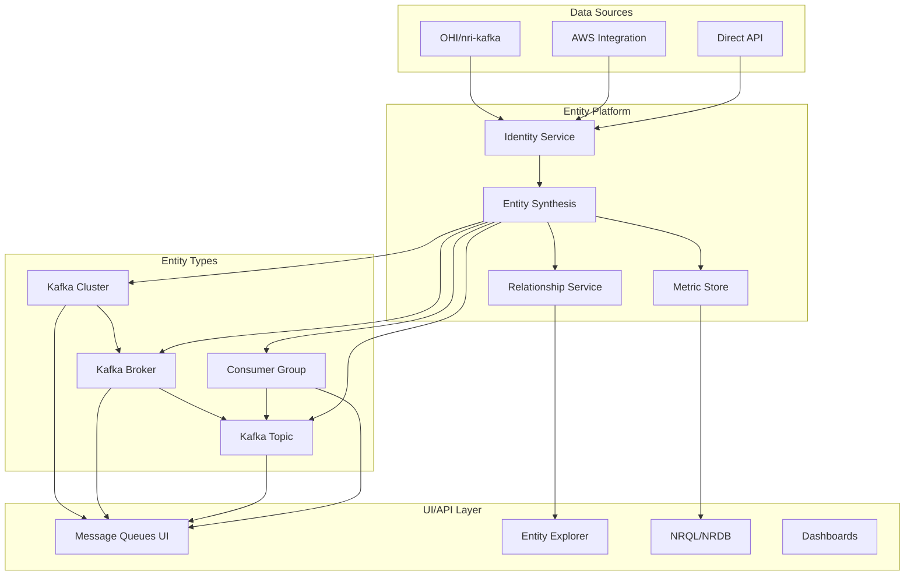

# Unified Kafka Domain Model for OHI and MSK

## Executive Summary

This document presents a unified domain model for Kafka monitoring that bridges the gap between On-Host Integration (OHI) and AWS Managed Streaming for Kafka (MSK). Based on our extensive analysis, we define how these two approaches can coexist within New Relic's entity platform.

## Core Domain Entities

### 1. Kafka Cluster Entity

**Unified Attributes:**
```yaml
entity:
  domain: INFRA
  type: KAFKA_CLUSTER | AWSMSKCLUSTER
  guid: {accountId}|INFRA|{type}|{base64(identifier)}
  
identity:
  name: string                    # Cluster name
  provider: string                # "kafka" | "AwsMskCluster"
  externalId: string             # ARN for MSK, cluster.id for OHI
  
configuration:
  kafkaVersion: string
  zookeeperConnectionString: string  # OHI only
  bootstrapServers: string[]
  securityProtocol: string
  
metrics:
  activeControllerCount: gauge
  offlinePartitionsCount: gauge
  underReplicatedPartitions: gauge
  globalPartitionCount: gauge
  globalTopicCount: gauge
  
relationships:
  contains: [KAFKA_BROKER | AWSMSKBROKER]
  hosts: [KAFKA_TOPIC | AWSMSKTOPIC]
  managedBy: HOST | AWS_ACCOUNT
```

### 2. Kafka Broker Entity

**Unified Attributes:**
```yaml
entity:
  domain: INFRA
  type: KAFKA_BROKER | AWSMSKBROKER
  guid: {accountId}|INFRA|{type}|{base64(clusterId/brokerId)}
  
identity:
  name: string                    # broker-{id} or {cluster}-broker-{id}
  brokerId: integer
  host: string
  port: integer
  provider: string                # "kafka" | "AwsMskBroker"
  
metrics:
  bytesInPerSec: rate + aggregations
  bytesOutPerSec: rate + aggregations
  messagesInPerSec: rate + aggregations
  cpuUser: percentage
  memoryUsed: percentage
  diskUsed: percentage
  produceRequestsPerSec: rate
  fetchRequestsPerSec: rate
  
relationships:
  belongsTo: KAFKA_CLUSTER | AWSMSKCLUSTER
  hosts: [KAFKA_PARTITION]
  runsOn: HOST                    # OHI only
```

### 3. Kafka Topic Entity

**Unified Attributes:**
```yaml
entity:
  domain: INFRA
  type: KAFKA_TOPIC | AWSMSKTOPIC
  guid: {accountId}|INFRA|{type}|{base64(clusterId/topicName)}
  
identity:
  name: string                    # topicName or clusterId/topicName
  topicName: string
  provider: string                # "kafka" | "AwsMskTopic"
  
configuration:
  partitionCount: integer
  replicationFactor: integer
  minInSyncReplicas: integer
  retentionMs: long
  
metrics:
  bytesInPerSec: rate + aggregations
  bytesOutPerSec: rate + aggregations
  messagesInPerSec: rate + aggregations
  fetchMessageConversionsPerSec: rate
  produceMessageConversionsPerSec: rate
  sumOffsetLag: gauge             # Consumer lag
  
relationships:
  belongsTo: KAFKA_CLUSTER | AWSMSKCLUSTER
  hasPartitions: [KAFKA_PARTITION]
  consumedBy: [KAFKA_CONSUMER_GROUP]
```

### 4. Kafka Consumer Group Entity

**Unified Attributes:**
```yaml
entity:
  domain: INFRA
  type: KAFKA_CONSUMER_GROUP
  guid: {accountId}|INFRA|KAFKA_CONSUMER_GROUP|{base64(clusterId/groupId)}
  
identity:
  name: string                    # Consumer group ID
  groupId: string
  state: string                   # Empty|Stable|PreparingRebalance|CompletingRebalance|Dead
  
metrics:
  totalLag: gauge                 # Sum of lag across all partitions
  memberCount: gauge              # Number of active consumers
  
relationships:
  consumes: [KAFKA_TOPIC | AWSMSKTOPIC]
  belongsTo: KAFKA_CLUSTER | AWSMSKCLUSTER
```

## Event Types and Data Flow

### OHI Event Types (nri-kafka)
```yaml
events:
  - KafkaClusterSample
  - KafkaBrokerSample  
  - KafkaTopicSample
  - KafkaPartitionSample
  - KafkaOffsetSample
  - KafkaConsumerSample
  - KafkaProducerSample
  
source:
  collector.name: "nri-kafka"
  integration.name: "com.newrelic.kafka"
  integration.version: "2.13.0"
```

### MSK Event Types (AWS Integration)
```yaml
events:
  - AwsMskClusterSample
  - AwsMskBrokerSample
  - AwsMskTopicSample
  
source:
  collector.name: "cloudwatch-metric-streams" | "cloud-integrations"
  provider.accountId: "AWS Account ID"
  provider.region: "AWS Region"
```

## Entity Platform Role

### 1. Entity Synthesis

The entity platform serves as the central orchestrator for creating and maintaining entities:

```yaml
entity_synthesis:
  triggers:
    - event_ingestion:
        when: New events received
        action: Match to existing entity or create new
        
    - cloud_integration:
        when: AWS integration polls
        action: Create/update MSK entities
        
    - host_integration:
        when: Infrastructure agent reports
        action: Create/update OHI entities
        
  validation:
    - identity_verification:
        MSK: Requires valid AWS credentials
        OHI: Requires agent authentication
        
    - uniqueness_check:
        key: domain + type + identifier
        prevent: Duplicate entities
```

### 2. Relationship Management

```yaml
relationship_engine:
  automatic_relationships:
    - cluster_to_broker:
        source: KAFKA_CLUSTER
        target: KAFKA_BROKER
        type: CONTAINS
        key: clusterName
        
    - broker_to_topic:
        source: KAFKA_BROKER  
        target: KAFKA_TOPIC
        type: HOSTS
        key: clusterName + brokerId
        
    - consumer_to_topic:
        source: KAFKA_CONSUMER_GROUP
        target: KAFKA_TOPIC
        type: CONSUMES
        key: groupId + topicName
        
  cross_domain_relationships:
    - host_to_broker:
        source: HOST
        target: KAFKA_BROKER
        type: HOSTS
        condition: OHI deployment
        
    - aws_account_to_cluster:
        source: AWS_ACCOUNT
        target: AWSMSKCLUSTER
        type: OWNS
        condition: MSK deployment
```

### 3. Metric Aggregation

```yaml
metric_aggregation:
  cluster_level:
    - sum_from_brokers:
        metrics: [bytesInPerSec, bytesOutPerSec, messagesInPerSec]
        
    - max_across_brokers:
        metrics: [underReplicatedPartitions, offlinePartitions]
        
  topic_level:
    - sum_from_partitions:
        metrics: [bytesIn, bytesOut, messages]
        
    - max_across_partitions:
        metrics: [offsetLag]
```

## Unified Query Model

### Cross-Provider Queries
```sql
-- Unified cluster view
FROM KafkaClusterSample, AwsMskClusterSample 
SELECT latest(activeControllerCount), latest(offlinePartitionsCount)
FACET clusterName OR provider.clusterName as 'Cluster'

-- Unified broker performance
FROM KafkaBrokerSample, AwsMskBrokerSample
SELECT average(bytesInPerSec) as 'Throughput'
FACET broker.id OR provider.brokerId as 'Broker'

-- Consumer lag across both types
FROM KafkaOffsetSample, AwsMskTopicSample
SELECT max(offset.lag) OR max(provider.sumOffsetLag.Average) as 'Max Lag'
FACET topic OR provider.topic as 'Topic'
```

## Entity Platform Architecture



## Key Platform Responsibilities

### 1. Identity Resolution
- Determine entity uniqueness across providers
- Prevent duplicate entities for same resource
- Maintain consistent GUIDs

### 2. Security & Authorization
- Enforce AWS integration requirement for MSK entities
- Validate agent credentials for OHI entities
- Prevent unauthorized entity creation

### 3. Data Normalization
- Convert between OHI and MSK metric formats
- Standardize units and aggregations
- Handle provider-specific fields

### 4. Lifecycle Management
- Mark entities as reporting/non-reporting
- Clean up stale entities
- Handle entity state transitions

## Implementation Recommendations

### 1. Short Term: Provider Abstraction
```yaml
provider_abstraction:
  interface: IKafkaProvider
  implementations:
    - OHIKafkaProvider
    - MSKProvider
    - SyntheticProvider  # For testing
  
  common_metrics:
    - throughput
    - latency
    - availability
    - consumer_lag
```

### 2. Medium Term: Unified Entity Type
```yaml
unified_entity:
  type: KAFKA_CLUSTER
  subtypes:
    - KAFKA_CLUSTER_OHI
    - KAFKA_CLUSTER_MSK
  
  benefits:
    - Single UI representation
    - Simplified querying
    - Provider flexibility
```

### 3. Long Term: Multi-Cloud Support
```yaml
extended_providers:
  - AWS_MSK
  - AZURE_EVENT_HUBS
  - GCP_PUBSUB
  - CONFLUENT_CLOUD
  - REDPANDA
  
  common_interface:
    - Cluster health
    - Broker performance
    - Topic throughput
    - Consumer lag
```

## Conclusion

The unified domain model provides a framework for:
1. **Consistent representation** of Kafka entities across providers
2. **Flexible data ingestion** from multiple sources
3. **Robust entity platform** that enforces security while enabling monitoring
4. **Future extensibility** for additional Kafka providers

The entity platform serves as the critical abstraction layer that:
- Validates and synthesizes entities from events
- Manages relationships between entities
- Enforces security policies
- Provides unified access through UI and API

This model enables New Relic to support both self-managed and cloud-managed Kafka deployments while maintaining data integrity and security.