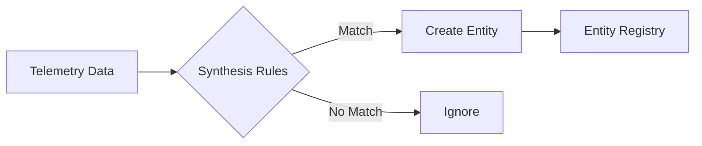

# Entity Lifecycle - Message Queue Entities

This document describes the lifecycle management of message queue entities in New Relic, including creation, updates, and expiration policies.

## Overview

Message queue entities have different lifecycle requirements based on their characteristics:
- **Long-lived entities**: Clusters and brokers that persist for extended periods
- **Dynamic entities**: Topics and queues that may be created and deleted frequently
- **Ephemeral entities**: Consumer groups that may come and go based on application lifecycle

## Entity Expiration Settings

### MESSAGE_QUEUE_CLUSTER

```yaml
domain: INFRA
type: MESSAGE_QUEUE_CLUSTER

configuration:
  entityExpirationTime: EIGHT_DAYS
  alertable: true
```

**Rationale**: Clusters are long-lived infrastructure that should persist in the system even after temporary outages. The 8-day retention allows for investigation of issues after extended downtime.

### MESSAGE_QUEUE_BROKER

```yaml
domain: INFRA
type: MESSAGE_QUEUE_BROKER

configuration:
  entityExpirationTime: EIGHT_DAYS
  alertable: true
```

**Rationale**: Brokers are critical infrastructure components. Retaining them for 8 days allows for post-mortem analysis and capacity planning even after broker removal.

### MESSAGE_QUEUE_TOPIC

```yaml
domain: INFRA
type: MESSAGE_QUEUE_TOPIC

configuration:
  entityExpirationTime: DAILY
  alertable: true
```

**Rationale**: Topics may be created and deleted as part of normal operations. Daily expiration prevents accumulation of unused topics while allowing time for troubleshooting.

### MESSAGE_QUEUE_QUEUE

```yaml
domain: INFRA
type: MESSAGE_QUEUE_QUEUE

configuration:
  entityExpirationTime: DAILY
  alertable: true
```

**Rationale**: Similar to topics, queues can be ephemeral. Daily expiration balances operational visibility with entity management overhead.

### MESSAGE_QUEUE_CONSUMER_GROUP

```yaml
domain: INFRA
type: MESSAGE_QUEUE_CONSUMER_GROUP

configuration:
  entityExpirationTime: FOUR_HOURS
  alertable: true
```

**Rationale**: Consumer groups are the most dynamic entities, often created for batch jobs or auto-scaling scenarios. Four-hour expiration prevents clutter while maintaining operational visibility.

## Lifecycle Stages

### 1. Entity Creation

Entities are created when synthesis rules match incoming telemetry:



**Creation Requirements:**
- Valid telemetry matching synthesis conditions
- Unique identifier within account/domain/type
- Required attributes (name, identifier)

### 2. Entity Updates

Entities are updated with each matching telemetry data point:

- **Metadata updates**: Tags, attributes
- **Metric updates**: Golden metrics, summary metrics
- **Status updates**: Reporting status, alert severity

```yaml
# Update frequency varies by entity type
updateFrequency:
  cluster: 60 seconds
  broker: 30 seconds
  topic: 30 seconds
  queue: 30 seconds
  consumerGroup: 60 seconds
```

### 3. Entity Expiration

Entities expire after not reporting for the configured duration:

```yaml
expirationBehavior:
  preExpiration:
    - 50%: Warning alert if configured
    - 75%: Mark as "at risk" in UI
    - 90%: Final warning notification
  
  postExpiration:
    - Remove from entity registry
    - Remove from active alerts
    - Maintain historical data in NRDB
    - Remove from dashboards/workloads
```

## Alert Lifecycle

### Alertable Configuration

All message queue entities are alertable by default:

```yaml
configuration:
  alertable: true
```

This enables:
- Threshold alerts on golden metrics
- Anomaly detection
- Alert condition targeting
- Incident correlation

### Alert State Management

```yaml
alertStates:
  - healthy: No active violations
  - warning: Non-critical threshold breach
  - critical: Critical threshold breach
  - muted: Alerts suppressed
```

## Telemetry Retention vs Entity Retention

**Important Distinction:**
- **Entity retention**: How long the entity record exists
- **Telemetry retention**: How long the data is queryable

| Data Type | Retention Period | Storage Location |
|-----------|-----------------|------------------|
| Entity Record | Per entityExpirationTime | Entity Registry |
| Event Data | 8 days default | NRDB |
| Metric Data | 13 months | NRDB |
| Dashboard Links | Until entity expires | Entity Registry |

## Special Lifecycle Scenarios

### Planned Maintenance

For planned maintenance, consider:

```yaml
maintenanceMode:
  - Disable alerts before maintenance
  - Tag entity with maintenance window
  - Extend expiration if needed
  - Re-enable alerts after validation
```

### Migration Scenarios

When migrating infrastructure:

```yaml
migrationStrategy:
  - Tag old entities with "migrating"
  - Create new entities in parallel
  - Update dashboards to show both
  - Allow old entities to expire naturally
```

### Disaster Recovery

Entity recovery after catastrophic failure:

```yaml
recoveryProcess:
  - Entities recreated on first telemetry
  - Historical data remains queryable
  - Dashboards auto-populate on recreation
  - Alerts resume automatically
```

## Configuration Best Practices

### Choosing Expiration Times

| Entity Characteristic | Recommended Expiration |
|----------------------|------------------------|
| Core infrastructure | EIGHT_DAYS |
| Stateful services | EIGHT_DAYS |
| Dynamic resources | DAILY |
| Ephemeral/batch | FOUR_HOURS |
| Development/test | DAILY |

### Alertability Decisions

Set `alertable: false` only for:
- Test/development entities
- Deprecated entities being phased out
- Entities monitored through aggregation only

### Custom Lifecycle Rules

For special requirements:

```yaml
configuration:
  entityExpirationTime: DAILY
  alertable: true
  customRules:
    - extendOnAlert: true  # Don't expire if alerts active
    - minLifetime: 4h      # Minimum time before expiration
    - graceOnError: 1h     # Extra time if errors detected
```

## Lifecycle Monitoring

### Track Entity Health

```sql
-- Entities at risk of expiration
FROM MessageQueue 
SELECT latest(timestamp) as 'Last Seen',
       entityGuid,
       entityName
WHERE entityType = 'MESSAGE_QUEUE_BROKER'
FACET entityName
SINCE 7 days ago
```

### Monitor Entity Churn

```sql
-- Entity creation/expiration rate
FROM NrAuditEvent
SELECT count(*) 
WHERE targetType = 'ENTITY'
  AND actionName IN ('create', 'expire')
FACET actionName
TIMESERIES 1 day
SINCE 1 week ago
```

## Future Considerations

### Planned Enhancements

1. **Dynamic expiration** based on entity importance
2. **Lifecycle webhooks** for external integration
3. **Batch lifecycle operations** for large-scale changes
4. **Lifecycle templates** for common patterns

### API Support

Future API support for lifecycle management:

```graphql
mutation UpdateEntityLifecycle {
  entityUpdate(guid: "...", lifecycle: {
    expirationTime: "EIGHT_DAYS",
    alertable: true,
    tags: ["critical", "production"]
  }) {
    success
    entity { guid, name }
  }
}
```