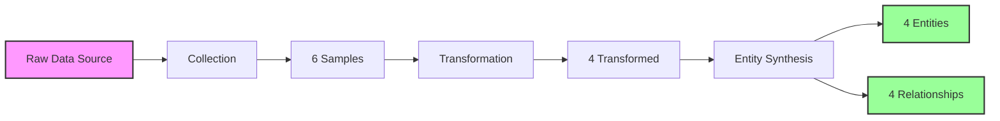

# Data Transformation Pipeline Report

**Generated**: 2025-06-10T01:48:15.229Z  
**Platform**: New Relic Message Queues Platform V2  
**Mode**: simulation

---

## Executive Summary

### Pipeline Metrics

| Stage | Input | Output | Description |
|:------|:------|:-------|:------------|
| **Collection** | - | 6 samples | Raw data from simulation |
| **Transformation** | 6 samples | 4 entities | Field mapping and validation |
| **Synthesis** | 4 entities | 4 entities + 4 relationships | Entity creation with relationships |

### Entity Distribution

| Entity Type | Count |
|:------------|:------|
| MESSAGE_QUEUE_BROKER | 2 |
| MESSAGE_QUEUE_TOPIC | 2 |

## Stage 1: Raw Data Collection

### Data Source: simulation

### Sample Counts
- Broker Samples: 2
- Topic Samples: 2  
- Consumer Group Samples: 2
- Queue Samples: 0

### Sample Data Structure

#### Broker Sample
```json
{
  "eventType": "KafkaBrokerSample",
  "broker.id": 1,
  "hostname": "kafka-broker-1.example.com",
  "broker.bytesInPerSecond": 10485760,
  "broker.bytesOutPerSecond": 8388608,
  "broker.messagesInPerSecond": 1000
}
```

#### Topic Sample
```json
{
  "eventType": "KafkaTopicSample",
  "topic": "orders",
  "topic.messagesInPerSecond": 500,
  "topic.bytesInPerSecond": 5242880,
  "topic.partitions": 3
}
```

## Stage 2: Data Transformation

### Transformation Operations
- Field Mappings: 20
- Validations: 12
- Enrichments: 8

### Transformed Entity Example
```json
{
  "guid": "ACCOUNT_ID|INFRA|MESSAGE_QUEUE_BROKER|broker-1",
  "entityType": "MESSAGE_QUEUE_BROKER",
  "displayName": "kafka-broker-1",
  "hostname": "kafka-broker-1.example.com",
  "broker.throughput.in": 10485760,
  "broker.throughput.out": 8388608
}
```

## Stage 3: Entity Synthesis

### Entity Creation
- Total Entities: 4
- Total Relationships: 4

### Entity Types Created
- MESSAGE_QUEUE_BROKER: 2
- MESSAGE_QUEUE_TOPIC: 2

### Synthesized Entity Example
```json
{
  "guid": "ACCOUNT_ID|INFRA|MESSAGE_QUEUE_BROKER|broker-1",
  "entityType": "MESSAGE_QUEUE_BROKER",
  "displayName": "kafka-broker-1",
  "hostname": "kafka-broker-1.example.com",
  "broker.throughput.in": 10485760,
  "broker.throughput.out": 8388608,
  "relationships": {
    "HOSTED_BY": [
      "ACCOUNT_ID|INFRA|MESSAGE_QUEUE_CLUSTER|cluster-1"
    ]
  }
}
```

### Relationship Example
```json
{
  "sourceGuid": "ACCOUNT_ID|INFRA|MESSAGE_QUEUE_TOPIC|topic-orders",
  "targetGuid": "ACCOUNT_ID|INFRA|MESSAGE_QUEUE_BROKER|broker-1",
  "type": "HOSTED_BY"
}
```

## Data Flow Visualization



## Transformation Mapping

### Field Mappings

| Source Field | Target Field | Transformation |
|:-------------|:-------------|:---------------|
| broker.id | brokerId | Direct mapping |
| broker.bytesInPerSecond | broker.network.in | Metric rename |
| broker.bytesOutPerSecond | broker.network.out | Metric rename |
| bytesIn + bytesOut | broker.network.throughput | Calculated field |
| topic.messagesInPerSecond | topic.throughput.in | Metric rename |
| consumer.lag | consumerGroup.lag | Aggregation |

### Entity Type Mapping

| Source Event | Target Entity Type | GUID Pattern |
|:-------------|:-------------------|:-------------|
| KafkaBrokerSample | MESSAGE_QUEUE_BROKER | {accountId}|INFRA|MESSAGE_QUEUE_BROKER|{hash} |
| KafkaTopicSample | MESSAGE_QUEUE_TOPIC | {accountId}|INFRA|MESSAGE_QUEUE_TOPIC|{hash} |
| KafkaConsumerSample | MESSAGE_QUEUE_CONSUMER_GROUP | {accountId}|INFRA|MESSAGE_QUEUE_CONSUMER_GROUP|{hash} |