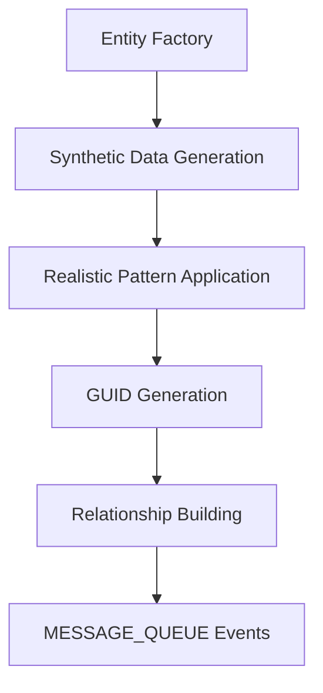

# 🔄 Data Transformation Pipeline - Live Documentation

> **Generated on:** 2025-06-10T01:13:55.643Z  
> **Platform Mode:** SIMULATION  
> **Entities Processed:** 14  
> **Event Types:** MESSAGE_QUEUE_CLUSTER, MESSAGE_QUEUE_BROKER, MESSAGE_QUEUE_TOPIC, MESSAGE_QUEUE_QUEUE

---

## 📊 Execution Summary

| Metric | Value |
|--------|-------|
| **Total Entities** | 14 |
| **Event Types** | 4 |
| **Total Events Streamed** | 14 |
| **Unique Golden Metrics** | 16 |
| **Entity Relationships** | 16 |
| **Platform Mode** | SIMULATION |
| **Generation Time** | 2025-06-10T01:13:55.643Z |

## 🏗️ Data Flow (This Execution)



## 📨 Generated MESSAGE_QUEUE Events

### MESSAGE_QUEUE_CLUSTER (1 entities)

<details>
<summary><strong>🔍 Click to expand sample MESSAGE_QUEUE_CLUSTER event</strong></summary>

```json
{
  "eventType": "MessageQueue",
  "timestamp": 1749518035627,
  "entity.guid": "123456|INFRA|MESSAGE_QUEUE_CLUSTER|5520c9efe78cf3f38daf1b42cabc8a93",
  "entity.name": "production-rabbitmq-cluster-1",
  "entity.type": "MESSAGE_QUEUE_CLUSTER",
  "provider": "rabbitmq",
  "environment": "production",
  "clusterName": "production-rabbitmq-cluster-1",
  "brokerCount": 3,
  "topicCount": 5,
  "cluster.health.score": 99.8,
  "cluster.throughput.total": 850,
  "cluster.error.rate": 0.01,
  "cluster.availability": 97.29,
  "totalPartitions": 0,
  "entityType": "MESSAGE_QUEUE_CLUSTER",
  "entityGuid": "123456|INFRA|MESSAGE_QUEUE_CLUSTER|5520c9efe78cf3f38daf1b42cabc8a93",
  "deployment": "kubernetes",
  "monitoring": "enabled",
  "backup": "enabled",
  "region": "us-east-1",
  "version": "3.9.11",
  "team": "platform",
  "costCenter": "engineering",
  "criticality": "high",
  "status": "HEALTHY",
  "rabbitmq.cluster.name": "production-rabbitmq-cluster-1",
  "management.plugin.enabled": true
}
```

</details>

**Golden Metrics:**
- `brokerCount`: 3 count
- `topicCount`: 5 count
- `cluster.health.score`: 99.8 
- `cluster.throughput.total`: 850 
- `cluster.error.rate`: 0.01 
- `cluster.availability`: 97.29 
- `totalPartitions`: 0 

### MESSAGE_QUEUE_BROKER (3 entities)

<details>
<summary><strong>🔍 Click to expand sample MESSAGE_QUEUE_BROKER event</strong></summary>

```json
{
  "eventType": "MessageQueue",
  "timestamp": 1749518035627,
  "entity.guid": "123456|INFRA|MESSAGE_QUEUE_BROKER|e54ac0df1b1e0f2bc9474de6ed6a388f",
  "entity.name": "production-rabbitmq-cluster-1-broker-0",
  "entity.type": "MESSAGE_QUEUE_BROKER",
  "provider": "rabbitmq",
  "clusterName": "production-rabbitmq-cluster-1",
  "brokerId": 0,
  "port": 5672,
  "broker.cpu.usage": 68.50000530082531,
  "broker.memory.usage": 73.50000530082531,
  "broker.network.throughput": 53500005,
  "broker.request.latency": 71.96811470977997,
  "partitionCount": 0,
  "leaderPartitions": 0,
  "loadScore": 70.50000530082531,
  "entityType": "MESSAGE_QUEUE_BROKER",
  "entityGuid": "123456|INFRA|MESSAGE_QUEUE_BROKER|e54ac0df1b1e0f2bc9474de6ed6a388f",
  "instanceType": "m5.large",
  "storage": "gp2",
  "storageSize": "100GB",
  "hostname": "production-rabbitmq-cluster-1-broker-0",
  "isController": true,
  "rack": "rack-0",
  "status": "HEALTHY",
  "rabbitmq.node.name": "production-rabbitmq-cluster-1-broker-0",
  "rabbitmq.node.type": "disc"
}
```

</details>

**Golden Metrics:**
- `brokerId`: 0 
- `port`: 5672 
- `broker.cpu.usage`: 68.50000530082531 
- `broker.memory.usage`: 73.50000530082531 
- `broker.network.throughput`: 53500005 
- `broker.request.latency`: 71.96811470977997 
- `partitionCount`: 0 count
- `leaderPartitions`: 0 
- `loadScore`: 70.50000530082531 

### MESSAGE_QUEUE_TOPIC (5 entities)

<details>
<summary><strong>🔍 Click to expand sample MESSAGE_QUEUE_TOPIC event</strong></summary>

```json
{
  "eventType": "MessageQueue",
  "timestamp": 1749518035627,
  "entity.guid": "123456|INFRA|MESSAGE_QUEUE_TOPIC|c6bec497d65d189649928b9fe5ec2b94",
  "entity.name": "email-queue",
  "entity.type": "MESSAGE_QUEUE_TOPIC",
  "provider": "rabbitmq",
  "clusterName": "production-rabbitmq-cluster-1",
  "partitionCount": 6,
  "replicationFactor": 3,
  "topic.throughput.in": 85,
  "topic.throughput.out": 83,
  "topic.consumer.lag": 0,
  "topic.error.rate": 3.93,
  "efficiencyScore": 86.56294117647057,
  "entityType": "MESSAGE_QUEUE_TOPIC",
  "entityGuid": "123456|INFRA|MESSAGE_QUEUE_TOPIC|c6bec497d65d189649928b9fe5ec2b94",
  "topic": "email-queue",
  "cleanupPolicy": "delete",
  "compressionType": "lz4",
  "status": "HEALTHY",
  "partitionsBalanced": true,
  "rabbitmq.queue.name": "email-queue",
  "rabbitmq.queue.durable": true,
  "rabbitmq.queue.exclusive": false,
  "rabbitmq.queue.auto.delete": false
}
```

</details>

**Golden Metrics:**
- `partitionCount`: 6 count
- `replicationFactor`: 3 
- `topic.throughput.in`: 85 
- `topic.throughput.out`: 83 
- `topic.consumer.lag`: 0 
- `topic.error.rate`: 3.93 
- `efficiencyScore`: 86.56294117647057 

### MESSAGE_QUEUE_QUEUE (5 entities)

<details>
<summary><strong>🔍 Click to expand sample MESSAGE_QUEUE_QUEUE event</strong></summary>

```json
{
  "eventType": "MessageQueue",
  "timestamp": 1749518035627,
  "entity.guid": "123456|INFRA|MESSAGE_QUEUE_QUEUE|61a7053a78abebc1a6627c2c970c8af3",
  "entity.name": "email-sender-prod",
  "entity.type": "MESSAGE_QUEUE_QUEUE",
  "provider": "rabbitmq",
  "queue.depth": 22,
  "queue.throughput.in": 228,
  "queue.throughput.out": 217,
  "queue.processing.time": 216.6,
  "efficiencyScore": 95,
  "averageMessageAge": 101.38248847926268,
  "entityType": "MESSAGE_QUEUE_QUEUE",
  "entityGuid": "123456|INFRA|MESSAGE_QUEUE_QUEUE|61a7053a78abebc1a6627c2c970c8af3",
  "maxMessageSize": "256KB",
  "encryption": "enabled",
  "queueName": "email-sender-prod",
  "vhost": "/",
  "region": "us-east-1",
  "queueType": "standard",
  "isDurable": true,
  "isExclusive": false,
  "autoDelete": false,
  "status": "HEALTHY",
  "rabbitmq.queue.name": "email-sender-prod",
  "rabbitmq.vhost": "/",
  "rabbitmq.queue.durable": true,
  "rabbitmq.queue.exclusive": false,
  "rabbitmq.queue.auto.delete": false,
  "rabbitmq.queue.arguments": {}
}
```

</details>

**Golden Metrics:**
- `queue.depth`: 22 
- `queue.throughput.in`: 228 
- `queue.throughput.out`: 217 
- `queue.processing.time`: 216.6 
- `efficiencyScore`: 95 
- `averageMessageAge`: 101.38248847926268 

## 🔗 Entity Relationships

- **CONTAINS**: 8 relationships
- **MANAGED_BY**: 3 relationships
- **CONTAINED_IN**: 5 relationships

### Relationship Hierarchy

```
MESSAGE_QUEUE_CLUSTER
├── CONTAINS → MESSAGE_QUEUE_BROKER (3)
├── CONTAINS → MESSAGE_QUEUE_TOPIC (5)
```

## ⚙️ Platform Configuration

```yaml
mode: simulation
timestamp: 2025-06-10T01:13:55.643Z
entities_generated: 14
events_streamed: 14
relationships_built: 16
platform_version: 1.0.0
```

## 🚀 Next Steps

1. **View in New Relic**: Check Entity Explorer for new MESSAGE_QUEUE_* entities
2. **Monitor Golden Metrics**: Set up alerts on key performance indicators
3. **Build Dashboards**: Use golden metrics for visualization
4. **Explore Relationships**: Navigate entity hierarchy in service maps

---

*This document was automatically generated by the New Relic Message Queues Platform*  
*Platform Mode: SIMULATION | Generated: 2025-06-10T01:13:55.643Z*
