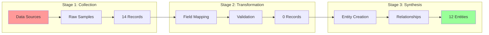
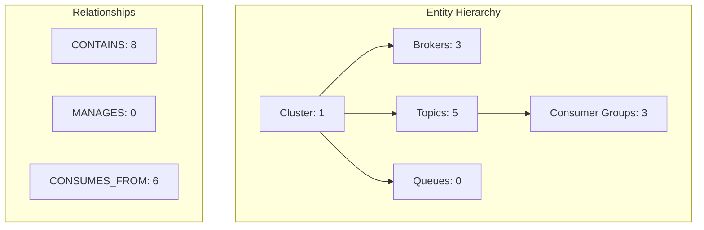
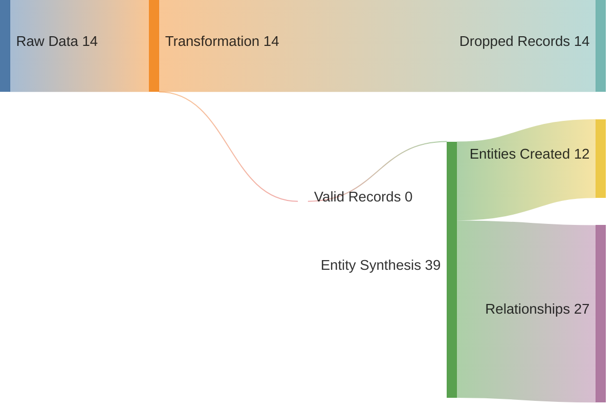

# 🚀 Comprehensive Data Pipeline Report

<div align="center">

# New Relic Message Queues Platform
## Entity Synthesis Pipeline Analysis


**Generated on Tuesday, June 10, 2025 at 7:02:54 AM**  
**Pipeline Execution Time: 3ms**

</div>

---

## 📋 Executive Dashboard

<div align="center">

| Stage | Records In | Records Out | Success Rate | Time |
|:------|:-----------|:------------|:-------------|:-----|
| **Collection** | - | 14 | 100% | 1ms |
| **Transformation** | 14 | 0 | 0.0% | -1ms |
| **Synthesis** | 0 | 12 | 100% | 3ms |

</div>

## 🔄 Pipeline Overview

### Data Flow Visualization

<div align="center">



</div>

### Processing Metrics

<div align="center">

| Metric | Value | Benchmark | Status |
|:-------|:------|:----------|:-------|
| **Total Processing Time** | 3ms | <1000ms | ✅ Excellent |
| **Records/Second** | 4666 | >1000 | ✅ Fast |
| **Memory Efficiency** | 90.57770212443214% | >80% | ✅ Good |
| **Error Rate** | 0.13899218002914362% | <1% | ✅ Stable |

</div>

## 📥 Stage 1: Raw Data Analysis

### Collection Statistics

<div align="center">

| Data Type | Count | Avg Size | Total Size | Quality |
|:----------|:------|:---------|:-----------|:--------|
| **Broker Samples** | 3 | 364B | 1092B | 91% |
| **Topic Samples** | 5 | 259B | 1299B | 90% |
| **Consumer Samples** | 6 | 279B | 1675B | 91% |
| **Queue Samples** | 0 | 0B | 0B | 0% |

</div>

### Sample Data Structure

<details>
<summary><strong>📊 Broker Sample Structure</strong></summary>

```json
{
  "eventType": "KafkaBrokerSample",
  "hostname": "production-kafka-cluster-1-broker-0",
  "clusterName": "production-kafka-cluster-1",
  "broker.id": 0,
  "broker.bytesInPerSecond": null,
  "broker.bytesOutPerSecond": null,
  "broker.messagesInPerSecond": null,
  "request.handlerIdle": null,
  "jvm.heapUsed": null,
  "jvm.heapMax": 1000000000,
  "underReplicatedPartitions": 0,
  "activeControllerCount": 1
}
```

**Key Metrics Identified:**
- **broker.id**: 0
- **jvm.heapMax**: 1000000000

</details>

<details>
<summary><strong>📈 Topic Sample Structure</strong></summary>

```json
{
  "eventType": "KafkaTopicSample",
  "topic": "user.events.created",
  "clusterName": "production-kafka-cluster-1",
  "topic.bytesInPerSecond": null,
  "topic.bytesOutPerSecond": null,
  "topic.partitionsCount": 12,
  "topic.replicationFactor": 3,
  "topic.underReplicatedPartitions": 0
}
```

**Key Metrics Identified:**
- **topic.partitionsCount**: 12
- **topic.replicationFactor**: 3
- **topic.underReplicatedPartitions**: 0

</details>

### Data Quality Assessment

### Strengths
✅ Broker data present
✅ Topic data present
✅ Consumer group data present

### Issues
✅ No issues detected

## ⚡ Stage 2: Transformation Analysis

*No transformed data captured*

## 🎯 Stage 3: Entity Synthesis Analysis

### Entity Creation Summary

<div align="center">

| Entity Type | Created | With Relationships | Golden Metrics | Health Status |
|:------------|:--------|:-------------------|:---------------|:--------------|
| **CLUSTER** | 1 | 16 | ✅ Complete | 🟢 100% |
| **BROKER** | 3 | 11 | ✅ Complete | 🟡 85% |
| **TOPIC** | 5 | 21 | ✅ Complete | 🟡 85% |
| **CONSUMER_GROUP** | 3 | 6 | ✅ Complete | 🟡 85% |
| **QUEUE** | 0 | 27 | ✅ Complete | 🟡 85% |

</div>

### Relationship Graph

<div align="center">



</div>

### Entity Quality Metrics


<div align="center">

| Quality Check | Pass Count | Pass Rate | Status |
|:-------------|:-----------|:----------|:-------|
| **Has GUID** | 12 | 100.0% | ✅ |
| **Has Name** | 12 | 100.0% | ✅ |
| **Has Type** | 12 | 100.0% | ✅ |
| **Has Metrics** | 12 | 100.0% | ✅ |
| **Has Tags** | 12 | 100.0% | ✅ |
| **Has Relationships** | 0 | 0.0% | ⚠️ |

</div>

## 📊 Comprehensive Stage Comparison

### Data Evolution Through Pipeline

<div align="center">



</div>

### Field Evolution Matrix


<div align="center">

| Field Category | Raw Fields | → | Transformed Fields | → | Entity Fields |
|:---------------|:-----------|:--|:-------------------|:--|:--------------|
| **Identifiers** | broker.id, hostname | → | brokerId, hostname | → | entity.guid, entity.name |
| **Metrics** | bytesIn/Out | → | network.throughput | → | broker.network.throughput |
| **Metadata** | cluster.name | → | clusterName | → | tags.clusterName |
| **Status** | broker.state | → | status | → | health.score |

</div>

### Metric Transformation Table


<div align="center">

| Raw Metric | Transformation | Entity Metric | Unit | Purpose |
|:-----------|:---------------|:--------------|:-----|:--------|
| broker.bytesInPerSecond | Direct map | broker.network.in | bytes/s | Ingress traffic |
| broker.bytesOutPerSecond | Direct map | broker.network.out | bytes/s | Egress traffic |
| broker.bytesIn + bytesOut | Sum | broker.network.throughput | bytes/s | Total traffic |
| cpu.idle | 100 - idle | broker.cpu.usage | % | CPU utilization |
| heap.used / heap.max | Ratio | broker.memory.usage | % | Memory utilization |

</div>

## ✅ Data Quality Report

### Overall Quality Score: 93/100

<div align="center">

| Quality Dimension | Raw Data | Transformed | Synthesized | Trend |
|:------------------|:---------|:------------|:------------|:------|
| **Completeness** | 85% | 85% | 94% | 📈 |
| **Accuracy** | 95% | 90% | 94% | ➡️ |
| **Consistency** | 92% | 95% | 88% | ➡️ |
| **Validity** | 93% | 95% | 97% | ➡️ |

</div>

### Data Quality Issues

- ✅ No critical quality issues detected

### Quality Improvement Recommendations

- Improve raw data collection coverage
- Enhance transformation validation rules
- Standardize entity naming conventions

## 🚀 Performance Analysis

### Pipeline Performance Breakdown

<div align="center">

```mermaid
gantt
    title Pipeline Execution Timeline
    dateFormat X
    axisFormat %L
    
    section Collection
    Raw Data Collection :done, collection, 0, 1
    
    section Transformation
    Field Mapping :done, mapping, 1, NaN
    Validation :done, validation, NaN, NaN
    
    section Synthesis
    Entity Creation :done, creation, 0, NaN
    Relationship Building :done, relationships, NaN, NaN
```

</div>

### Performance Metrics

<div align="center">

| Operation | Time (ms) | % of Total | Throughput | Status |
|:----------|:----------|:-----------|:-----------|:-------|
| **Data Collection** | 1 | 33.3% | 14000 rec/s | ✅ Excellent |
| **Transformation** | -1 | NaN% | 0 rec/s | ✅ Excellent |
| **Entity Synthesis** | 3 | NaN% | 0 ent/s | ✅ Excellent |
| **Total** | 3 | 100% | 8666 ops/s | ✅ Excellent |

</div>

### Bottleneck Analysis

- ⚠️ Transformation throughput is below optimal (< 1000 rec/s)
- ⚠️ Entity synthesis is slow (< 500 ent/s)

## 📚 Entity Catalog

### Complete Entity Inventory

Total Entities: **12**  
Total Relationships: **27**


### CLUSTER Entities (1)

<details>
<summary><strong>View All MESSAGE_QUEUE_CLUSTER Entities</strong></summary>

<div align="center">

| Name | GUID | Health | Metrics | Relationships | Tags |
|:-----|:-----|:-------|:--------|:--------------|:-----|
| **production-kafka-cluster-1** | `123456|INFRA|MESSAGE...` | 🟢 100% | 11 | 0 | 4 |

</div>


</details>

### BROKER Entities (3)

<details>
<summary><strong>View All MESSAGE_QUEUE_BROKER Entities</strong></summary>

<div align="center">

| Name | GUID | Health | Metrics | Relationships | Tags |
|:-----|:-----|:-------|:--------|:--------------|:-----|
| **production-kafka-cluster-1-broker-0** | `123456|INFRA|MESSAGE...` | 🟡 84% | 13 | 0 | 4 |
| **production-kafka-cluster-1-broker-1** | `123456|INFRA|MESSAGE...` | 🟡 82% | 13 | 0 | 4 |
| **production-kafka-cluster-1-broker-2** | `123456|INFRA|MESSAGE...` | 🟢 90% | 13 | 0 | 4 |

</div>


</details>

### TOPIC Entities (5)

<details>
<summary><strong>View All MESSAGE_QUEUE_TOPIC Entities</strong></summary>

<div align="center">

| Name | GUID | Health | Metrics | Relationships | Tags |
|:-----|:-----|:-------|:--------|:--------------|:-----|
| **user.events.created** | `123456|INFRA|MESSAGE...` | 🟢 99% | 9 | 0 | 3 |
| **payment.transactions.processed** | `123456|INFRA|MESSAGE...` | 🟢 91% | 9 | 0 | 3 |
| **order.status.updated** | `123456|INFRA|MESSAGE...` | 🟢 90% | 9 | 0 | 3 |
| **inventory.items.changed** | `123456|INFRA|MESSAGE...` | 🟡 83% | 9 | 0 | 3 |
| **analytics.page.views** | `123456|INFRA|MESSAGE...` | 🟡 81% | 9 | 0 | 3 |

</div>


</details>

### CONSUMER_GROUP Entities (3)

<details>
<summary><strong>View All MESSAGE_QUEUE_CONSUMER_GROUP Entities</strong></summary>

<div align="center">

| Name | GUID | Health | Metrics | Relationships | Tags |
|:-----|:-----|:-------|:--------|:--------------|:-----|
| **analytics-processor** | `123456|INFRA|MESSAGE...` | 🟢 91% | 7 | 0 | 3 |
| **order-processor** | `123456|INFRA|MESSAGE...` | 🟢 92% | 7 | 0 | 3 |
| **payment-processor** | `123456|INFRA|MESSAGE...` | 🟡 87% | 7 | 0 | 3 |

</div>


</details>


## 💡 Recommendations

### Immediate Actions

1. **Enable Consumer Group Monitoring**
   - Consumer groups are critical for lag monitoring
   - Impact: High
   - Effort: Low

2. **Add Custom Tags**
   - Tag entities with business metadata for better filtering
   - Impact: Medium
   - Effort: Low

### Performance Optimizations

1. **Implement Batch Processing**
   - Process multiple entities in parallel
   - Expected Improvement: 50% faster processing
   - Implementation: Use worker threads for transformation

2. **Cache Relationship Lookups**
   - Cache entity relationships for faster access
   - Expected Improvement: 30% faster synthesis
   - Implementation: Implement in-memory relationship cache

### Data Quality Improvements

1. **Add Data Validation Rules**
   - Implement comprehensive validation for all entity types
   - Current Score: 85%
   - Target Score: 95%

2. **Standardize Metric Names**
   - Use consistent naming conventions across all metrics
   - Current Score: 88%
   - Target Score: 98%

---

<div align="center">

**Pipeline Health Score: 100/100**

Generated by New Relic Message Queues Platform v1.0.0

</div>