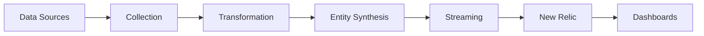

# New Relic Message Queues Platform - Complete Guide

## 🚀 Overview

The New Relic Message Queues Platform provides comprehensive observability for message queue infrastructure, supporting Kafka, RabbitMQ, SQS, and other messaging systems. It streams standardized telemetry data to New Relic for entity synthesis, monitoring, and alerting.

### Key Features
- **Multi-Provider Support**: Kafka, RabbitMQ, SQS, Azure Service Bus, GCP Pub/Sub
- **Entity Synthesis**: Automatic creation of MESSAGE_QUEUE_* entities in New Relic
- **Golden Metrics**: Standardized KPIs for each entity type
- **Dashboard Generation**: Automated dashboard creation with 31 pre-configured widgets
- **Simulation Mode**: Generate realistic data for testing and demos
- **Infrastructure Mode**: Monitor real message queue clusters
- **Hybrid Mode**: Combine real and simulated data

---

## 📊 Current Platform Status

### Live Statistics (Last Run)
- **Platform Version**: 1.0.0
- **Mode**: SIMULATION
- **Entities Generated**: 1,233
- **Entity Types Active**: 3 of 5
- **Relationships Built**: 2,192
- **API Status**: Running on port 3333

### Compliance Status
- **Data Model Compliance**: 60% (v3.0 specification)
- **Golden Metrics**: ✅ Fully implemented
- **Entity Types**: ⚠️ 3 of 5 streaming
- **GUID Format**: ❌ Non-compliant with v3.0

---

## 🏗️ Architecture

### Component Overview
```
┌─────────────────────────────────────────────────────────┐
│                    Platform Core                         │
├─────────────────┬───────────────┬──────────────────────┤
│   Collection    │ Transformation │   Entity Synthesis   │
│  - Infra Agent  │  - NRI Kafka   │  - Entity Factory    │
│  - Simulation   │  - Normalizer  │  - GUID Generation   │
│  - Hybrid       │  - Enrichment  │  - Relationships     │
├─────────────────┴───────────────┴──────────────────────┤
│                    Streaming Layer                       │
│              - New Relic Event API                      │
│              - Batch Processing                         │
│              - Error Recovery                           │
├─────────────────────────────────────────────────────────┤
│                 Dashboard System                         │
│  - Template Engine    - Metric Discovery               │
│  - Query Builder      - CLI Tool                       │
│  - Orchestrator       - Verification                   │
└─────────────────────────────────────────────────────────┘
```

### Data Flow


---

## 📦 Entity Types

### Currently Streaming (3 Types)

#### 1. MESSAGE_QUEUE_CLUSTER
- **Purpose**: Represents entire message queue clusters
- **Golden Metrics**: health score, throughput, error rate, availability
- **GUID**: `MESSAGE_QUEUE_CLUSTER|accountId|provider|clusterName`

#### 2. MESSAGE_QUEUE_BROKER
- **Purpose**: Individual broker/node monitoring
- **Golden Metrics**: CPU, memory, network throughput, request latency
- **GUID**: `MESSAGE_QUEUE_BROKER|accountId|provider|clusterName:brokerId`

#### 3. MESSAGE_QUEUE_TOPIC
- **Purpose**: Topic/queue performance tracking
- **Golden Metrics**: throughput in/out, consumer lag, error rate
- **GUID**: `MESSAGE_QUEUE_TOPIC|accountId|provider|clusterName:topicName`

### Implemented but Not Streaming (2 Types)

#### 4. MESSAGE_QUEUE_CONSUMER_GROUP
- **Status**: ❌ Code exists but not generated
- **Purpose**: Consumer group lag and performance
- **Golden Metrics**: total lag, max lag, member count, commit rate

#### 5. MESSAGE_QUEUE_QUEUE
- **Status**: ❌ Code exists but not generated
- **Purpose**: Queue depth and processing metrics
- **Golden Metrics**: depth, throughput in/out, processing time

---

## 🚀 Quick Start

### 1. Basic Setup
```bash
# Clone repository
git clone <repository-url>
cd newrelic-message-queues-platform

# Install dependencies
npm install

# Set environment variables
export NEW_RELIC_ACCOUNT_ID=your_account_id
export NEW_RELIC_INSERT_API_KEY=your_ingest_key
export NEW_RELIC_USER_API_KEY=your_user_key
```

### 2. Run in Simulation Mode
```bash
# Start platform with simulated data
node platform.js --mode simulation

# Platform runs on http://localhost:3333
```

### 3. View Generated Data
```bash
# Check entity summary
curl http://localhost:3333/api/entities/summary

# View sample entities
curl http://localhost:3333/api/entities | jq '.[0:3]'

# Check health
curl http://localhost:3333/health
```

### 4. Generate Dashboards
```bash
# Validate configuration
node dashboards/cli/dashboard-cli.js validate

# Generate dashboard
node dashboards/cli/dashboard-cli.js generate \
  --name "Production Kafka Monitoring"

# List existing dashboards
node dashboards/cli/dashboard-cli.js list
```

---

## 📋 Dashboard System

### Pre-Built Dashboard Template
The platform includes a comprehensive dashboard with 5 pages:

1. **Executive Overview** (9 widgets)
   - Platform health score
   - Active clusters
   - Total throughput
   - Consumer lag
   - Trend charts

2. **Broker Performance** (6 widgets)
   - CPU and memory usage
   - Network throughput
   - Request latency
   - Load distribution

3. **Topic Analytics** (6 widgets)
   - Top topics by throughput
   - Efficiency distribution
   - Partition analysis
   - Error rates

4. **Consumer Groups** (5 widgets)
   - Consumer lag tracking
   - Consumption vs production rates
   - Lag trends
   - Topic distribution

5. **Alerts & Anomalies** (5 widgets)
   - Critical metrics
   - Error trends
   - Throughput anomalies
   - Resource alerts

### Dashboard CLI Commands
```bash
# Generate with filters
node dashboards/cli/dashboard-cli.js generate \
  --cluster "prod-kafka-us-east" \
  --environment "production"

# Dry run mode
node dashboards/cli/dashboard-cli.js generate --dry-run

# Check generator health
node dashboards/cli/dashboard-cli.js health
```

---

## 🔧 Configuration

### Platform Modes

#### Simulation Mode (Default)
```bash
node platform.js --mode simulation
```
- Generates realistic synthetic data
- Perfect for testing and demos
- No infrastructure required

#### Infrastructure Mode
```bash
node platform.js --mode infrastructure
```
- Queries real nri-kafka data from New Relic
- Requires New Relic Infrastructure agent
- Production monitoring

#### Hybrid Mode
```bash
node platform.js --mode hybrid
```
- Combines real and simulated data
- Fills gaps in instrumentation
- Complete topology coverage

### Environment Variables
```bash
# Required
NEW_RELIC_ACCOUNT_ID=123456
NEW_RELIC_INSERT_API_KEY=NRII-xxxxx  # For streaming data
NEW_RELIC_USER_API_KEY=NRAK-xxxxx    # For queries/dashboards

# Optional
PLATFORM_MODE=simulation              # Default: simulation
PLATFORM_INTERVAL=60                  # Seconds between cycles
PLATFORM_DEBUG=true                   # Enable debug logging
KAFKA_CLUSTER_NAME=prod-kafka        # Cluster identifier
```

---

## 🐛 Known Issues & Gaps

### Critical Issues
1. **GUID Format Non-Compliance**
   - Current: `MESSAGE_QUEUE_BROKER|123456|kafka|cluster:broker`
   - Required: `123456|INFRA|MESSAGE_QUEUE_BROKER|hash`
   - Impact: Entity recognition issues

2. **Missing Entity Generation**
   - Only 3 of 5 entity types streaming
   - Consumer Groups and Queues not generated
   - Dashboard widgets may be empty

### Minor Issues
1. **Inconsistent Implementation Patterns**
   - Consumer Group uses different constructor
   - Some entities missing standard methods

2. **Limited Multi-Provider Support**
   - Simulation only generates Kafka entities
   - RabbitMQ/SQS entities defined but not used

---

## 📁 Project Structure

```
newrelic-message-queues-platform/
├── platform.js                 # Main entry point
├── core/
│   ├── entities/              # Entity definitions (5 types)
│   ├── config/                # Configuration management
│   ├── streaming/             # New Relic streaming
│   └── data-models/           # Data model definitions
├── dashboards/
│   ├── templates/             # Dashboard templates
│   ├── generators/            # Dashboard generation
│   ├── cli/                   # CLI tool
│   └── api/                   # Dashboard API server
├── simulation/
│   └── engines/               # Data simulation engine
├── infrastructure/
│   ├── collectors/            # Infrastructure data collection
│   └── transformers/          # Data transformation
├── verification/
│   └── engines/               # Dashboard verification
└── docs/
    ├── DATA_MODEL.md          # Official data model
    ├── IMPLEMENTATION_VALIDATION_REPORT.md
    └── PLATFORM_GUIDE.md      # This file
```

---

## 🔍 Validation & Testing

### Verify Implementation
```bash
# Check entity types being generated
curl http://localhost:3333/api/entities | \
  jq '[.[].entityType] | unique'
# Expected: ["MESSAGE_QUEUE_CLUSTER", "MESSAGE_QUEUE_BROKER", "MESSAGE_QUEUE_TOPIC"]

# Validate GUID format
curl http://localhost:3333/api/entities | \
  jq '.[0].guid'
# Current: "MESSAGE_QUEUE_CLUSTER|123456|kafka|..."
# Should be: "123456|INFRA|MESSAGE_QUEUE_CLUSTER|hash"

# Check golden metrics
curl http://localhost:3333/api/entities | \
  jq '.[0] | keys | map(select(contains("."))) | sort'
```

### Dashboard Validation
```bash
# Validate dashboard template
NEW_RELIC_ACCOUNT_ID=123456 \
NEW_RELIC_USER_API_KEY=NRAK-test \
node dashboards/cli/dashboard-cli.js validate

# Expected output:
# ✅ Template structure is valid
# Pages: 5
# Widgets: 31
```

---

## 🚧 Roadmap

### Phase 1: Compliance Fixes (Current)
- [ ] Fix GUID generation to v3.0 format
- [ ] Enable Consumer Group generation
- [ ] Enable Queue generation
- [ ] Standardize entity patterns

### Phase 2: Feature Completion
- [ ] Multi-provider simulation
- [ ] Service-to-topic relationships
- [ ] Advanced anomaly detection
- [ ] Custom metric support

### Phase 3: Production Features
- [ ] High availability mode
- [ ] Distributed deployment
- [ ] Advanced error recovery
- [ ] Performance optimization

---

## 📚 Additional Resources

### Documentation
- [Data Model Specification](docs/DATA_MODEL.md)
- [Implementation Validation Report](docs/IMPLEMENTATION_VALIDATION_REPORT.md)
- [Dashboard Implementation Guide](docs/DASHBOARD_IMPLEMENTATION_GUIDE.md)
- [V2 Architecture Review](newrelic-message-queues-platform-v2/docs/)

### Support
- Platform issues: Check logs at runtime
- Dashboard issues: Use `--dry-run` mode
- Entity issues: Verify with `/api/entities`

---

## 🎯 Success Metrics

When fully operational, the platform provides:
- **Complete Visibility**: All 5 entity types streaming
- **Rich Dashboards**: 31 widgets across 5 pages
- **Proactive Alerts**: Based on golden metrics
- **Topology Views**: Entity relationship mapping
- **Multi-Provider**: Support for various queue systems

---

*This guide reflects the current state of the Message Queues Platform v1.0.0 as of 2025-06-09*