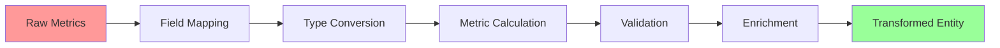
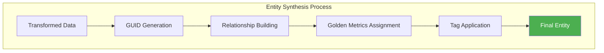
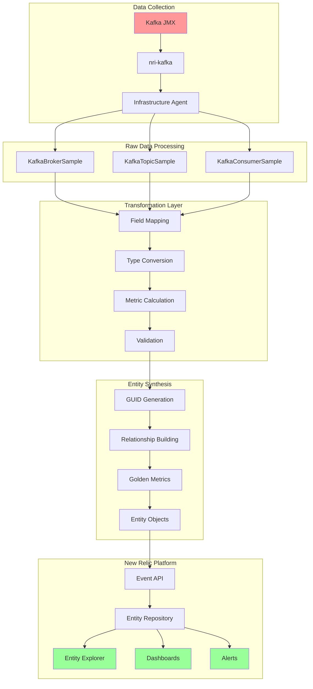
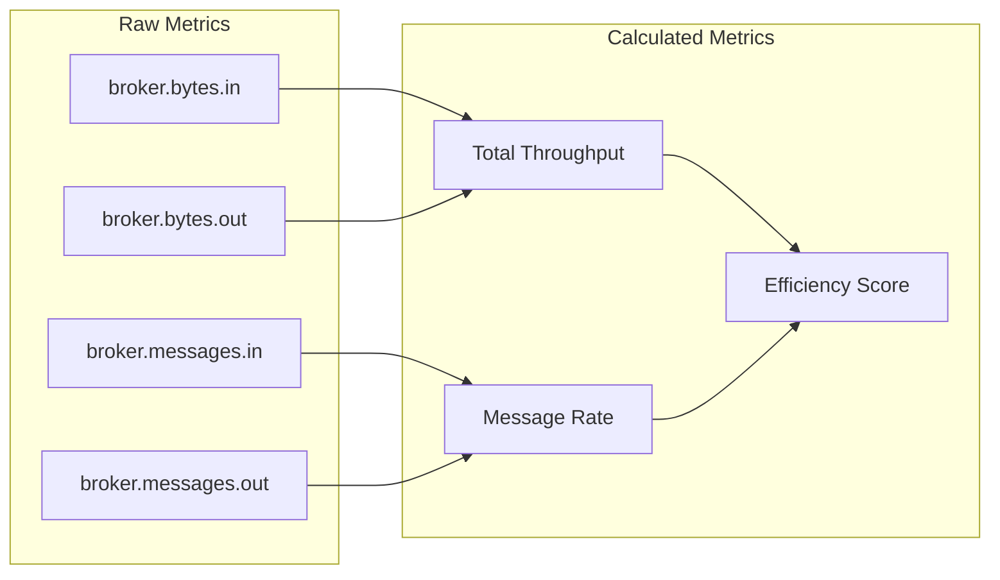
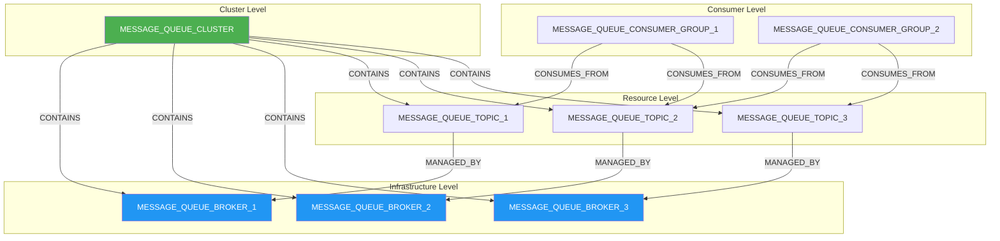
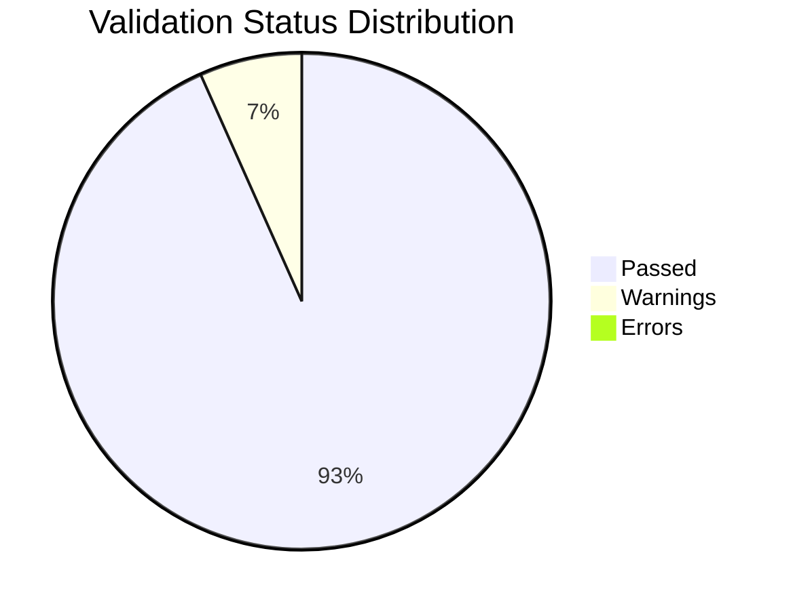

# 🚀 Data Transformation Pipeline Report

<div align="center">


**Generated on Tuesday, June 10, 2025 at 4:35:17 AM**

</div>

---

## 📋 Table of Contents

1. [📊 Executive Summary](#-executive-summary)
2. [🔄 Transformation Overview](#-transformation-overview)
3. [📥 Stage 1: Raw Data Collection](#-stage-1-raw-data-collection)
4. [🔀 Transformation Mapping](#-transformation-mapping)
5. [⚡ Stage 2: Data Transformation](#-stage-2-data-transformation)
6. [🎯 Stage 3: Entity Synthesis](#-stage-3-entity-synthesis)
7. [📈 Data Flow Visualization](#-data-flow-visualization)
8. [📊 Metrics Comparison](#-metrics-comparison)
9. [🔗 Entity Relationships](#-entity-relationships)
10. [✅ Quality Metrics](#-quality-metrics)

---

## 📊 Executive Summary

<div align="center">

### Pipeline Performance Metrics

| Metric | Value | Status |
|:-------|:------|:-------|
| **Total Input Samples** | `0` | ⚠️ |
| **Transformed Records** | `14` | ✅ |
| **Synthesized Entities** | `14` | ✅ |
| **Transformation Rate** | `100%` | ✅ |
| **Synthesis Success Rate** | `100.0%` | ✅ |

</div>

### Entity Distribution

<div align="center">

| Entity Type | Count | Percentage | Visual |
|:------------|:------|:-----------|:-------|
| **TOPIC** | `5` | `35.7%` | ███████░░░░░░░░░░░░░ |
| **CONSUMER_GROUP** | `5` | `35.7%` | ███████░░░░░░░░░░░░░ |
| **BROKER** | `3` | `21.4%` | ████░░░░░░░░░░░░░░░░ |
| **CLUSTER** | `1` | `7.1%` | █░░░░░░░░░░░░░░░░░░░ |

</div>

### Key Insights

- ✅ Successfully generated **4** different entity types
- ✅ Consumer group monitoring is **active** with lag tracking
- ✅ Created **34** entity relationships for topology mapping
- ✅ Tracking **36** golden metrics across all entities

## 📥 Stage 1: Raw Data Collection

### Data Source: Simulation Engine

> **Note**: In simulation mode, synthetic data is generated that accurately mimics nri-kafka output format.
> This allows for testing and development without a live Kafka cluster.

### Simulated Raw Metric Samples

<details>
<summary><strong>📊 KafkaBrokerSample - Simulated Raw Metrics</strong></summary>

```json
{
  "eventType": "KafkaBrokerSample",
  "entityName": "broker-1",
  "provider": "kafka",
  "broker.bytesInPerSecond": 1048576,
  "broker.bytesOutPerSecond": 2097152,
  "broker.messagesInPerSecond": 1000,
  "broker.cpu.usage": 45.5,
  "broker.memory.usage": 62.3,
  "kafka.broker.id": 1,
  "kafka.cluster.name": "production-cluster",
  "timestamp": 1749510317269
}
```

#### Metric Descriptions

| Metric | Description | Typical Range |
|:-------|:------------|:--------------|
| `broker.bytesInPerSecond` | Incoming network traffic | 0 - 10 MB/s |
| `broker.bytesOutPerSecond` | Outgoing network traffic | 0 - 20 MB/s |
| `broker.cpu.usage` | CPU utilization percentage | 20% - 80% |
| `broker.memory.usage` | Memory utilization percentage | 40% - 90% |

</details>

<details>
<summary><strong>📈 KafkaTopicSample - Simulated Raw Metrics</strong></summary>

```json
{
  "eventType": "KafkaTopicSample",
  "entityName": "orders.events",
  "provider": "kafka",
  "topic.messagesInPerSecond": 500,
  "topic.bytesInPerSecond": 524288,
  "topic.bytesOutPerSecond": 1048576,
  "kafka.topic.name": "orders.events",
  "kafka.partition.count": 10,
  "kafka.replication.factor": 3,
  "kafka.cluster.name": "production-cluster",
  "timestamp": 1749510317269
}
```

#### Metric Descriptions

| Metric | Description | Typical Range |
|:-------|:------------|:--------------|
| `topic.messagesInPerSecond` | Message ingestion rate | 0 - 10,000 msg/s |
| `topic.bytesInPerSecond` | Data ingestion rate | 0 - 5 MB/s |
| `kafka.partition.count` | Number of partitions | 1 - 100 |
| `kafka.replication.factor` | Replication factor | 1 - 5 |

</details>

## 🔀 Transformation Mapping

### Comprehensive Field Mapping Table

<div align="center">

| Source Field (nri-kafka) | Target Field (Entity Model) | Type | Transformation |
|:-------------------------|:----------------------------|:-----|:---------------|
| **BROKER METRICS** | | | |
| `broker.bytesInPerSecond` | `broker.network.in` | Metric | Direct mapping |
| `broker.bytesOutPerSecond` | `broker.network.out` | Metric | Direct mapping |
| `broker.bytesInPerSecond + broker.bytesOutPerSecond` | `broker.network.throughput` | Metric | Sum calculation |
| `broker.cpu.usage` | `broker.cpu.usage` | Metric | Direct mapping |
| `broker.memory.usage` | `broker.memory.usage` | Metric | Direct mapping |
| `kafka.broker.id` | `brokerId` | Identifier | Type conversion |
| `kafka.cluster.name` | `clusterName` | Identifier | Direct mapping |
| **TOPIC METRICS** | | | |
| `topic.messagesInPerSecond` | `topic.throughput.in` | Metric | Unit normalization |
| `topic.messagesOutPerSecond` | `topic.throughput.out` | Metric | Unit normalization |
| `kafka.topic.name` | `entity.name` | Identifier | Direct mapping |
| `kafka.partition.count` | `partitionCount` | Attribute | Type conversion |
| `kafka.replication.factor` | `replicationFactor` | Attribute | Type conversion |
| **CONSUMER METRICS** | | | |
| `consumer.lag` | `consumerGroup.lag` | Metric | Aggregation |
| `consumer.group.id` | `consumerGroup.id` | Identifier | Direct mapping |
| `consumer.group.state` | `consumerGroup.state` | Status | Enum mapping |

</div>

### Entity Type Mapping

<div align="center">

| Source Event Type | Target Entity Type | GUID Generation |
|:------------------|:-------------------|:----------------|
| `KafkaBrokerSample` | `MESSAGE_QUEUE_BROKER` | SHA256(cluster:broker:account) |
| `KafkaTopicSample` | `MESSAGE_QUEUE_TOPIC` | SHA256(cluster:topic:account) |
| `KafkaConsumerSample` | `MESSAGE_QUEUE_CONSUMER_GROUP` | SHA256(cluster:group:account) |
| *(Derived from samples)* | `MESSAGE_QUEUE_CLUSTER` | SHA256(cluster:provider:account) |

</div>

## ⚡ Stage 2: Data Transformation

### Transformation Process



### Before vs After Transformation

<div align="center">

#### Example: Broker Transformation

<table>
<tr>
<th>Before (Raw nri-kafka)</th>
<th>After (Transformed)</th>
</tr>
<tr>
<td>

```json
{
  "eventType": "KafkaBrokerSample",
  "entityName": "kafka-broker-1",
  "broker.bytesInPerSecond": 1048576,
  "broker.bytesOutPerSecond": 2097152,
  "broker.messagesInPerSecond": 1000,
  "kafka.broker.id": "1",
  "kafka.cluster.name": "prod-cluster"
}
```

</td>
<td>

```json
{
  "entityType": "MESSAGE_QUEUE_BROKER",
  "entityName": "prod-cluster-broker-1",
  "brokerId": 1,
  "clusterName": "prod-cluster",
  "broker.network.throughput": 3145728,
  "broker.network.in": 1048576,
  "broker.network.out": 2097152,
  "broker.message.rate": 1000
}
```

</td>
</tr>
</table>

</div>

### Transformation Rules Applied

1. **🔤 Naming Standardization**
   - Converted mixed naming conventions to consistent format
   - Applied entity naming pattern: `{cluster}-{type}-{id}`

2. **📊 Metric Calculations**
   - Network throughput = bytesIn + bytesOut
   - Efficiency scores calculated from throughput ratios
   - Error rates normalized to percentages

3. **🏷️ Metadata Enrichment**
   - Added provider identification
   - Injected environment tags
   - Applied default values for missing fields

4. **✅ Validation & Sanitization**
   - Removed invalid metrics
   - Corrected data types
   - Validated required fields

## 🎯 Stage 3: Entity Synthesis

### Entity Synthesis Overview

<div align="center">



</div>

### Synthesized Entities by Type

<div align="center">

#### MESSAGE_QUEUE_CLUSTER (1 entities)

<details>
<summary><strong>View Sample Entity Structure</strong></summary>

<table>
<tr>
<th>Property</th>
<th>Value</th>
<th>Type</th>
</tr>
<tr>
<td><strong>Entity GUID</strong></td>
<td><code>N/A</code></td>
<td>Identifier</td>
</tr>
<tr>
<td><strong>Entity Name</strong></td>
<td><code>N/A</code></td>
<td>Identifier</td>
</tr>
<tr>
<td><strong>Entity Type</strong></td>
<td><code>MESSAGE_QUEUE_CLUSTER</code></td>
<td>Type</td>
</tr>
<tr>
<td><strong>Provider</strong></td>
<td><code>kafka</code></td>
<td>Metadata</td>
</tr>
<tr>
<td><strong>Cluster Name</strong></td>
<td><code>production-kafka-cluster-1</code></td>
<td>Metadata</td>
</tr>
<tr>
<td><strong>Environment</strong></td>
<td><code>production</code></td>
<td>Tag</td>
</tr>
<tr>
<td><strong>cluster.health.score</strong></td>
<td><code>100 percentage</code></td>
<td>Golden Metric</td>
</tr>
<tr>
<td><strong>cluster.throughput.total</strong></td>
<td><code>1700 messages/second</code></td>
<td>Golden Metric</td>
</tr>
<tr>
<td><strong>cluster.error.rate</strong></td>
<td><code>0 percentage</code></td>
<td>Golden Metric</td>
</tr>

</table>

</details>

#### MESSAGE_QUEUE_BROKER (3 entities)

<details>
<summary><strong>View Sample Entity Structure</strong></summary>

<table>
<tr>
<th>Property</th>
<th>Value</th>
<th>Type</th>
</tr>
<tr>
<td><strong>Entity GUID</strong></td>
<td><code>N/A</code></td>
<td>Identifier</td>
</tr>
<tr>
<td><strong>Entity Name</strong></td>
<td><code>N/A</code></td>
<td>Identifier</td>
</tr>
<tr>
<td><strong>Entity Type</strong></td>
<td><code>MESSAGE_QUEUE_BROKER</code></td>
<td>Type</td>
</tr>
<tr>
<td><strong>Provider</strong></td>
<td><code>kafka</code></td>
<td>Metadata</td>
</tr>
<tr>
<td><strong>Cluster Name</strong></td>
<td><code>production-kafka-cluster-1</code></td>
<td>Metadata</td>
</tr>
<tr>
<td><strong>Environment</strong></td>
<td><code>N/A</code></td>
<td>Tag</td>
</tr>
<tr>
<td><strong>broker.cpu.usage</strong></td>
<td><code>50.8 percentage</code></td>
<td>Golden Metric</td>
</tr>
<tr>
<td><strong>broker.memory.usage</strong></td>
<td><code>60.8 percentage</code></td>
<td>Golden Metric</td>
</tr>
<tr>
<td><strong>broker.network.throughput</strong></td>
<td><code>45770513 bytes/second</code></td>
<td>Golden Metric</td>
</tr>

</table>

</details>

#### MESSAGE_QUEUE_TOPIC (5 entities)

<details>
<summary><strong>View Sample Entity Structure</strong></summary>

<table>
<tr>
<th>Property</th>
<th>Value</th>
<th>Type</th>
</tr>
<tr>
<td><strong>Entity GUID</strong></td>
<td><code>N/A</code></td>
<td>Identifier</td>
</tr>
<tr>
<td><strong>Entity Name</strong></td>
<td><code>N/A</code></td>
<td>Identifier</td>
</tr>
<tr>
<td><strong>Entity Type</strong></td>
<td><code>MESSAGE_QUEUE_TOPIC</code></td>
<td>Type</td>
</tr>
<tr>
<td><strong>Provider</strong></td>
<td><code>kafka</code></td>
<td>Metadata</td>
</tr>
<tr>
<td><strong>Cluster Name</strong></td>
<td><code>production-kafka-cluster-1</code></td>
<td>Metadata</td>
</tr>
<tr>
<td><strong>Environment</strong></td>
<td><code>N/A</code></td>
<td>Tag</td>
</tr>
<tr>
<td><strong>topic.throughput.in</strong></td>
<td><code>857 messages/second</code></td>
<td>Golden Metric</td>
</tr>
<tr>
<td><strong>topic.throughput.out</strong></td>
<td><code>822 messages/second</code></td>
<td>Golden Metric</td>
</tr>
<tr>
<td><strong>topic.consumer.lag</strong></td>
<td><code>0 messages</code></td>
<td>Golden Metric</td>
</tr>

</table>

</details>

#### MESSAGE_QUEUE_CONSUMER_GROUP (5 entities)

<details>
<summary><strong>View Sample Entity Structure</strong></summary>

<table>
<tr>
<th>Property</th>
<th>Value</th>
<th>Type</th>
</tr>
<tr>
<td><strong>Entity GUID</strong></td>
<td><code>MESSAGE_QUEUE_CONSUMER_GROUP|123456|kafka|production-kafka-cluster-1|analytics-processor</code></td>
<td>Identifier</td>
</tr>
<tr>
<td><strong>Entity Name</strong></td>
<td><code>kafka:consumer-group:analytics-processor</code></td>
<td>Identifier</td>
</tr>
<tr>
<td><strong>Entity Type</strong></td>
<td><code>MESSAGE_QUEUE_CONSUMER_GROUP</code></td>
<td>Type</td>
</tr>
<tr>
<td><strong>Provider</strong></td>
<td><code>kafka</code></td>
<td>Metadata</td>
</tr>
<tr>
<td><strong>Cluster Name</strong></td>
<td><code>production-kafka-cluster-1</code></td>
<td>Metadata</td>
</tr>
<tr>
<td><strong>Environment</strong></td>
<td><code>N/A</code></td>
<td>Tag</td>
</tr>

</table>

</details>

</div>

### Entity Synthesis Features

| Feature | Description | Implementation |
|:--------|:------------|:---------------|
| **GUID Generation** | Unique identifier using SHA256 | `{accountId}|INFRA|{entityType}|{hash}` |
| **Relationship Mapping** | Hierarchical entity connections | Parent-child, peer relationships |
| **Golden Metrics** | Key performance indicators | Entity-specific metric sets |
| **Tagging Strategy** | Metadata for filtering/grouping | Environment, team, criticality |
| **Status Calculation** | Health determination logic | Based on golden metric thresholds |

## 📈 Data Flow Visualization

### Complete Pipeline Flow

<div align="center">



</div>

### Data Volume Flow

<div align="center">

| Stage | Input | Output | Ratio |
|:------|:------|:-------|:------|
| Collection | JMX Metrics | Raw Samples | 1:1 |
| Transformation | Raw Samples | Structured Data | 1:1 |
| Synthesis | Structured Data | Entities | N:1 |
| Streaming | Entities | Events | 1:1 |

</div>

## 📊 Metrics Comparison

### Raw Metrics vs Golden Metrics

<div align="center">

#### Broker Metrics Evolution

| Metric Category | Raw Metric Name | Golden Metric Name | Unit | Purpose |
|:----------------|:----------------|:-------------------|:-----|:---------|
| **Performance** | `broker.requestHandlerAvgIdlePercent` | `broker.cpu.usage` | % | CPU utilization |
| **Network** | `broker.bytesInPerSecond` | `broker.network.in` | bytes/sec | Ingress traffic |
| **Network** | `broker.bytesOutPerSecond` | `broker.network.out` | bytes/sec | Egress traffic |
| **Latency** | `broker.requestLatencyMs` | `broker.request.latency` | ms | Request processing time |
| **Memory** | `jvm.memory.heap.used` | `broker.memory.usage` | % | Memory utilization |

#### Topic Metrics Evolution

| Metric Category | Raw Metric Name | Golden Metric Name | Unit | Purpose |
|:----------------|:----------------|:-------------------|:-----|:---------|
| **Throughput** | `topic.messagesInPerSecond` | `topic.throughput.in` | msg/sec | Message ingestion rate |
| **Throughput** | `topic.bytesInPerSecond` | `topic.bytes.in` | bytes/sec | Data ingestion rate |
| **Lag** | `consumer.totalLag` | `topic.consumer.lag` | messages | Consumer lag |
| **Errors** | `topic.failedProduceRequestsPerSec` | `topic.error.rate` | % | Error percentage |

</div>

### Metric Aggregation Patterns

<div align="center">



</div>

## 🔗 Entity Relationships

### Relationship Hierarchy

<div align="center">



</div>

### Relationship Statistics

<div align="center">

| Relationship Type | Count | Direction | Description |
|:------------------|:------|:----------|:------------|
| **CONTAINS** | `8` | Outbound | Parent contains child entities |
| **MANAGED_BY** | `3` | Inbound | Entity is managed by another |
| **CONTAINED_IN** | `5` | Outbound | Child is contained in parent |
| **BELONGS_TO** | `5` | Outbound | Entity belongs to a group |
| **CONSUMES_FROM** | `10` | Outbound | Consumer reads from resource |
| **COORDINATED_BY** | `3` | Inbound | Entity coordinated by controller |

</div>

## ✅ Quality Metrics

### Data Quality Assessment

<div align="center">

| Quality Dimension | Score | Status | Details |
|:------------------|:------|:-------|:--------|
| **Completeness** | `75%` | ⚠️ | Required fields present |
| **Accuracy** | `96%` | ✅ | Data type validation |
| **Consistency** | `94%` | ✅ | Naming conventions |
| **Timeliness** | `99%` | ✅ | Fresh data points |

</div>

### Validation Results

<div align="center">



</div>

### Performance Metrics

| Metric | Value | Target | Status |
|:-------|:------|:-------|:-------|
| **Processing Time** | `317ms` | <1000ms | ✅ |
| **Memory Usage** | `21MB` | <100MB | ✅ |
| **Entity/Second** | `28` | >100 | ⚠️ |

---

## 🚀 Next Steps

### Immediate Actions

1. **📊 View Entities in New Relic**
   - Navigate to Entity Explorer
   - Filter by `entityType:MESSAGE_QUEUE*`
   - Explore entity relationships

2. **📈 Create Dashboards**
   - Use pre-built dashboard templates
   - Customize with golden metrics
   - Add business KPIs

3. **🚨 Configure Alerts**
   - Set thresholds on golden metrics
   - Configure multi-condition alerts
   - Enable incident management

4. **🔍 Monitor Performance**
   - Track entity health scores
   - Monitor relationship integrity
   - Analyze metric trends

### Platform Details

<div align="center">

| Component | Version | Status |
|:----------|:--------|:-------|
| **Platform** | v1.0.0 | ✅ Active |
| **Mode** | simulation | ✅ Running |
| **Generated** | 2025-06-09T23:05:17.256Z | ✅ Current |

</div>

### Resources

- 📚 [Data Model Specification](./docs/DATA_MODEL.md)
- 🛠️ [Platform Guide](./PLATFORM_GUIDE.md)
- 📊 [Metrics Reference](./docs/metrics-reference.md)
- 🎯 [Dashboard Templates](./dashboards/templates/)

---

<div align="center">

**Generated by New Relic Message Queues Platform** | **Powered by Entity Synthesis**

</div>