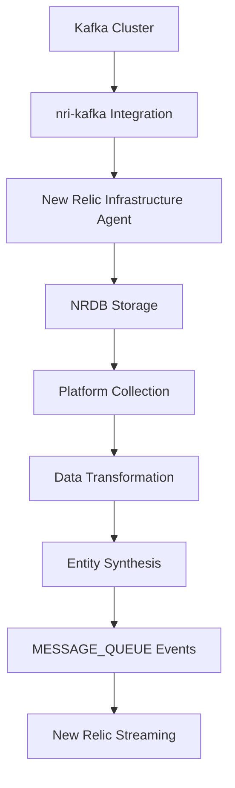
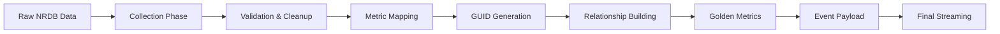

# 🔄 Data Transformation Pipeline Documentation

> **Complete journey from raw NRDB data to standardized MESSAGE_QUEUE events**

This document provides a comprehensive view of how the New Relic Message Queues Platform transforms raw infrastructure data from NRDB into standardized, entity-synthesis-ready events.

---

## 📋 Table of Contents

- [Overview](#-overview)
- [Infrastructure Mode Data Flow](#-infrastructure-mode-data-flow)
- [Raw NRDB Data Models](#-raw-nrdb-data-models)
- [Transformation Process](#-transformation-process)
- [Final Streamed Data Models](#-final-streamed-data-models)
- [Simulation Mode Data](#-simulation-mode-data)
- [Data Lineage Tracking](#-data-lineage-tracking)
- [Troubleshooting Guide](#-troubleshooting-guide)

---

## 🎯 Overview

The platform operates in three distinct modes, each with different data sources and transformation patterns:

| Mode | Input Source | Transformation | Output |
|------|-------------|----------------|---------|
| **Infrastructure** | Raw nri-kafka data from NRDB | ✅ Full transformation pipeline | Standardized MESSAGE_QUEUE events |
| **Simulation** | Generated synthetic data | ⚡ Direct entity creation | Standardized MESSAGE_QUEUE events |
| **Hybrid** | NRDB + synthetic data | 🔄 Selective transformation | Complete MESSAGE_QUEUE topology |

---

## 🏗️ Infrastructure Mode Data Flow



### Data Collection Query Pattern

The platform uses NerdGraph to query NRDB with patterns like:

```graphql
{
  actor {
    account(id: ACCOUNT_ID) {
      nrql(query: "FROM KafkaBrokerSample SELECT * WHERE cluster = 'production' SINCE 5 minutes ago") {
        results
      }
    }
  }
}
```

---

## 📥 Raw NRDB Data Models

### KafkaBrokerSample (Source Event)

Raw broker metrics collected by nri-kafka integration:

<details>
<summary><strong>📊 Click to expand KafkaBrokerSample structure</strong></summary>

```json
{
  "eventType": "KafkaBrokerSample",
  "timestamp": 1704067200000,
  "entityKey": "kafka-broker",
  "displayName": "kafka-broker-1.prod.internal",
  "entityName": "kafka-broker-1.prod.internal",
  
  // Core identification
  "clusterName": "production-kafka",
  "brokerID": 1,
  "host": "kafka-broker-1.prod.internal", 
  "port": 9092,
  
  // JMX Metrics (Raw)
  "net.bytesRejectedPerSecond": 0,
  "net.bytesInPerSecond": 52428800.5,
  "net.bytesOutPerSecond": 41943040.2,
  "net.requestsPerSecond": 890.5,
  "net.errorRate": 0.02,
  
  // Broker State
  "broker.logSize": 2147483648,
  "broker.offsetLag": 0,
  "broker.messagesInPerSecond": 1500.75,
  "broker.replicationBytesInPerSecond": 26214400,
  "broker.replicationBytesOutPerSecond": 20971520,
  
  // Controller Status
  "broker.isController": 0,
  "broker.leaderCount": 23,
  "broker.partitionCount": 45,
  "broker.replicaCount": 135,
  
  // JVM Metrics
  "jvm.heapMemoryUsed": 2147483648,
  "jvm.heapMemoryMax": 4294967296,
  "jvm.nonHeapMemoryUsed": 104857600,
  "jvm.gcCollectionCount": 45,
  "jvm.gcCollectionTime": 125.5,
  
  // System Metrics
  "system.cpuPercent": 65.2,
  "system.loadAverage1m": 2.1,
  "system.memoryUsedPercent": 73.4,
  "system.diskUsedPercent": 68.7,
  
  // Network Metrics
  "network.connectionsAcceptedPerSecond": 12.5,
  "network.connectionsCreatedPerSecond": 8.2,
  "network.selectsPerSecond": 450.3,
  
  // Additional metadata from Infrastructure agent
  "hostname": "kafka-broker-1",
  "kernelVersion": "5.4.0-74-generic",
  "linuxDistribution": "Ubuntu 20.04.2 LTS",
  "agentVersion": "1.20.0",
  "integrationName": "nri-kafka",
  "integrationVersion": "3.2.1"
}
```

</details>

### KafkaTopicSample (Source Event)

Raw topic metrics with partition-level details:

<details>
<summary><strong>📊 Click to expand KafkaTopicSample structure</strong></summary>

```json
{
  "eventType": "KafkaTopicSample", 
  "timestamp": 1704067200000,
  "entityKey": "kafka-topic",
  "displayName": "user.events.created",
  "entityName": "user.events.created",
  
  // Core identification
  "clusterName": "production-kafka",
  "topic": "user.events.created",
  "partition": 0,
  
  // Topic Configuration
  "topic.partitionCount": 12,
  "topic.replicationFactor": 3,
  "topic.retentionMs": 604800000,
  "topic.retentionBytes": 1073741824000,
  "topic.segmentMs": 86400000,
  "topic.compressionType": "gzip",
  "topic.cleanupPolicy": "delete",
  
  // Throughput Metrics
  "topic.bytesInPerSecond": 1048576.5,
  "topic.bytesOutPerSecond": 2097152.3,
  "topic.messagesInPerSecond": 425.3,
  "topic.totalProduceRequestsPerSecond": 89.2,
  "topic.totalFetchRequestsPerSecond": 156.7,
  "topic.failedProduceRequestsPerSecond": 0.1,
  "topic.failedFetchRequestsPerSecond": 0.05,
  
  // Size and Offset Metrics
  "topic.diskSize": 5368709120,
  "topic.offsetMax": 1250847,
  "topic.offsetMin": 847234,
  "topic.logEndOffset": 1250847,
  "topic.logStartOffset": 847234,
  
  // Per-partition metrics (when partition specified)
  "partition.high_water_mark": 104295,
  "partition.log_end_offset": 104295,
  "partition.log_start_offset": 98432,
  "partition.size": 447392768,
  
  // Producer metrics
  "producer.avgRecordSizeBytes": 2468.5,
  "producer.avgRecordsPerSecond": 425.3,
  "producer.avgBatchSizeBytes": 15234.2,
  
  // Consumer lag (aggregate across all consumer groups)
  "consumer.lagSum": 1250,
  "consumer.lagMax": 450,
  "consumer.offsetLatestSum": 1250847,
  "consumer.offsetOldestSum": 847234,
  
  // Additional metadata
  "hostname": "kafka-broker-1",
  "integrationName": "nri-kafka",
  "integrationVersion": "3.2.1"
}
```

</details>

### KafkaConsumerSample (Source Event)

Raw consumer group metrics collected via Admin API:

<details>
<summary><strong>📊 Click to expand KafkaConsumerSample structure</strong></summary>

```json
{
  "eventType": "KafkaConsumerSample",
  "timestamp": 1704067200000,
  "entityKey": "kafka-consumer",
  "displayName": "analytics-consumer",
  "entityName": "analytics-consumer",
  
  // Core identification
  "clusterName": "production-kafka",
  "consumerGroup": "analytics-consumer",
  "topic": "user.events.created",
  "partition": 0,
  
  // Consumer Group State
  "consumerGroup.state": "Stable",
  "consumerGroup.members": 3,
  "consumerGroup.coordinator": "kafka-broker-2.prod.internal:9092",
  "consumerGroup.assignmentStrategy": "range",
  
  // Lag Metrics (per partition)
  "consumer.lag": 125,
  "consumer.offset": 104170,
  "consumer.logEndOffset": 104295,
  "consumer.timeOfLastRecord": 1704067195000,
  
  // Consumer Performance
  "consumer.totalRecordsConsumed": 2847293,
  "consumer.avgRecordsConsumedPerSecond": 380.7,
  "consumer.totalBytesConsumed": 7038271488,
  "consumer.avgBytesConsumedPerSecond": 920576,
  
  // Commit Metrics
  "consumer.totalCommits": 1847,
  "consumer.commitsPerSecond": 5.2,
  "consumer.avgCommitLatencyMs": 12.5,
  "consumer.lastCommitTimestamp": 1704067190000,
  
  // Processing Metrics
  "consumer.avgProcessingTimeMs": 45.2,
  "consumer.maxProcessingTimeMs": 156.7,
  "consumer.totalRebalances": 3,
  "consumer.lastRebalanceTimestamp": 1704066600000,
  
  // Fetch Metrics
  "consumer.avgFetchLatencyMs": 12.5,
  "consumer.maxFetchLatencyMs": 45.8,
  "consumer.avgFetchSizeBytes": 32768,
  "consumer.fetchRequestsPerSecond": 25.3,
  
  // Error Metrics
  "consumer.totalErrors": 12,
  "consumer.errorsPerSecond": 0.005,
  "consumer.lastErrorTimestamp": 1704067100000,
  "consumer.lastErrorMessage": "Offset commit failed",
  
  // Client Information
  "consumer.clientId": "analytics-consumer-1",
  "consumer.clientHost": "analytics-worker-1.prod.internal",
  "consumer.memberAssignment": "[0,1,2,3]",
  
  // Additional metadata
  "hostname": "kafka-broker-1", 
  "integrationName": "nri-kafka",
  "integrationVersion": "3.2.1"
}
```

</details>

---

## ⚙️ Transformation Process

### 🔄 Step-by-Step Transformation Pipeline



#### Phase 1: Collection & Aggregation

```javascript
// Platform collects multiple event types
const rawData = {
  brokerSamples: [], // KafkaBrokerSample events
  topicSamples: [],  // KafkaTopicSample events  
  consumerSamples: [] // KafkaConsumerSample events
};
```

#### Phase 2: Data Validation & Cleanup

```javascript
// Remove invalid/incomplete samples
const validatedData = {
  brokerSamples: rawData.brokerSamples.filter(sample => 
    sample.clusterName && sample.brokerID !== undefined
  ),
  // ... similar validation for other types
};
```

#### Phase 3: Metric Transformation & Mapping

<details>
<summary><strong>🔧 Click to expand transformation mappings</strong></summary>

##### KafkaBrokerSample → MESSAGE_QUEUE_BROKER

```javascript
const brokerTransformation = {
  // Identity mapping
  'clusterName': 'clusterName',
  'brokerID': 'brokerId', 
  'host': 'brokerHost',
  'port': 'brokerPort',
  
  // Golden metric mappings
  'broker.messagesInPerSecond': 'throughputPerSecond',
  'system.diskUsedPercent': 'diskUsagePercent',
  'net.bytesInPerSecond': 'networkBytesInPerSecond',
  'net.bytesOutPerSecond': 'networkBytesOutPerSecond',
  'broker.partitionCount': 'partitionCount',
  'broker.leaderCount': 'leaderPartitionCount',
  'net.requestsPerSecond': 'requestRate',
  'net.errorRate': 'errorRate',
  
  // System metrics
  'jvm.heapMemoryUsed': 'jvmMemoryUsed',
  'jvm.heapMemoryMax': 'jvmMemoryMax',
  'jvm.gcCollectionTime': 'gcTime'
};
```

##### KafkaTopicSample → MESSAGE_QUEUE_TOPIC

```javascript
const topicTransformation = {
  // Identity mapping
  'clusterName': 'clusterName',
  'topic': 'topicName',
  'topic.partitionCount': 'partitionCount',
  'topic.replicationFactor': 'replicationFactor',
  'topic.retentionMs': 'retentionMs',
  
  // Golden metric mappings
  'topic.messagesInPerSecond': 'throughputPerSecond',
  'topic.bytesInPerSecond': 'bytesInPerSecond',
  'topic.bytesOutPerSecond': 'bytesOutPerSecond',
  'consumer.lagSum': 'offsetLag',
  'topic.failedProduceRequestsPerSecond': 'errorRate',
  'topic.diskSize': 'retentionBytes',
  
  // Configuration mapping
  'topic.compressionType': 'compressionType',
  'topic.cleanupPolicy': 'cleanupPolicy',
  'topic.segmentMs': 'segmentMs'
};
```

##### KafkaConsumerSample → MESSAGE_QUEUE_CONSUMER

```javascript
const consumerTransformation = {
  // Identity mapping (aggregated by consumer group)
  'clusterName': 'clusterName',
  'consumerGroup': 'consumerGroupId',
  'consumerGroup.state': 'state',
  'consumerGroup.members': 'memberCount',
  
  // Golden metric mappings (aggregated across partitions)
  'consumer.lag': 'lagTotal', // SUM across partitions
  'consumer.lag': 'lagMax',   // MAX across partitions
  'consumer.avgRecordsConsumedPerSecond': 'throughputPerSecond',
  'consumer.commitsPerSecond': 'commitRate',
  'consumer.errorsPerSecond': 'errorRate',
  'consumer.totalRebalances': 'rebalanceRate',
  
  // Performance metrics
  'consumer.avgFetchLatencyMs': 'fetchLatencyAvg',
  'consumer.avgProcessingTimeMs': 'processTimeAvg',
  'consumerGroup.members': 'assignedPartitions'
};
```

</details>

#### Phase 4: GUID Generation

Each entity gets a standardized GUID following the pattern:

```javascript
const guidGeneration = {
  broker: `MESSAGE_QUEUE_BROKER|${accountId}|${provider}|${clusterName}|${brokerId}`,
  topic: `MESSAGE_QUEUE_TOPIC|${accountId}|${provider}|${clusterName}|${topicName}`,
  consumer: `MESSAGE_QUEUE_CONSUMER|${accountId}|${provider}|${clusterName}|${consumerGroupId}`,
  cluster: `MESSAGE_QUEUE_CLUSTER|${accountId}|${provider}|${clusterName}`
};
```

#### Phase 5: Relationship Building

```javascript
const relationships = {
  clusterToBrokers: "CONTAINS",
  clusterToTopics: "CONTAINS", 
  clusterToConsumers: "CONTAINS",
  brokersToCluster: "CONTAINED_IN",
  topicsToCluster: "CONTAINED_IN",
  consumersToCluster: "CONTAINED_IN",
  consumersToTopics: "CONSUMES"
};
```

---

## 📤 Final Streamed Data Models

### MESSAGE_QUEUE_BROKER (Transformed Output)

Result after transforming KafkaBrokerSample:

<details>
<summary><strong>✨ Click to expand transformed MESSAGE_QUEUE_BROKER</strong></summary>

```json
{
  // New Relic Event Structure
  "eventType": "MessageQueue",
  "timestamp": 1704067200000,
  
  // Entity Synthesis Fields
  "entity.guid": "MESSAGE_QUEUE_BROKER|123456|kafka|production-kafka|1",
  "entity.name": "kafka-broker-1.prod.internal",
  "entity.type": "MESSAGE_QUEUE_BROKER",
  "entityType": "MESSAGE_QUEUE_BROKER",
  "entityGuid": "MESSAGE_QUEUE_BROKER|123456|kafka|production-kafka|1",
  
  // Provider & Environment
  "provider": "kafka",
  "accountId": "123456",
  "environment": "production",
  
  // Broker Identity (from KafkaBrokerSample)
  "clusterName": "production-kafka",
  "brokerId": "1",
  "brokerHost": "kafka-broker-1.prod.internal",
  "brokerPort": 9092,
  "isController": false,
  
  // Golden Metrics (transformed from raw JMX)
  "throughputPerSecond": 1500.75,        // ← broker.messagesInPerSecond
  "diskUsagePercent": 68.7,              // ← system.diskUsedPercent  
  "networkBytesInPerSecond": 52428800,   // ← net.bytesInPerSecond
  "networkBytesOutPerSecond": 41943040,  // ← net.bytesOutPerSecond
  "partitionCount": 45,                  // ← broker.partitionCount
  "leaderPartitionCount": 23,            // ← broker.leaderCount
  "requestRate": 890.5,                  // ← net.requestsPerSecond
  "errorRate": 0.02,                     // ← net.errorRate
  
  // System Metrics (enhanced from raw data)
  "jvmMemoryUsed": 2147483648,           // ← jvm.heapMemoryUsed
  "jvmMemoryMax": 4294967296,            // ← jvm.heapMemoryMax
  "gcTime": 125.5,                       // ← jvm.gcCollectionTime
  "cpuUsagePercent": 65.2,               // ← system.cpuPercent
  "memoryUsagePercent": 73.4,            // ← system.memoryUsedPercent
  
  // Standardized Tags
  "tag.environment": "production",
  "tag.datacenter": "us-east-1a",
  "tag.cluster": "production-kafka",
  "tag.integration": "nri-kafka"
}
```

</details>

### MESSAGE_QUEUE_TOPIC (Transformed Output)

Result after aggregating and transforming KafkaTopicSample data:

<details>
<summary><strong>✨ Click to expand transformed MESSAGE_QUEUE_TOPIC</strong></summary>

```json
{
  // New Relic Event Structure
  "eventType": "MessageQueue",
  "timestamp": 1704067200000,
  
  // Entity Synthesis Fields
  "entity.guid": "MESSAGE_QUEUE_TOPIC|123456|kafka|production-kafka|user.events.created",
  "entity.name": "user.events.created",
  "entity.type": "MESSAGE_QUEUE_TOPIC",
  "entityType": "MESSAGE_QUEUE_TOPIC",
  "entityGuid": "MESSAGE_QUEUE_TOPIC|123456|kafka|production-kafka|user.events.created",
  
  // Provider & Environment
  "provider": "kafka",
  "accountId": "123456", 
  "environment": "production",
  
  // Topic Identity (from KafkaTopicSample)
  "clusterName": "production-kafka",
  "topicName": "user.events.created",
  "partitionCount": 12,
  "replicationFactor": 3,
  "retentionMs": 604800000,
  
  // Golden Metrics (aggregated across partitions)
  "throughputPerSecond": 425.3,          // ← SUM(topic.messagesInPerSecond)
  "bytesInPerSecond": 1048576,           // ← SUM(topic.bytesInPerSecond)
  "bytesOutPerSecond": 2097152,          // ← SUM(topic.bytesOutPerSecond)
  "partitionCount": 12,                  // ← topic.partitionCount
  "retentionBytes": 1073741824000,       // ← topic.retentionBytes
  "offsetLag": 1250,                     // ← SUM(consumer.lagSum)
  "errorRate": 0.001,                    // ← AVG(topic.failedProduceRequestsPerSecond)
  
  // Topic Configuration (from raw config)
  "compressionType": "gzip",             // ← topic.compressionType
  "cleanupPolicy": "delete",             // ← topic.cleanupPolicy
  "segmentMs": 86400000,                 // ← topic.segmentMs
  
  // Performance Metrics (calculated)
  "diskSizeBytes": 5368709120,           // ← SUM(partition.size)
  "totalRecords": 403613,                // ← MAX(offsetMax) - MIN(offsetMin)
  "avgRecordSizeBytes": 2468.5,          // ← producer.avgRecordSizeBytes
  
  // Standardized Tags  
  "tag.environment": "production",
  "tag.topic-type": "events",
  "tag.business-unit": "user-analytics",
  "tag.retention-policy": "7-days"
}
```

</details>

### MESSAGE_QUEUE_CONSUMER (Transformed Output)

Result after aggregating KafkaConsumerSample data by consumer group:

<details>
<summary><strong>✨ Click to expand transformed MESSAGE_QUEUE_CONSUMER</strong></summary>

```json
{
  // New Relic Event Structure
  "eventType": "MessageQueue",
  "timestamp": 1704067200000,
  
  // Entity Synthesis Fields
  "entity.guid": "MESSAGE_QUEUE_CONSUMER|123456|kafka|production-kafka|analytics-consumer",
  "entity.name": "analytics-consumer", 
  "entity.type": "MESSAGE_QUEUE_CONSUMER",
  "entityType": "MESSAGE_QUEUE_CONSUMER",
  "entityGuid": "MESSAGE_QUEUE_CONSUMER|123456|kafka|production-kafka|analytics-consumer",
  
  // Provider & Environment
  "provider": "kafka",
  "accountId": "123456",
  "environment": "production",
  
  // Consumer Identity (from KafkaConsumerSample)
  "clusterName": "production-kafka",
  "consumerGroupId": "analytics-consumer",
  "topicName": "user.events.created",  // Primary topic
  "memberCount": 3,
  "state": "Stable",
  
  // Golden Metrics (aggregated across partitions/members)
  "lagTotal": 1250,                     // ← SUM(consumer.lag) across partitions
  "lagMax": 450,                        // ← MAX(consumer.lag) across partitions
  "throughputPerSecond": 380.7,         // ← SUM(consumer.avgRecordsConsumedPerSecond)
  "commitRate": 5.2,                    // ← AVG(consumer.commitsPerSecond)
  "errorRate": 0.005,                   // ← AVG(consumer.errorsPerSecond)
  "rebalanceRate": 0.1,                 // ← consumer.totalRebalances/hour
  
  // Performance Metrics (calculated)
  "fetchLatencyAvg": 12.5,              // ← AVG(consumer.avgFetchLatencyMs)
  "processTimeAvg": 45.2,               // ← AVG(consumer.avgProcessingTimeMs)
  "assignedPartitions": 4,              // ← COUNT(DISTINCT partition)
  "totalBytesConsumed": 7038271488,     // ← SUM(consumer.totalBytesConsumed)
  "avgBytesPerSecond": 920576,          // ← AVG(consumer.avgBytesConsumedPerSecond)
  
  // Consumer Group Details
  "coordinatorBroker": "kafka-broker-2.prod.internal:9092",
  "assignmentStrategy": "range",
  "lastRebalanceTimestamp": 1704066600000,
  "totalRebalances": 3,
  
  // Standardized Tags
  "tag.environment": "production",
  "tag.service": "analytics-service",
  "tag.consumer-type": "real-time",
  "tag.assignment-strategy": "range"
}
```

</details>

---

## 🎭 Simulation Mode Data

In simulation mode, the platform generates synthetic data that mimics the same structure:

### Generated Entity Creation

```javascript
// Simulation bypasses NRDB collection and creates entities directly
const simulatedBroker = entityFactory.createBroker({
  accountId: "123456",
  clusterName: "simulated-cluster",
  brokerId: "1",
  brokerHost: "simulated-broker-1",
  // Golden metrics with realistic patterns
  throughputPerSecond: generateRealisticThroughput(),
  diskUsagePercent: generateDiskUsage(),
  // ... other metrics with business hour patterns
});
```

### Realistic Pattern Generation

The simulation engine creates data with:

- **Business Hour Patterns**: Higher throughput during work hours
- **Seasonal Variations**: Weekly and monthly patterns
- **Anomaly Injection**: Controlled error conditions
- **Correlation**: Related metrics move together realistically

---

## 🔍 Data Lineage Tracking

Every transformed event maintains lineage information:

```json
{
  "eventType": "MessageQueue",
  // ... standard fields
  
  // Data lineage metadata
  "_transformation": {
    "sourceEventType": "KafkaBrokerSample",
    "sourceTimestamp": 1704067200000,
    "transformationVersion": "1.0.0",
    "collectionTimestamp": 1704067205000,
    "processingTimestamp": 1704067210000,
    "qualityScore": 0.95
  },
  
  // Source data fingerprint
  "_sourceData": {
    "originalEntityKey": "kafka-broker",
    "integrationVersion": "3.2.1", 
    "samplingInterval": 60,
    "metricCount": 34
  }
}
```

---

## 🛠️ Troubleshooting Guide

### Common Transformation Issues

<details>
<summary><strong>🔧 Missing Source Data</strong></summary>

**Symptoms:**
- No MESSAGE_QUEUE events generated
- "No infrastructure data found" warnings

**Diagnosis:**
```bash
# Check if nri-kafka is sending data
node platform.js --mode infrastructure --debug

# Query NRDB directly
curl -X POST 'https://api.newrelic.com/graphql' \
  -H 'Content-Type: application/json' \
  -H 'API-Key: YOUR_USER_KEY' \
  -d '{"query": "{ actor { account(id: YOUR_ACCOUNT) { nrql(query: \"FROM KafkaBrokerSample SELECT count(*) SINCE 1 hour ago\") { results } } } }"}'
```

**Solutions:**
- Verify nri-kafka integration is installed and configured
- Check cluster name matches between integration and platform config
- Ensure Infrastructure agent is running and reporting

</details>

<details>
<summary><strong>🔧 Incomplete Transformations</strong></summary>

**Symptoms:**
- Some entities missing golden metrics
- GUID generation failures
- Relationship building errors

**Diagnosis:**
```bash
# Enable transformation debugging
DEBUG=transform:* node platform.js --mode infrastructure

# Extract and examine data model
node platform.js --mode infrastructure --show-data-model --save-data-model debug.json
```

**Solutions:**
- Check source data completeness (some JMX metrics may be missing)
- Verify cluster name consistency across all sample types
- Update transformation mappings for newer nri-kafka versions

</details>

<details>
<summary><strong>🔧 Performance Issues</strong></summary>

**Symptoms:**
- Long transformation times
- Memory usage spikes
- Timeout errors during collection

**Diagnosis:**
```bash
# Monitor collection performance
node platform.js --mode infrastructure --debug --interval 120

# Check query performance
time node -e "
const collector = require('./infrastructure/collectors/enhanced-kafka-collector');
// Test collection timing
"
```

**Solutions:**
- Increase collection interval for large deployments
- Enable enhanced collector with worker pools
- Use cluster filtering for multi-cluster environments

</details>

---

## 📈 Viewing Live Transformations

### Real-time Data Model Inspection

```bash
# Show complete transformation pipeline
node platform.js --mode infrastructure --show-data-model

# Compare before/after transformation
node platform.js --mode infrastructure --save-data-model before-after.json

# View transformation in hybrid mode
node platform.js --mode hybrid --show-data-model
```

### Data Model Analysis Tool

```bash
# Complete data model reference
node tools/show-data-model.js

# Focus on specific entity types
node tools/show-data-model.js --entity-type MESSAGE_QUEUE_BROKER

# Export for external analysis
node tools/show-data-model.js --format json > complete-model.json
```

---

## 📚 Additional Resources

| Resource | Description | Location |
|----------|-------------|----------|
| **Source Code** | Transformation logic implementation | `/infrastructure/transformers/` |
| **Entity Definitions** | Entity class definitions | `/core/entities/` |
| **Collection Logic** | NRDB data collection | `/infrastructure/collectors/` |
| **Test Data** | Sample transformations | `/examples/` |
| **Debug Tools** | Data inspection utilities | `/tools/` |

---

*This document is automatically generated from the platform's data model. For the most current information, run the platform with `--show-data-model` flag.*