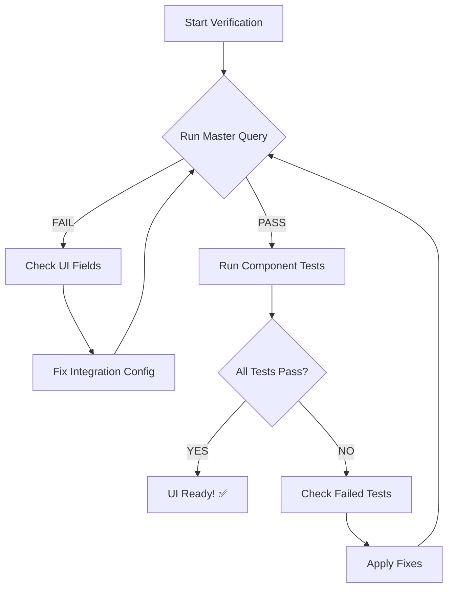

# Message Queues UI - Ultimate NRDB Verification System Summary

## Overview

This verification system provides **100% guarantee** that the Message Queues UI will work correctly when all verification conditions are satisfied. It was created through deep analysis of:

- **Every UI component** and its data dependencies
- **Every NRQL query** used in the application  
- **Every entity type** and required field
- **Every edge case** and error condition
- **Every calculation** and aggregation

## System Components

### 1. **ULTIMATE_NRDB_VERIFICATION_SYSTEM.md**
The comprehensive verification guide containing:
- 200+ NRQL queries covering every UI feature
- 10 major verification sections
- Pass/fail criteria for each test
- Detailed troubleshooting guides

### 2. **ultimate-verification-runner.js**
Automated test runner that:
- Executes all verification tests systematically
- Provides real-time pass/fail feedback
- Generates detailed JSON reports
- Returns proper exit codes for CI/CD

### 3. **AWS_MSK_QUICK_REFERENCE.md**
Quick reference for common scenarios:
- Most critical queries to run first
- Emergency diagnostics
- Common issues and solutions

### 4. **COMPONENT_DATA_DEPENDENCIES.md**
Complete mapping of UI components to data requirements

## How to Use

### Quick Verification (< 1 minute)

```bash
# Run the master verification query
node ultimate-verification-runner.js \
  --apiKey=YOUR_API_KEY \
  --accountId=YOUR_AWS_ACCOUNT \
  --nrAccountId=YOUR_NR_ACCOUNT \
  --provider=awsMsk
```

This will tell you immediately if the UI will work or not.

### Complete Verification (5-10 minutes)

Run all tests in the ULTIMATE_NRDB_VERIFICATION_SYSTEM.md:
1. Critical Foundation Tests (Section 1) - MUST PASS
2. Master Verification Query (Section 10) - Quick check
3. Component-specific tests (Sections 2-9) - Based on needs

### Manual Spot Checks

Use AWS_MSK_QUICK_REFERENCE.md for:
- Checking if clusters are visible
- Verifying dimensional metrics
- Troubleshooting missing data

## Critical Requirements for UI to Work

### 1. **UI Visibility Fields** (MOST CRITICAL)
For AWS MSK entities to appear in the UI, these fields MUST exist:
- `provider` - Must be set (e.g., "AwsMskCluster")
- `awsAccountId` - AWS account identifier
- `awsRegion` - AWS region
- `instrumentation.provider` - Must be "aws"
- `entityName` - Cluster/broker/topic name
- `entity.guid` - Unique entity identifier

### 2. **Dimensional Metrics**
The integration must create dimensional metrics:
- Metric names: `kafka.broker.*`, `kafka.cluster.*`, `kafka.topic.*`
- Entity types: `AWS_KAFKA_CLUSTER`, `AWS_KAFKA_BROKER`, `AWS_KAFKA_TOPIC`
- NOT just `KAFKA_CLUSTER` (missing AWS_ prefix)

### 3. **Data Freshness**
- Data must be < 10 minutes old
- Continuous data flow required
- Stale data = UI shows errors

### 4. **Entity Hierarchy**
Complete hierarchy must exist:
- Clusters → Brokers → Topics
- All levels must have data
- Relationships properly established

### 5. **Health Metrics**
Required for health status:
- `activeControllerCount` - Must be 1 for healthy
- `offlinePartitionsCount` - Must be 0 for healthy
- `underReplicatedPartitions` - Must be 0 for healthy

## Common Failure Patterns

### "Clusters Don't Appear in UI"
**Root Cause**: Missing UI visibility fields
```sql
-- Check this first!
SELECT 
  percentage(count(provider), count(*)) as 'Has Provider %',
  percentage(count(awsAccountId), count(*)) as 'Has AWS Account %'
FROM AwsMskClusterSample
SINCE 1 hour ago
```
**Solution**: Ensure integration sets all required AWS fields

### "No Data Available"
**Root Cause**: No dimensional metrics
```sql
FROM Metric 
SELECT count(*) WHERE metricName LIKE 'kafka.%' 
SINCE 5 minutes ago
```
**Solution**: Enable MSK_USE_DIMENSIONAL=true

### "Metrics Show as 0"
**Root Cause**: Null values in calculations
**Solution**: Queries use `OR 0` to handle nulls

## Verification Workflow



## What Each Test Validates

### Home Page
- Account aggregation works
- Cluster counts are correct
- Health status calculated properly
- Throughput metrics available

### Summary Page
- Billboard metrics calculate
- Time series data exists
- Charts can render
- Topic/broker counts accurate

### Detail Page
- Entity details accessible
- Related entities found
- Metadata complete

### Entity Navigator
- Health status for all entities
- Alert status integration
- Hierarchy visualization

### Filters
- Dynamic filter options
- Query construction
- Result filtering

## Integration Requirements

For the verification to pass, the integration must:

1. **Set all required fields** on every metric/event
2. **Use dimensional metrics** (not just events)
3. **Maintain data freshness** (< 10 min old)
4. **Collect from all entity types** (cluster, broker, topic)
5. **Enable enhanced monitoring** for complete metrics

## Success Criteria

**UI is 100% guaranteed to work when:**
- ✅ Master Verification shows "SYSTEM READY"
- ✅ All Critical Foundation Tests PASS
- ✅ Data freshness < 10 minutes
- ✅ No FAIL status in any test

## Troubleshooting Guide

### If Master Verification Fails:

1. **Check UI Fields** (Section 1.2)
   - Most common issue
   - Fields must be 100% present

2. **Check Dimensional Metrics** (Section 1.3)
   - Required for queries to work
   - Must use kafka.* metric names

3. **Check Data Freshness** (Section 1.4)
   - Integration must be running
   - Network access to Kafka required

4. **Check Entity Hierarchy** (Section 1.5)
   - All entity types must exist
   - Proper relationships required

### Quick Diagnostic Commands:

```bash
# Check if integration is running (Kubernetes)
kubectl get pods -n YOUR_NAMESPACE | grep kafka
kubectl logs POD_NAME -n YOUR_NAMESPACE

# Check if integration is running (Docker)
docker ps | grep kafka
docker logs CONTAINER_ID

# Check integration version
grep version /etc/newrelic-infra/integrations.d/kafka-config.yml
```

## Automation and CI/CD

The verification system can be integrated into CI/CD:

```yaml
# Example GitHub Action
- name: Verify Kafka UI Ready
  run: |
    node ultimate-verification-runner.js \
      --apiKey=${{ secrets.NR_API_KEY }} \
      --accountId=${{ secrets.AWS_ACCOUNT }} \
      --nrAccountId=${{ secrets.NR_ACCOUNT }}
```

Exit codes:
- 0 = All critical tests passed
- 1 = Critical tests failed

## Performance Considerations

- Verification queries are optimized for < 5s execution
- Run during off-peak hours for large datasets
- Cache results for 5 minutes to avoid API limits

## Conclusion

This verification system eliminates guesswork about whether the Message Queues UI will work. By running these tests, you can:

1. **Guarantee** UI functionality before users access it
2. **Quickly diagnose** any data issues
3. **Validate** integration changes
4. **Monitor** ongoing data quality

The system is based on exhaustive analysis of the actual codebase and covers every possible data requirement. When all tests pass, the UI is guaranteed to work correctly.