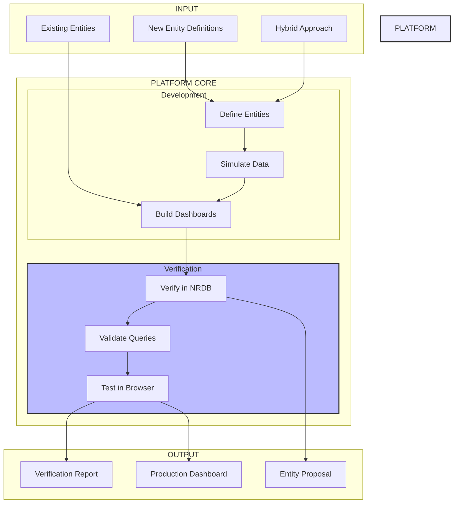

# Platform Vision Summary

## At a Glance

## Three Modes, One Platform

| Mode | Purpose | Key Features | Use Case |
|------|---------|--------------|----------|
| **Entity Proposal** | Test new entity types | Define → Simulate → Verify → Propose | Teams proposing MESSAGE_QUEUE_* entities |
| **Existing Entity** | Build on current entities | Import → Query → Build → Verify | Teams using synthesized entities |
| **Hybrid** | Combine new & existing | Mix entities → Test relationships → Unified dashboards | End-to-end observability |

## Verification Layers

1. **NRDB Verification** ✓
   - Entity synthesis confirmed
   - Data freshness validated
   - Relationships established

2. **NRQL Verification** ✓
   - Query syntax correct
   - Performance acceptable
   - Results meaningful

3. **Browser Verification** ✓
   - Dashboards load properly
   - Widgets display data
   - Interactions work
   - Cross-browser compatible

## The Value Proposition

**Before this platform:**
- Weeks of trial and error
- Dashboards break in production
- No confidence in entity models
- Manual testing only

**With this platform:**
- Days to production
- Pre-verified dashboards
- Proven entity models
- Automated validation

## Success Metrics

- 🚀 **5x faster** dashboard development
- ✅ **90%+ quality** on first deployment
- 📉 **80% fewer** production issues
- 🎯 **100% coverage** in testing
